# 多模型路由聊天系统详细设计（LLD）

> 迭代3同步状态（2026-07-23）：迭代3设计已经用户确认并完成实施；实现记录见 `docs/iteration3-plan.md`。后端 39 项、前端 17 项测试通过，Alembic 迁移升降级与前端生产构建通过。

> 文档状态：需求已确认，待按迭代实施  
> 目标环境：Windows 本地开发  
> 技术栈：React + TypeScript + Vite / Python 3.11+ + FastAPI + SQLAlchemy 2.x + Alembic / SQLite  
> 设计原则：KISS、YAGNI、分迭代交付、历史记录不可覆盖或物理删除  
> 本文采用已确认的本地 MIRT 路由与公式：`route_score = 0.70 × predicted_accuracy + 0.30 × cost_score`。

## 项目结构与总体设计

### 1. 目标与边界

系统最终提供单用户、本地运行的多轮聊天能力，包括强制 360 搜索、固定三个模型的消息级路由、失败重试与降级、回答版本、历史分支、分支级版本化备忘录、会话级角色配置及左右分栏界面。三个模型通过 `models.yaml` 配置任意展示名称和各自完整 API 地址；调用统一采用无鉴权、非流式 JSON `POST /v1/completions` 文本补全协议。

当前工程已经按本文完成迭代2代码；后续仍按以下顺序逐个迭代，不允许一次性实现全部功能：

| 迭代 | 交付范围 | 明确不在本迭代实现 |
|---|---|---|
| 迭代1 | 前后端基础工程、SQLite、会话与主分支、消息和单一生效回答、游标分页、左右分栏、统一 Provider 接口、Mock 测试 | 搜索、真实模型、自动路由、重新生成、分支操作、备忘录、角色 |
| 迭代2 | 搜索快照、360 适配边界、本地 MIRT+BERT 三模型路由、Tokenizer、统一 Prompt、`/v1/completions` 调用、尝试记录、重试/降级、预测与实际成本 | 回答切换、编辑分支、备忘录、角色 |
| 迭代3 | 重新生成、回答版本激活、历史用户消息编辑、分支创建与切换 | 备忘录、角色 |
| 迭代4 | 备忘录自动/增量更新、用户编辑、版本恢复、冲突标记、分支继承 | 角色 |
| 迭代5 | 角色模板与版本、完整页面交互、完整系统测试 | 多用户、流式、高可用、部署平台 |

### 2. 非目标

本项目不设计或实现多用户、登录、RBAC、多租户、Redis、消息队列、微服务、CQRS、事件总线、SSE、WebSocket、停止生成、独立内容审核、动态模型发现、动态价格同步、在线模型配置后台、API Key 管理、运行时增加第四个模型、自动生成未知模型的 MIRT 向量、Docker、云部署与 PostgreSQL 专属功能。

### 3. 总体架构

采用单体仓库、前后端分离、后端分层的最小架构：

- React 前端只负责展示和用户操作，通过 REST API 调用后端，不保存业务真相。
- FastAPI API 层负责协议解析、参数校验和错误映射。
- Service 层承载事务边界和业务规则，是所有状态变更的唯一入口。
- Repository 层封装 SQLAlchemy 查询，禁止在 API 和 Provider 层直接访问数据库。
- Provider 层隔离模型 HTTP 调用、搜索、本地 MIRT 路由器与 Tokenizer 的实现差异。
- SQLite 保存完整业务历史；真实模型经配置的 HTTP 地址调用，本地路由资产随项目统一管理，测试时均可由 Mock 替换。
- 普通同步 HTTP 完成一次请求。外部调用发生在同一请求生命周期内，不引入后台任务基础设施。

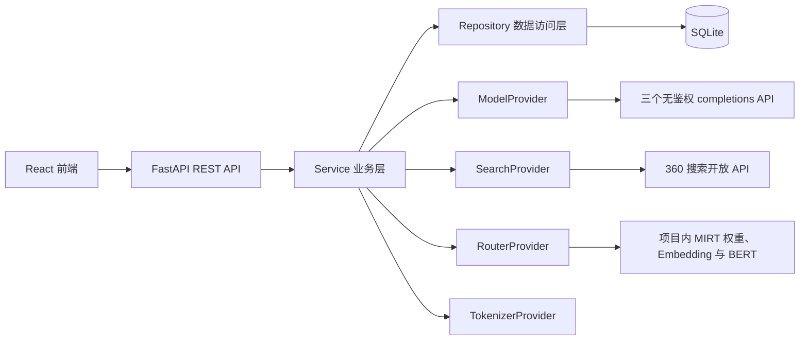

### 4. 核心设计不变量

1. 历史不可变：已创建的用户消息正文、搜索快照、上下文快照、路由快照、生成尝试、回答版本、备忘录版本均不执行物理删除或原地覆盖。
2. 分支视图唯一：`BranchMessage` 决定某分支的线性消息顺序和每个用户消息在该分支的当前回答；共享消息内容不等于共享“当前回答选择”。
3. 单一当前回答：同一 `BranchMessage` 最多指向一个成功回答版本。激活新版本与取消旧版本在同一数据库事务内完成。
4. 搜索一次：每个新 `UserMessage` 最多一个 `SearchSnapshot`；该消息的全部重新生成与自动降级复用它。
5. 上下文一致：同一 `GenerationTask` 的全部 `GenerationAttempt` 只读取同一个不可变 `ContextSnapshot`。
6. 路由排序不可变：自动模式下创建一次 `RouteSnapshot`；重试和降级严格沿快照排名，不在任务内重新路由。
7. 手动不降级：`USER_SELECTED` 失败后只记录失败，不能自动切换模型。
8. 全局错误短路：`GLOBAL_*` 错误立即结束生成链，禁止重试或换模型。
9. 成功后计轮：只有存在当前成功回答的用户消息才是完整轮；失败、停止和部分输出不计轮、不触发备忘录。
10. 备忘录失败隔离：备忘录更新失败不改变已成功回答，不创建空白新版本，并保留可重试记录。
11. 用户保护区不可变：系统生成流程只能读取、不能改写 `protected_user_text`；用户操作也通过创建新版本完成。
12. 模型协议固定：模型请求只发送 `prompt`、`max_tokens`、`temperature`，不发送 API Key、`Authorization`、`logprobs` 或 `logprobs_mode`；响应必须按已确认的 text completion 结构解析。
13. 路由名称受控：`display_name` 可任意配置；每个 `router_model_name` 必须存在于项目内 `map/llm.csv`，且三个槽不得重复。系统不为未知模型生成向量。
14. 路由资产一致：MIRT、BERT、Embedding、冷启动数据、映射表和快照全部复制到项目内，随部署版本统一管理；运行时不得依赖微信文件目录。

### 5. 对建议实体的必要深化

引入 `BranchMessage`，而不是只在 `UserMessage` 上保存 `branch_id` 和 `active_answer_version_id`。原因是一个用户消息在分叉点之前会被多个分支共享，而不同分支可以选择不同回答版本。更简单的单外键方案无法同时满足“共享不可变历史”“原分支不受影响”和“分支内最多一个当前回答”。`BranchMessage` 只保存关联、位置和当前回答指针，不复制消息正文，复杂度最小。

引入 `ContextSnapshot`。如果只在每次尝试时临时重组上下文，自动重试和降级可能读到不同的角色、备忘录或回答状态，违反同任务上下文完全一致的要求。

引入 `MemoryUpdateRecord`。仅依赖日志无法可靠表达“备忘录更新失败但回答成功、后续可重试”，也无法进行验收查询；一张轻量记录表是满足审计要求的最小方案。

本地 MIRT Provider 在应用启动时一次性加载 BERT、MIRT 权重、映射和 KNN 索引。若每次请求都照搬参考脚本重新加载模型并拟合 KNN，会产生明显重复开销；保持算法不变、只缓存只读资产是满足交互响应时间的最小改造。

迭代2优先复用现有代码：保留 `api.py` 的外部路径与 `SendMessageRequest`、`ModelOption(label)` 契约，扩展现有 `Settings`、`ModelProvider`、`ChatService` 和核心 ORM；数据库只新增 `0002` 迁移，不重建迭代1表。`MIRT.py` 只复用推理网络与已训练参数，不把训练/评估代码带入运行时。

不引入通用工作流引擎、领域事件或异步队列。当前同步本地应用用显式 Service 编排即可满足需求。

## 目录结构

以下是最终目标目录，不代表当前或迭代1会提前创建全部文件。实施每个迭代时只创建该迭代实际使用的文件；标注未来迭代的文件不得提前创建为空文件。

```text
docs/
  requirements.md
  LLD.md
backend/
  pyproject.toml
  alembic.ini
  .env.example
  config/
    models.yaml                              # 迭代2再实现，用固定返回值占位；本地实际配置加入 .gitignore
    models.example.yaml
    app.example.yaml
  resources/
    router/
      bert-base-uncased/                     # 从参考目录复制的本地 BERT 资产
      bert_embeddings/
        llm_embeddings.pkl
        query_embeddings.pkl
      cold/
        test_avg_embeddings_bert.pkl
      map/
        llm.csv
        query.csv
      mirt_bert.snapshot
    tokenizers/
      model-a/                              # 迭代2部署时放置 MODEL_A 匹配 Tokenizer
      model-b/                              # 迭代2部署时放置 MODEL_B 匹配 Tokenizer
      model-c/                              # 迭代2部署时放置 MODEL_C 匹配 Tokenizer
  data/
    .gitkeep
  alembic/
    env.py
    versions/
      0001_core_chat.py
      0002_routing_generation.py             # 迭代2再实现，用固定返回值占位
      0003_answer_branching.py
      0004_memory.py                          # 迭代4再实现，用固定返回值占位
      0005_roles.py                           # 迭代5再实现，用固定返回值占位
  app/
    __init__.py
    main.py
    api.py
    core/
      config.py
      enums.py
      errors.py
    db/
      session.py
      models_core.py
      models_generation.py                    # 迭代2再实现，用固定返回值占位
      models_memory.py                        # 迭代4再实现，用固定返回值占位
      models_role.py                          # 迭代5再实现，用固定返回值占位
    schemas/
      common.py
      conversations.py
      chat.py
      generation.py                           # 迭代2再实现，用固定返回值占位
      branches.py
      memories.py                             # 迭代4再实现，用固定返回值占位
      roles.py                                # 迭代5再实现，用固定返回值占位
    repositories/
      conversations.py
      chat.py
      generation.py                           # 迭代2再实现，用固定返回值占位
      memories.py                             # 迭代4再实现，用固定返回值占位
      roles.py                                # 迭代5再实现，用固定返回值占位
    providers/
      model.py
      search.py                              # 迭代2再实现，用固定返回值占位
      router.py                              # 迭代2再实现，用固定返回值占位
      mirt.py                                # 迭代2再实现，用固定返回值占位；复用参考 MIRT 网络定义
      tokenizer.py                           # 迭代2再实现，用固定返回值占位
      registry.py                            # 迭代2再实现，用固定返回值占位
    services/
      conversations.py
      title.py
      chat.py
      context.py                               # 迭代2再实现，用固定返回值占位
      routing.py                               # 迭代2再实现，用固定返回值占位
      generation.py                            # 迭代2再实现，用固定返回值占位
      answers.py
      branches.py
      memories.py                              # 迭代4再实现，用固定返回值占位
      roles.py                                 # 迭代5再实现，用固定返回值占位
  tests/
    conftest.py
    unit/
      test_config.py
      test_title.py
      test_routing.py                          # 迭代2再实现，用固定返回值占位
      test_router_assets.py                    # 迭代2再实现，用固定返回值占位
      test_prompt_rendering.py                 # 迭代2再实现，用固定返回值占位
      test_completion_provider.py              # 迭代2再实现，用固定返回值占位
      test_costs.py                            # 迭代2再实现，用固定返回值占位
      test_candidate_filter.py                 # 迭代2再实现，用固定返回值占位
      test_error_classification.py             # 迭代2再实现，用固定返回值占位
      test_retry_fallback.py                   # 迭代2再实现，用固定返回值占位
      test_answer_activation.py
      test_branch_inheritance.py
      test_memory_trigger.py                    # 迭代4再实现，用固定返回值占位
    api/
      test_conversations.py
      test_chat.py
      test_answers.py
      test_branches.py
      test_memories.py                         # 迭代4再实现，用固定返回值占位
    integration/
      test_generation_pipeline.py              # 迭代2再实现，用固定返回值占位
frontend/
  package.json
  pnpm-lock.yaml
  pnpm-workspace.yaml
  vite.config.ts
  tsconfig.json
  tsconfig.app.json
  tsconfig.node.json
  index.html
  src/
    main.tsx
    App.tsx
    vite-env.d.ts
    api/client.ts
    api/types.ts
    hooks/useConversations.ts
    hooks/useChat.ts
    storage/hiddenConversations.ts
    components/AppLayout.tsx
    components/ConversationList.tsx
    components/conversation-list.css
    components/ConfirmationDialog.tsx
    components/confirmation-dialog.css
    components/ChatPanel.tsx
    components/MessageItem.tsx
    components/Composer.tsx
    components/AnswerMetadata.tsx              # 迭代2再实现，用固定返回值占位
    components/MessageActions.tsx
    components/MessageEditor.tsx
    components/AnswerVersionDialog.tsx
    components/BranchSwitcher.tsx
    components/chat-actions.css
    components/MemoryPanel.tsx                  # 迭代4再实现，用固定返回值占位
    components/RolePanel.tsx                    # 迭代5再实现，用固定返回值占位
    styles.css
    test/
      setup.ts
      App.test.tsx
      ConversationList.test.tsx
      ChatPanel.test.tsx
e2e/
  playwright.config.ts                         # 迭代5完成全流程验收
  core-chat.spec.ts                            # 迭代5完成全流程验收
README.md
```

约束：每个新增代码文件不超过 500 行；达到约 400 行时优先按职责拆分。迁移文件不放业务逻辑。未来迭代标注是规划说明，不授权提前创建占位文件。路由资源只复制 MIRT 运行所需文件，不复制 `NIRT.py`、NIRT relevance 数据、参考测试脚本或 Python 缓存；实际 `models.yaml` 不提交公开仓库，但与应用一起部署。

## 整体逻辑和交互时序图

### 1. 新用户消息完整流程

`POST /api/v1/conversations/{conversation_id}/messages` 的最终流程如下。迭代1中 `ChatService` 使用 `MockModelProvider` 完成最小保存链路；迭代2替换为完整搜索、路由和生成编排，但 API 请求/响应保持兼容。

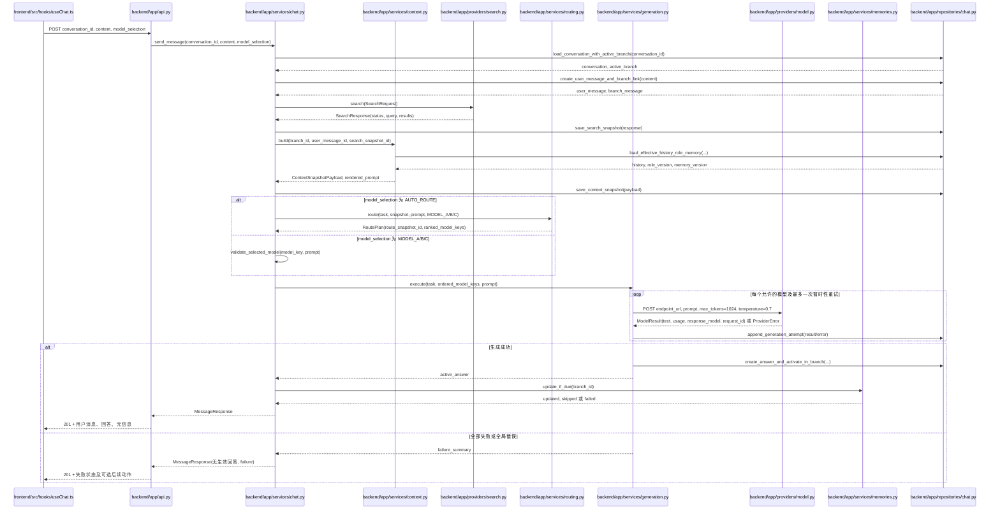

### 2. 自动路由与降级

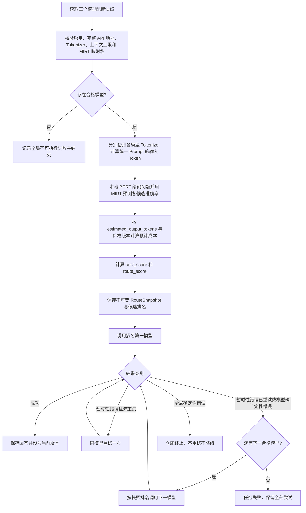

### 3. 统一 Prompt 渲染

所有模型收到完全相同的文本结构；不使用各模型 chat template，不发送 `messages` 数组。空的角色、备忘录或搜索段不输出空标题。`System:` 段内部固定按系统规则、角色、用户保护区、系统摘要、搜索上下文排列；随后按分支逻辑位置输出历史有效轮，最后输出当前问题并以 `Assistant:` 结尾：

```text
System:
{system_rules_text}
{role_text}
{protected_memory_text}
{system_memory_text}
{search_context_text}

User:
{history_user_text_1}

Assistant:
{history_answer_text_1}

User:
{current_user_text}

Assistant:
```

各动态正文原样插入，不解释其中的 `System:` 等字符串；每个非空系统子段之间、每个角色块之间固定插入两个换行符，整个 Prompt 使用 `\n`，末尾不再追加换行。分隔标签只由渲染器在独立行生成。同一 `ContextSnapshot` 只渲染一次，得到的同一 `prompt` 字符串供三模型 Token 计数、重试和降级复用。

### 4. 本地 MIRT 预测流程

该流程严格复用参考目录中 `test.py` 的 `bert/mirt/cpu/lamda=0.1/knowledge_n=25/KNN=5` 设置，只把模型和索引加载移动到应用启动阶段：

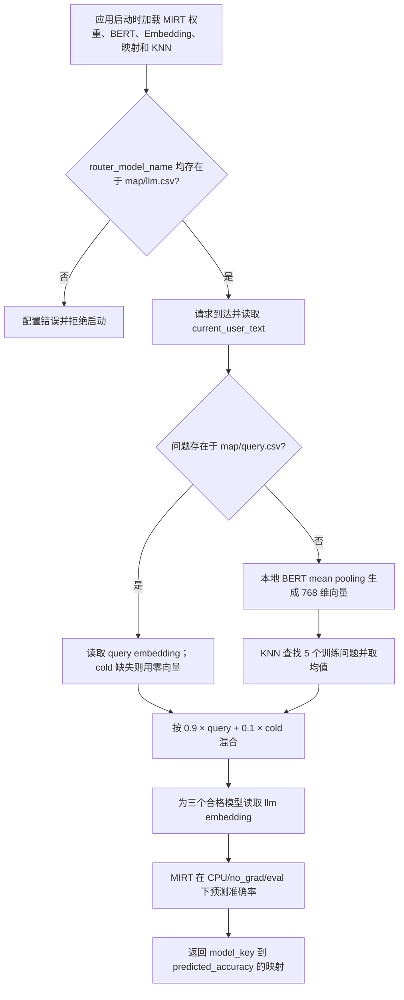

### 5. 历史回答激活或重新生成

任何操作只要要将历史位置的新回答设为当前，均复用同一激活策略，防止修改已有后续消息的上下文事实。

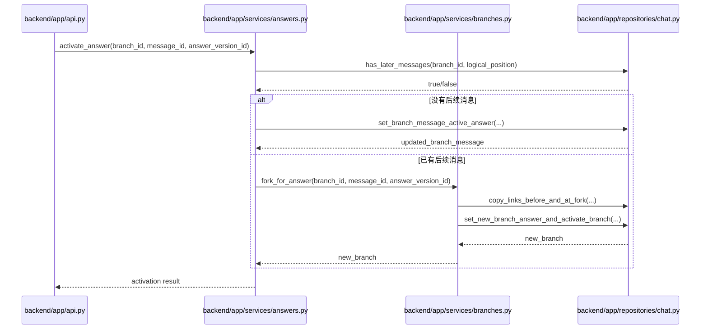

### 6. 备忘录更新

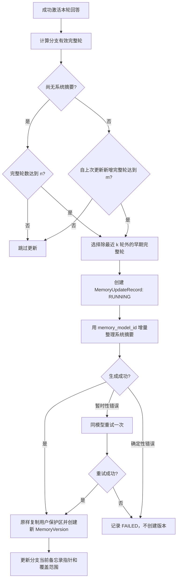

### 7. 左侧会话前端隐藏

用户界面中的“删除”严格定义为当前浏览器内的前端隐藏，不调用后端、不修改数据库，也不影响历史不可变规则。用户必须在确认弹窗中再次确认；取消、按 Escape 或点击遮罩均不改变列表。确认后将会话 ID 加入浏览器 `localStorage`，Hook 过滤服务端返回的列表；若隐藏的是当前会话，`App` 同时清空当前选择。分页结果全部被隐藏时继续加载下一页，直到出现可见会话或服务端无下一页。

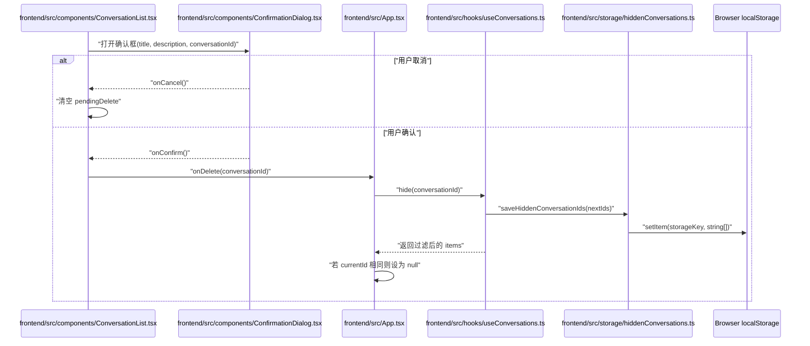

## API接口定义

### 1. 通用约定

- 前缀：`/api/v1`。
- 请求与响应：`application/json; charset=utf-8`。
- ID：后端生成 UUID 字符串；客户端不得自行指定。
- 时间：UTC ISO 8601，前端负责本地化显示。
- 成功发送消息即使模型最终失败也返回 `201`，因为用户消息、搜索快照和失败尝试已成功持久化；响应内 `generation_status=FAILED`。只有请求校验或事务失败返回 4xx/5xx。
- 错误结构：`{"error":{"code":"...","message":"...","details":{...},"request_id":"..."}}`。
- 所有写操作以数据库事务保证指针与版本状态一致。
- 当前为单用户系统，不设置认证头。
- 后端调用三个模型 API 时同样不设置 API Key、`Authorization` 或其他鉴权头；仅发送 `Content-Type: application/json`。
- 左侧会话“删除”是浏览器本地隐藏，不新增 `DELETE /conversations/{id}`，也不调用现有后端端点。

### 2. 端点清单

| 迭代 | 方法与路径 | 简要说明 |
|---|---|---|
| 1 | `GET /api/v1/health` | 本地健康检查 |
| 1 | `POST /api/v1/conversations` | 创建会话及主分支 |
| 1 | `GET /api/v1/conversations?limit=20&cursor=` | 按 `updated_at DESC, id DESC` 游标分页 |
| 1 | `GET /api/v1/conversations/{id}` | 获取会话摘要与活动分支 |
| 1 | `PATCH /api/v1/conversations/{id}` | 手动修改标题 |
| 1 | `GET /api/v1/conversations/{id}/messages` | 获取活动分支消息与当前回答 |
| 1/2 | `POST /api/v1/conversations/{id}/messages` | 保存新消息并同步生成回答；迭代2扩展搜索和路由 |
| 1/2 | `GET /api/v1/models` | 返回 `MODEL_A/B/C`、`label`（取自任意 `display_name`）和可用状态；不返回 API 地址、价格或路由映射名 |
| 2 | `GET /api/v1/generation-tasks/{id}` | 查看任务、尝试、路由与搜索元信息 |
| 3 | `POST /api/v1/messages/{id}/regenerations` | 三种模式重新生成并复用搜索快照 |
| 3 | `POST /api/v1/messages/{id}/answers/{answer_id}/activate` | 激活已有回答；必要时自动建分支 |
| 3 | `PATCH /api/v1/messages/{id}` | 编辑历史用户消息并创建新分支、新消息和新搜索 |
| 3 | `GET /api/v1/conversations/{id}/branches` | 列出分支和当前分支 |
| 3 | `POST /api/v1/conversations/{id}/branches/{branch_id}/activate` | 切换活动分支 |
| 4 | `GET /api/v1/branches/{id}/memory` | 当前备忘录及更新状态 |
| 4 | `GET /api/v1/branches/{id}/memory/versions` | 备忘录版本历史游标分页 |
| 4 | `PUT /api/v1/branches/{id}/memory` | 编辑用户保护区并创建版本 |
| 4 | `POST /api/v1/branches/{id}/memory/versions/{version_id}/restore` | 恢复历史基线并创建 RESTORE 版本 |
| 5 | `GET /api/v1/conversations/{id}/role` | 获取当前分支生效角色 |
| 5 | `PUT /api/v1/conversations/{id}/role` | 修改角色并创建版本，仅影响后续消息 |
| 5 | `GET /api/v1/role-templates` | 列出角色模板 |
| 5 | `POST /api/v1/role-templates` | 创建角色模板 |

### 3. 关键请求与响应

#### 3.1 创建会话

`POST /api/v1/conversations`

请求：`title` 可省略；未提供时为“新会话”。此时尚无第一条消息，待首条消息成功保存后按标题规则自动更新；用户已经手动改过标题时不再自动覆盖。

响应字段：`id`、`title`、`title_source`、`active_branch_id`、`created_at`、`updated_at`、`generation_status`。

#### 3.2 会话分页

`GET /api/v1/conversations?limit=20&cursor=<opaque>`

- `limit` 默认 20，最大 100。
- 排序键为 `(updated_at DESC, id DESC)`。
- 游标是服务端编码的不透明值，包含上一页最后项的 `updated_at` 与 `id`；客户端不得解析。
- 响应：`items[]`、`next_cursor`、`has_more`。
- 每项包含 `title`、`latest_message_preview`、`updated_at`、`generation_status`。

#### 3.3 发送消息

`POST /api/v1/conversations/{id}/messages`

请求字段：

| 字段 | 类型 | 必填 | 约束 |
|---|---|---:|---|
| `content` | string | 是 | 去除首尾空白后不得为空；正文原样保存，不做 HTML 解释 |
| `selection_mode` | enum | 是 | `AUTO_ROUTE` 或 `USER_SELECTED` |
| `model_key` | string/null | 条件必填 | 手动时只能为 `MODEL_A/B/C`；自动时必须为空 |

响应字段：`user_message`、`active_answer`（可空，成功时含 `model_key/display_name/model_id`）、`generation_task`、`search_status`、`route_summary`（手动时为空）、`failure`（成功时为空）。迭代1的兼容响应中 `generation_task` 可使用最小同步结果结构；迭代2迁移后返回持久化任务 ID。

手动选择状态只存在于本次请求，不写回会话偏好，前端请求结束后始终把选择器复位为 `AUTO_ROUTE`。

#### 3.4 模型出站接口

每个模型调用 `models.yaml` 中配置的完整 `endpoint_url`，该 URL 必须以 `/v1/completions` 结尾。请求方法为 `POST`，不拼接模型 ID，也不发送鉴权头：

```json
{
  "prompt": "<统一渲染的完整 Prompt>",
  "max_tokens": 1024,
  "temperature": 0.7
}
```

正式调用不发送 `logprobs` 与 `logprobs_mode`；这两个字段只允许在独立连通性诊断脚本中使用。成功响应按以下已确认字段读取：

- `id`：供应商请求 ID，写入 GenerationAttempt。
- `object`：必须为 `text_completion`。
- `model`：实际响应模型名，写入 `model_id_snapshot`。
- `choices[0].text`：回答正文；缺失、非字符串或空正文均视为模型响应错误。
- `choices[0].finish_reason`：保存到安全元数据；`length` 仍属于成功，但前端标记“达到输出上限”。
- `usage.prompt_tokens`、`usage.completion_tokens`、`usage.total_tokens`：实际 Token；三项必须为非负整数且总数一致。

响应中的 `logprobs`、`system_fingerprint` 等非业务字段不整包入库。HTTP 非 2xx、超时、JSON 解析失败或上述字段不完整统一转换为 `ProviderError`，由生成服务决定重试或降级。

#### 3.5 重新生成

`POST /api/v1/messages/{id}/regenerations`

请求字段：

- `branch_id`：指出操作所在分支。
- `mode`：`REGENERATE_ORIGINAL_MODEL`、`REGENERATE_AUTO_ROUTE`、`REGENERATE_USER_SELECTED`。
- `model_key`：仅临时指定模式必填。

返回新回答版本或失败任务。搜索快照 ID 必须与原用户消息一致。若目标位置之后已有消息，生成成功后的自动激活沿用“历史激活即建分支”规则，响应返回 `created_branch_id`。

#### 3.6 编辑历史消息

`PATCH /api/v1/messages/{id}`

请求：`branch_id`、`content`、`selection_mode`、`model_key`。响应：新分支、新用户消息、新搜索快照及生成结果。原消息和原分支不改变。

#### 3.7 编辑与恢复备忘录

`PUT /api/v1/branches/{id}/memory` 请求 `protected_user_text`。系统摘要由当前版本原样带入，创建 `USER_EDIT` 版本。

`POST /api/v1/branches/{id}/memory/versions/{version_id}/restore` 无正文。服务端创建新 `RESTORE` 版本，记录 `restored_from_version_id` 和 `base_version_id`，必要时增量补齐已退出原始窗口的历史。

### 4. HTTP 状态与业务错误

| HTTP | 场景 |
|---:|---|
| 200 | 查询、标题修改、分支切换、角色/备忘录更新成功 |
| 201 | 会话、用户消息、回答生成任务或新版本已持久化 |
| 400 | 请求字段组合非法、无效游标 |
| 404 | 会话、分支、消息或版本不存在 |
| 409 | 目标不属于指定分支、版本不成功、状态已变化造成冲突 |
| 422 | Pydantic 字段校验失败 |
| 500 | 本地事务或上下文组装等未预期错误；已进入任务的失败应尽量持久化后以业务失败响应返回 |

## 数据实体结构深化

### 1. 通用数据约定

- 主键均为 UUID 字符串，避免依赖 SQLite 自增语义并便于迁移 PostgreSQL。
- 时间字段在应用层生成 UTC aware datetime；SQLite 保存标准 UTC 字符串/SQLAlchemy DateTime，API 统一输出 ISO 8601。
- 金额使用 `Decimal` 对应 `Numeric(20, 10)`，禁止浮点数计算成本。
- JSON 字段只保存不可变快照和供应商原始安全元数据；需要筛选、关联和保持约束的数据使用普通列。
- 不建立级联物理删除。当前 API 不提供删除端点。
- `created_at` 不更新；版本化实体不提供通用 update 方法。
- 前端隐藏 ID 不是业务数据实体，不进入 ER 图和数据库；它只是当前浏览器 `localStorage` 中的字符串数组，清理浏览器站点数据后可恢复显示。

### 2. 实体字段

#### Conversation

| 字段 | 类型 | 约束/说明 |
|---|---|---|
| `id` | UUID string | PK |
| `title` | string(200) | 非空 |
| `title_source` | enum | `DEFAULT`、`AUTO_FIRST_MESSAGE`、`USER_EDIT` |
| `active_branch_id` | UUID | FK Branch，创建主分支后设置 |
| `default_memory_config_json` | JSON | `n/k/m` 会话级覆盖；为空使用应用默认 |
| `created_at` | datetime | 非空 |
| `updated_at` | datetime | 列表排序键，消息/标题/分支活动变化时更新 |

#### Branch

| 字段 | 类型 | 约束/说明 |
|---|---|---|
| `id` | UUID string | PK |
| `conversation_id` | UUID | FK Conversation，索引 |
| `parent_branch_id` | UUID/null | FK Branch |
| `branch_point_type` | enum | `ROOT`、`USER_MESSAGE_EDIT`、`ANSWER_VERSION_ACTIVATE` |
| `branch_point_message_id` | UUID/null | 原分叉用户消息 |
| `branch_point_answer_version_id` | UUID/null | 回答分叉时的新选择 |
| `active_memory_version_id` | UUID/null | FK MemoryVersion，迭代4加入 |
| `active_role_version_id` | UUID/null | FK RoleVersion，迭代5加入；角色版本属于会话，生效指针属于分支 |
| `complete_turn_count` | integer | 非负，事务内维护的派生缓存 |
| `status` | enum | `ACTIVE`、`ARCHIVED`；当前不提供归档 UI，仅预留非删除状态 |
| `created_at` | datetime | 非空 |

#### BranchMessage

| 字段 | 类型 | 约束/说明 |
|---|---|---|
| `id` | UUID string | PK |
| `branch_id` | UUID | FK Branch |
| `user_message_id` | UUID | FK UserMessage |
| `logical_position` | integer | 从 1 开始 |
| `active_answer_version_id` | UUID/null | FK AssistantAnswerVersion；每分支消息唯一当前回答 |
| `created_at` | datetime | 非空 |

唯一约束：`(branch_id, logical_position)`、`(branch_id, user_message_id)`。激活回答时校验回答的 `user_message_id` 与关联一致。

#### UserMessage

| 字段 | 类型 | 约束/说明 |
|---|---|---|
| `id` | UUID string | PK |
| `content` | text | 非空；创建后不可修改 |
| `search_snapshot_id` | UUID/null | 迭代2加入，一对一唯一 |
| `status` | enum | `PENDING`、`HAS_ACTIVE_ANSWER`、`GENERATION_FAILED` |
| `created_at` | datetime | 非空 |

编辑历史消息会新建 UserMessage，绝不更新 `content`。

#### AssistantAnswerVersion

| 字段 | 类型 | 约束/说明 |
|---|---|---|
| `id` | UUID string | PK |
| `user_message_id` | UUID | FK UserMessage，索引 |
| `generation_task_id` | UUID/null | 迭代2前为空；迭代2后与 GenerationTask 一对一唯一关联 |
| `model_key` | string/null | 成功时为最终实际回答的 `MODEL_A/B/C`；任务失败时可空 |
| `display_name_snapshot` | string/null | 成功时保存调用当时的任意展示名称，后续修改 YAML 不追溯改变历史展示 |
| `model_id_snapshot` | string/null | 成功时取响应的 `model` 字段；任务失败时可空 |
| `selection_mode` | enum | `AUTO_ROUTE`、`AUTO_FALLBACK`、`USER_SELECTED` |
| `route_snapshot_id` | UUID/null | 自动路由时关联 |
| `status` | AnswerVersionStatus | 见枚举；ACTIVE 表示至少一个分支当前引用它 |
| `content` | text/null | 成功时非空；失败或停止版本为空，不保存部分输出冒充答案 |
| `created_at` | datetime | 非空 |
| `completed_at` | datetime/null | 成功完成时间 |
| `predicted_input_tokens` | integer/null | 迭代2加入 |
| `predicted_output_tokens` | integer/null | 迭代2加入 |
| `actual_input_tokens` | integer/null | 迭代2加入 |
| `actual_output_tokens` | integer/null | 迭代2加入 |
| `predicted_cost` | Decimal/null | 迭代2加入 |
| `actual_cost` | Decimal/null | 迭代2加入 |
| `input_token_error` | integer/null | 实际减预测 |
| `output_token_error` | integer/null | 实际减预测 |
| `cost_error` | Decimal/null | 实际减预测 |
| `price_version` | string/null | 计算所用价格版本 |

#### SearchSnapshot / SearchResult

`SearchSnapshot`：`id`、`user_message_id`（唯一）、`query`、`provider`、`status`、`failure_code`、`failure_message`、`searched_at`、`latency_ms`、`provider_metadata_json`。供应商元数据不得含密钥。

`SearchResult`：`id`、`search_snapshot_id`、`rank`（1-5）、`title`、`snippet`、`url`、`dedupe_key`。唯一约束 `(search_snapshot_id, rank)`；URL 仅内部保存，不进入模型上下文和回答 UI。

#### ContextSnapshot

| 字段 | 类型 | 说明 |
|---|---|---|
| `id` | UUID | PK |
| `user_message_id` | UUID | 目标消息 |
| `branch_id` | UUID | 构建时分支 |
| `role_version_id` | UUID/null | 当时生效角色 |
| `memory_version_id` | UUID/null | 当时生效备忘录 |
| `search_snapshot_id` | UUID | 本轮搜索 |
| `system_rules_text` | text | 系统规则快照 |
| `role_text` | text | 角色渲染快照 |
| `protected_memory_text` | text | 用户保护区快照 |
| `system_memory_text` | text | 系统摘要快照 |
| `history_json` | JSON | 有效原始对话，记录消息/回答版本 ID 与文本 |
| `search_context_json` | JSON | 最多 5 条标题/摘要或明确失败状态，不含 URL |
| `current_user_text` | text | 当前消息 |
| `created_at` | datetime | 非空 |

#### RouteSnapshot / RouteCandidate

`RouteSnapshot`：`id`、`generation_task_id`（唯一）、`user_message_id`、`strategy_version`、`router_provider_version`、`accuracy_weight=0.70`、`cost_weight=0.30`、`price_version`、`model_config_snapshot_json`（包含展示名、MIRT 映射名、价格、预计输出 Token 和启用状态，不含 API 地址）、`routing_latency_ms`、`created_at`。

`RouteCandidate`：`id`、`route_snapshot_id`、`model_key`、`display_name_snapshot`、`router_model_name_snapshot`、`eligible`、`ineligible_reason`、`predicted_accuracy`、`predicted_input_tokens`、`predicted_output_tokens`、`predicted_cost`、`cost_score`、`route_score`、`rank`。`predicted_accuracy` 来自 MIRT；`predicted_output_tokens` 来自该模型配置的 `estimated_output_tokens`，不是 MIRT 输出。不合格候选的预测和得分字段为空；三个配置槽均保存一条候选记录以满足完整审计。

成本计算：

```text
predicted_cost = predicted_input_tokens × input_price
               + predicted_output_tokens × output_price
cost_score = minimum_positive_predicted_cost / predicted_cost
route_score = 0.70 × predicted_accuracy + 0.30 × cost_score
```

价格配置明确使用“每 Token”Decimal；不支持在同一字段混用每千/百万 Token 单位。每个模型的 `estimated_output_tokens` 默认 512，允许分别覆盖，且必须小于等于 `max_tokens=1024`。预计成本为 0 时：所有合格模型均为 0，则成本得分均为 1；仅某些为 0，则零成本模型得分为 1，其他模型按最低正成本除以自身成本计算。该边界规则避免除零，且保持越便宜得分越高。

#### GenerationTask / GenerationAttempt

`GenerationTask`：`id`、`user_message_id`、`branch_id`、`generation_mode`、`source_answer_version_id`、`requested_model_key`、`search_snapshot_id`、`context_snapshot_id`、`route_snapshot_id`、`status`、`failure_category`、`failure_message`、`created_at`、`completed_at`。每个任务创建一个对应的 `AssistantAnswerVersion(status=GENERATING)`；成功时填入最终内容和模型并转为成功状态，全部失败时转为 `FAILED` 且永不激活。多次重试/降级仍只对应这个回答版本。

`GenerationAttempt`：`id`、`generation_task_id`、`attempt_index`、`model_key`、`display_name_snapshot`、`response_model_snapshot`、`started_at`、`ended_at`、`status`、`finish_reason`、`error_category`、`error_code`、`error_message`、`retry_of_attempt_id`、`actual_input_tokens`、`actual_output_tokens`、`charged_cost`、`price_version`、`provider_request_id`。唯一约束 `(generation_task_id, attempt_index)`；`response_model_snapshot` 取成功响应的 `model` 字段。

#### MemoryVersion / MemoryUpdateRecord

`MemoryVersion`：`id`、`branch_id`、`version_number`、`type`、`base_version_id`、`restored_from_version_id`、`inherited_from_version_id`、`protected_user_text`、`system_summary`、`covered_through_position`、`added_from_position`、`added_through_position`、`conflict_metadata_json`、`created_at`。唯一约束 `(branch_id, version_number)`。

`MemoryUpdateRecord`：`id`、`branch_id`、`base_memory_version_id`、`target_from_position`、`target_through_position`、`status`（`RUNNING/SUCCEEDED/FAILED`）、`attempt_count`、`error_category`、`error_message`、`created_at`、`completed_at`、`created_memory_version_id`。该记录不作为异步任务，只用于同步更新审计和后续重试判断。

#### RoleTemplate / RoleVersion

`RoleTemplate`：`id`、`name`、`persona`、`background`、`traits_json`、`style`、`constraints_text`、`created_at`。当前为单用户本地模板，不加 owner 字段。

`RoleVersion`：`id`、`conversation_id`、`version_number`、`source_template_id`、`name`、`persona`、`background`、`traits_json`、`style`、`constraints_text`、`created_at`。角色内容创建后不可更新；分支通过 `active_role_version_id` 决定后续消息所用版本。

### 3. 实体关系图

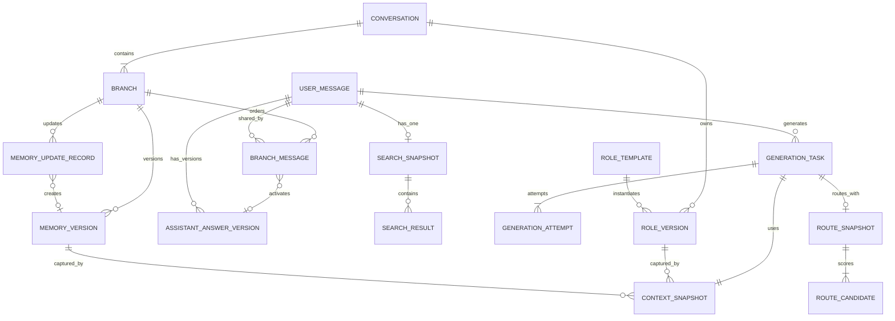

### 4. 索引与约束

- `Conversation(updated_at DESC, id DESC)`：会话游标分页。
- `Branch(conversation_id, created_at)`：分支列表。
- `BranchMessage(branch_id, logical_position)`：唯一索引，读取线性上下文。
- `AssistantAnswerVersion(user_message_id, created_at)`：回答版本列表。
- `GenerationAttempt(generation_task_id, attempt_index)`：唯一索引，尝试链路。
- `MemoryVersion(branch_id, version_number)`：唯一索引，版本历史。
- `SearchSnapshot(user_message_id)`：唯一约束，保证新消息最多一个快照。
- 由于 SQLite 与 PostgreSQL 的部分索引行为差异，不依赖数据库专属 partial index 保证当前版本；使用指针外键和 Service 事务保证。

### 5. 状态枚举与转换

保留需求中的全部枚举：`SearchStatus`、`GenerationMode`、`GenerationStatus`、`AnswerVersionStatus`、`SelectionMode`、`ErrorCategory`、`MemoryVersionType`。额外内部枚举仅限：`BranchPointType`、`BranchStatus`、`TitleSource`、`MemoryUpdateStatus`、`AttemptStatus`，它们用于持久化明确状态，不增加产品能力。

主要转换：

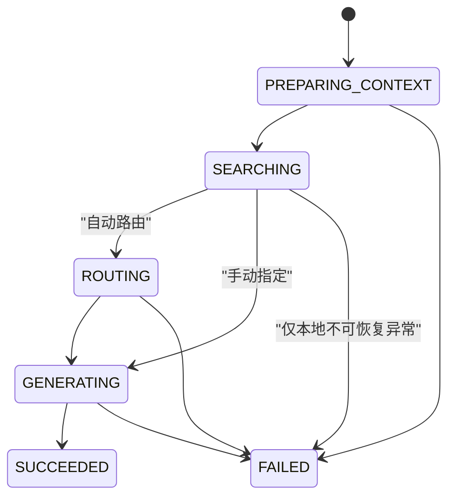

`STOPPED` 保留在最终枚举以兼容需求，但前五个迭代不提供产生该状态的 API；不得伪造停止能力。

## 配置项

### 1. 配置来源与优先级

配置加载顺序固定为：代码内确认过的非敏感默认值 → `app.yaml`/`models.yaml` →允许的环境变量覆盖。生产启动时必须校验；任一启用模型缺少必要配置都导致启动失败。测试通过依赖注入传入 Mock，不访问真实模型地址。

模型 API 已确认无鉴权，因此模型配置不定义 `api_key` 或 `api_key_env`。360 搜索若存在密钥，仍禁止进入 YAML 示例、日志、异常详情、数据库快照和前端响应。模型快照只保存 `model_key/display_name/router_model_name/context_window/price/estimated_output_tokens/enabled/price_version`，不保存 `endpoint_url`。

### 2. 应用配置

| 配置项 | 环境变量 | 默认值 | 校验/用途 |
|---|---|---|---|
| `app_name` | `APP_NAME` | `Multi Model Chat` | 服务名称 |
| `environment` | `APP_ENV` | `development` | `development/test/production` |
| `database_url` | `DATABASE_URL` | `sqlite:///./data/chat.db` | 第一阶段只验收 SQLite；SQLAlchemy URL 保持可迁移 |
| `cors_origins` | `CORS_ORIGINS` | `http://localhost:5173` | 本地 Vite 地址列表 |
| `api_prefix` | 不覆盖 | `/api/v1` | 固定 API 前缀 |
| `conversation_page_size` | `CONVERSATION_PAGE_SIZE` | `20` | 1-100 |
| `conversation_page_max_size` | `CONVERSATION_PAGE_MAX_SIZE` | `100` | 分页上限 |
| `title_max_chars` | `TITLE_MAX_CHARS` | `30` | 首消息标题截取字符数 |
| `search_max_results` | `SEARCH_MAX_RESULTS` | `5` | 必须为 1-5，本需求部署值为 5 |
| `search_timeout_seconds` | `SEARCH_TIMEOUT_SECONDS` | 无业务默认，部署必填 | 360 请求超时；未配置真实搜索时 Provider 返回 FAILED |
| `accuracy_weight` | `ROUTER_ACCURACY_WEIGHT` | `0.70` | Decimal，和成本权重之和必须为 1 |
| `cost_weight` | `ROUTER_COST_WEIGHT` | `0.30` | Decimal |
| `routing_strategy_version` | `ROUTING_STRATEGY_VERSION` | `mirt-bert-cost-v1` | 写入路由快照 |
| `router_asset_dir` | `ROUTER_ASSET_DIR` | `./resources/router` | 必须同时含 MIRT、BERT、Embedding、cold、map 资产 |
| `router_device` | 不覆盖 | `cpu` | 按已确认参考设置固定 |
| `router_lambda` | 不覆盖 | `0.1` | 冷启动向量混合权重 |
| `router_knowledge_n` | 不覆盖 | `25` | MIRT latent dimension |
| `router_knn_neighbors` | 不覆盖 | `5` | 新问题近邻数 |
| `price_version` | `MODEL_PRICE_VERSION` | 部署必填 | 写入成本记录 |
| `memory_n` | `MEMORY_N` | `10` | `n > k >= 0` |
| `memory_k` | `MEMORY_K` | `5` | 最近原始完整轮 |
| `memory_m` | `MEMORY_M` | `5` | 必须大于 0 |
| `memory_model_id` | `MEMORY_MODEL_ID` | 无 | 迭代4启用时必填，必须匹配三个候选模型之一 |
| `system_rules_text` | `SYSTEM_RULES_TEXT` | 配置文件提供 | 进入每次上下文并写入快照 |

重试次数由业务规则固定为“自动模式暂时性错误最多重试一次”。模型请求超时由每个模型的 `request_timeout_seconds` 明确配置，不设置隐藏默认值。

### 3. 三模型配置

`models.yaml` 固定包含全局生成参数和三个逻辑槽 `MODEL_A`、`MODEL_B`、`MODEL_C`，不支持增减槽位，也不提供前端维护页面：

| 字段 | 类型 | 说明 |
|---|---|---|
| `display_name` | non-empty string | 前端展示名称，可任意配置 |
| `router_model_name` | non-empty string | 必须存在于 `resources/router/map/llm.csv`，三个槽不得重复 |
| `endpoint_url` | URL | 完整模型地址，必须以 `/v1/completions` 结尾 |
| `context_window` | positive integer | 最大上下文 Token |
| `input_price_per_token` | Decimal string | 输入每 Token 单价 |
| `output_price_per_token` | Decimal string | 输出每 Token 单价 |
| `estimated_output_tokens` | positive integer | 默认 512，可逐模型覆盖，且不得超过 1024 |
| `request_timeout_seconds` | positive number | HTTP 请求总超时，部署时必填 |
| `enabled` | boolean | 是否参与调用 |
| `tokenizer_path` | local path | 与实际 API 模型一致的本地 Tokenizer；用于 Prompt Token 计数 |

全局生成参数固定为 `max_tokens: 1024`、`temperature: 0.7`、`logprobs: null`、`logprobs_mode: null`。后两个 null 表示正式请求完全省略字段。`estimated_output_tokens` 独立于最大输出上限，用于避免按最坏情况夸大路由成本。

`tokenizer_path` 必需：路由前无法从尚未调用的 completions API 获得输入 Token 数，若用字符数或 BERT Tokenizer 代替各生成模型 Tokenizer，会扭曲成本得分与上下文上限判断。缺失或加载失败的模型在自动路由中标记不合格；手动选择时返回模型不可用。

```yaml
generation:
  max_tokens: 1024
  temperature: 0.7
  logprobs: null
  logprobs_mode: null
models:
  MODEL_A:
    display_name: "自定义展示名称"
    router_model_name: "map/llm.csv 中的名称"
    endpoint_url: "http://host/model-path/v1/completions"
    context_window: 8192
    input_price_per_token: "0"
    output_price_per_token: "0"
    estimated_output_tokens: 512
    request_timeout_seconds: 120
    tokenizer_path: "./resources/tokenizers/model-a"
    enabled: true
  MODEL_B: {}
  MODEL_C: {}
```

示例中的 URL、价格、超时、上下文长度和 Tokenizer 路径只表达格式，不作为实际部署默认值；`MODEL_B/C` 必须提供与 `MODEL_A` 相同的完整字段。

### 4. Provider 配置

| Provider | 环境变量/配置 | 未配置行为 |
|---|---|---|
| 360 Search | `SEARCH_PROVIDER=360`、后续文档确定的 URL/鉴权环境变量 | 创建 `SearchSnapshot(status=FAILED)`，结果为空，继续回答；不得生成 Mock 结果 |
| Router | `router_asset_dir` 及固定的本地 MIRT 参数 | 启动时任一资产缺失、维度不符或映射名无效则拒绝启动，不退化为固定预测 |
| Model | 每模型 `endpoint_url`、Tokenizer、价格、预计输出 Token、上下文和超时 | 单个停用模型不参与；启用模型配置不完整则拒绝启动 |
| Mock | 仅测试依赖注入启用 | 禁止 `production` 环境注册为活动 Provider |

### 5. 前端配置

| 环境变量 | 示例 | 用途 |
|---|---|---|
| `VITE_API_BASE_URL` | `http://localhost:8000/api/v1` | REST API 根地址 |

前端不接收或保存任何模型、搜索或路由器密钥。

会话隐藏使用固定本地存储键 `multi-model-chat:hidden-conversation-ids`，值为 JSON 字符串数组。该键不是环境配置项：它只表达单一、稳定的浏览器端 UI 偏好，不值得增加部署配置复杂度。本地存储不可读写或内容损坏时回退为空集合；本次页面内的隐藏仍可生效，不阻断主流程。

## 模块化文件详解 (File-by-File Breakdown)

### 1. 后端模块职责

| 模块 | 职责 | 依赖方向 |
|---|---|---|
| `api.py` | REST 路由、Schema 校验、HTTP 错误映射 | 只依赖 Service/Schema |
| `core` | 配置、枚举、统一异常 | 可被所有后端模块依赖，不依赖业务模块 |
| `db` | Session 与 ORM 映射 | 依赖 core，不依赖 API/Provider |
| `schemas` | API 输入输出 DTO | 依赖 core enum，不依赖 ORM |
| `repositories` | 查询与持久化原语 | 依赖 db，不调用 Provider |
| `providers` | 模型/搜索外部适配器、本地 MIRT 推理、Tokenizer 和注册 | 依赖配置/DTO，不访问数据库 |
| `services` | 业务规则、事务编排、Provider 与 Repository 协作 | 依赖 repository/provider/core |

依赖必须单向。更简单的“所有逻辑写进 API 路由”会把事务、重试和版本不变量散落到多个端点，无法可靠复用在发送、重新生成和编辑分支流程中；因此保留适度 Service/Repository 分层。

### 2. 前端模块职责

| 模块 | 职责 |
|---|---|
| `api` | HTTP 客户端、请求/响应类型与统一错误 |
| `hooks` | 页面状态、游标加载、发送/重新生成/切换动作 |
| `components` | 无业务持久化的展示和交互组件 |
| `App.tsx` | 选择会话、协调左右栏与面板 |

不引入全局状态框架。当前单页面用 React state 和自定义 hooks 足够；加入 Redux 等无法带来本期必要收益。

### 3. 事务边界

- 创建会话：Conversation、ROOT Branch、active_branch_id 在一个事务中完成。
- 发送消息前半段：创建 UserMessage/BranchMessage 后提交，使外部搜索或模型失败时消息仍保留。
- 每个外部调用结果：用短事务追加快照或 Attempt，避免长事务跨网络等待锁住 SQLite。
- 成功激活回答：AnswerVersion、BranchMessage 指针、旧/新状态、UserMessage 状态、Branch 完整轮缓存、Conversation 更新时间在一个事务中完成。
- 分支创建：新 Branch、共享链接、新版本选择、备忘录/角色继承、本会话 active_branch_id 在一个事务中完成。
- 备忘录版本：新版本、更新记录成功态和分支当前指针在一个事务中完成。

外部调用不包在数据库事务中。更简单的单大事务会在本地 SQLite 上造成不必要的写锁，并在超时后扩大回滚范围。

## 涉及到的文件详解 (File-by-File Breakdown)

以下描述覆盖最终目标中的代码文件。标注迭代号的文件仅在对应迭代创建。配置、迁移和测试文件在本节末单独说明。

### backend/app/main.py

a. 文件用途说明：创建 FastAPI 应用，挂载 API、CORS 和统一异常处理；不包含业务规则。

b. 文件内类图：无自定义类。

c. 函数/方法详解：

#### `create_app(settings_override=None)`

- 用途：组装可运行应用，并允许测试注入配置。
- 输入参数：`settings_override`，可空的 Settings；生产为空时从配置加载。
- 输出数据结构：`FastAPI` 实例。

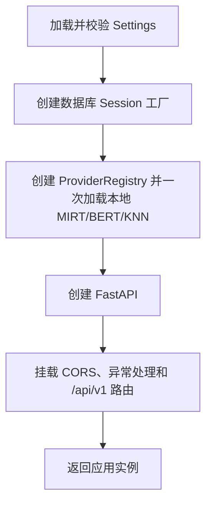

### backend/app/api.py

a. 文件用途说明：集中定义版本化 REST 端点和依赖注入入口；按迭代增加端点，文件接近 400 行时拆成 `api/` 子模块。

b. 文件内类图：无业务类，使用 FastAPI `APIRouter`。

c. 函数/方法详解：

#### `health()`

- 用途：返回进程和数据库可用状态。
- 输入参数：无。
- 输出数据结构：`HealthResponse(status)`。

#### `create_conversation(request, service)` / `list_conversations(limit, cursor, service)` / `get_conversation(id, service)` / `update_conversation(id, request, service)`

- 用途：分别创建、分页查询、读取和改标题。
- 输入参数：经 Pydantic 校验的请求或路径/查询参数，以及注入的 `ConversationService`。
- 输出数据结构：`ConversationResponse` 或 `CursorPage[ConversationListItem]`。

#### `list_messages(conversation_id, service)` / `send_message(conversation_id, request, service)`

- 用途：读取活动分支消息或同步执行一轮聊天。
- 输入参数：会话 ID、`SendMessageRequest`、`ChatService`。
- 输出数据结构：`BranchMessagesResponse` 或 `SendMessageResponse`。

#### 迭代2-5端点函数

- 用途：与“API接口定义”表逐项对应，仅做协议转换并调用 `AnswerService`、`BranchService`、`MemoryService`、`RoleService`。
- 输入参数：路径 ID、Pydantic 请求 DTO、对应 Service。
- 输出数据结构：对应响应 DTO。

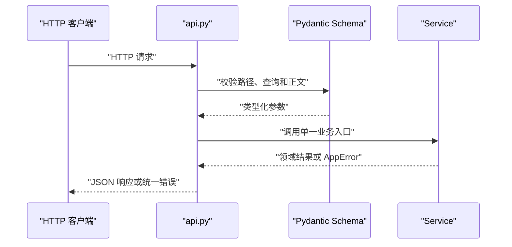

### backend/app/core/config.py

a. 文件用途说明：定义应用、模型和 Provider 配置，完成 YAML/环境变量合并、机密解析和启动校验。

b. 文件内类图：

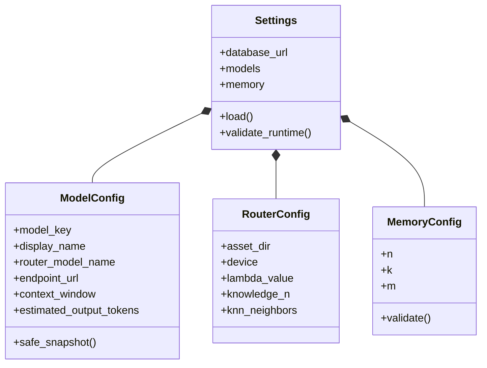

c. 函数/方法详解：

#### `Settings.load(config_paths, environ)`

- 用途：按优先级构造完整配置。
- 输入参数：YAML 路径集合、环境变量映射。
- 输出数据结构：已校验 `Settings`。

#### `Settings.validate_runtime()`

- 用途：校验三个且仅三个模型槽、固定生成参数、权重、模型 URL、价格、预计输出 Token、Tokenizer 路径、MIRT 资产与映射名、备忘录参数及生产环境 Mock 禁令。
- 输入参数：实例自身。
- 输出数据结构：无；失败抛 `ConfigurationError`。

#### `ModelConfig.safe_snapshot()`

- 用途：生成可持久化且不含 `endpoint_url` 的配置快照。
- 输入参数：实例自身。
- 输出数据结构：字典。

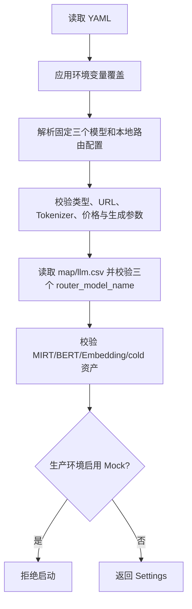

### backend/app/core/enums.py

a. 文件用途说明：集中定义持久化和 API 共用枚举，避免散落字符串。

b. 文件内类图：各枚举继承 `str, Enum`，包含需求规定值和前述最小内部状态。

c. 函数/方法详解：无行为方法；不得在枚举文件放业务转换规则。

### backend/app/core/errors.py

a. 文件用途说明：定义 `AppError` 层次及 Provider 错误到 `ErrorCategory` 的统一结构。

b. 文件内类图：

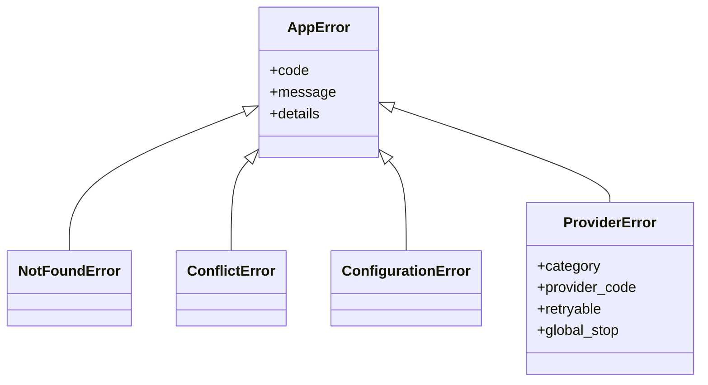

#### `classify_provider_error(provider, status_code, provider_code, message)`

- 用途：依据已知供应商映射把错误统一分类；未知错误归入 `UNKNOWN`，不得猜测为可重试。
- 输入参数：供应商键、HTTP 状态、供应商错误码、安全错误消息。
- 输出数据结构：`ProviderError`。

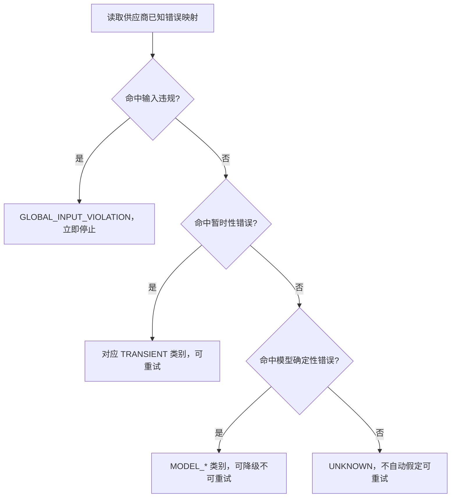

### backend/app/db/session.py

a. 文件用途说明：创建 SQLAlchemy Engine、Session 工厂和请求级会话依赖；统一 SQLite 外键开启设置。

b. 文件内类图：无业务类。

c. 函数/方法详解：

#### `create_engine_and_session_factory(database_url)`

- 用途：构造数据库连接和 `sessionmaker`。
- 输入参数：SQLAlchemy 数据库 URL。
- 输出数据结构：`(Engine, sessionmaker)`。

#### `get_session()`

- 用途：为请求提供 Session，并在异常时回滚、结束时关闭。
- 输入参数：无显式参数。
- 输出数据结构：生成器形式的 `Session`。

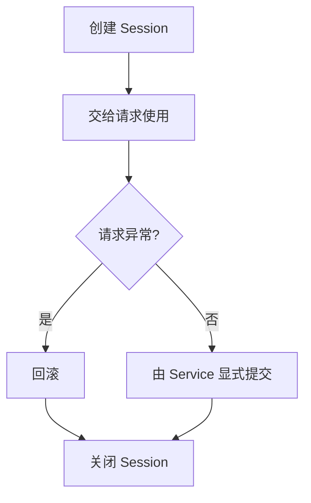

### backend/app/db/models_core.py

a. 文件用途说明：映射迭代1核心表 `Conversation`、`Branch`、`BranchMessage`、`UserMessage`、`AssistantAnswerVersion`。

b. 文件内类图：

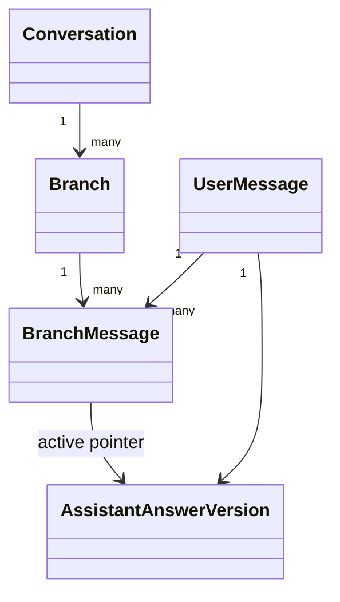

c. 函数/方法详解：ORM 类只声明字段、关系和表约束，不实现状态变更方法；状态改变统一进入 Service，避免绕过事务不变量。

### backend/app/db/models_generation.py

a. 文件用途说明：迭代2映射搜索、上下文、路由、任务与尝试实体。

b. 文件内类图：

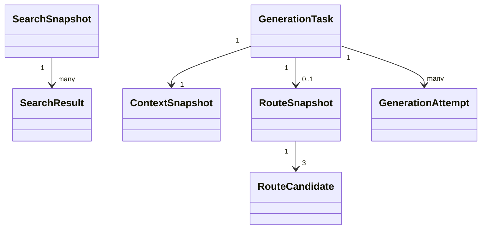

c. 函数/方法详解：同 `models_core.py`，仅声明映射；JSON 列的内容由 Schema/Service 构造后整体写入，不提供原地局部更新。

### backend/app/db/models_memory.py

a. 文件用途说明：迭代4映射 `MemoryVersion` 和 `MemoryUpdateRecord`。

b. 文件内类图：

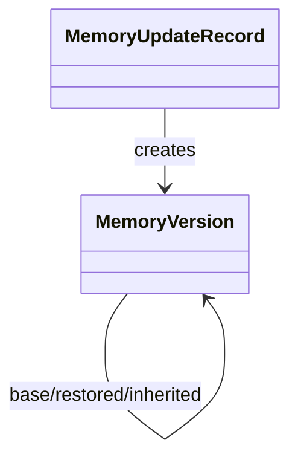

c. 函数/方法详解：仅 ORM 声明；版本记录无更新/删除方法。

### backend/app/db/models_role.py

a. 文件用途说明：迭代5映射 `RoleTemplate` 和 `RoleVersion`。

b. 文件内类图：

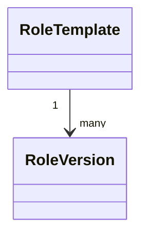

c. 函数/方法详解：仅 ORM 声明；模板允许新增，角色版本不可覆盖。

### backend/app/schemas/common.py

a. 文件用途说明：定义通用游标页、错误和健康检查响应。

b. 文件内类图：

```mermaid
classDiagram
    class ErrorBody
    class ErrorResponse
    class CursorPage~T~
    class HealthResponse
    ErrorResponse *-- ErrorBody
```

c. 函数/方法详解：

#### `encode_cursor(updated_at, id)` / `decode_cursor(cursor)`

- 用途：生成和解析带版本号的不透明分页游标。
- 输入参数：排序时间与 ID，或游标字符串。
- 输出数据结构：字符串，或 `(updated_at, id)`；非法值抛请求错误。

```mermaid
flowchart LR
    A["排序键"] --> B["序列化版本、时间和 ID"] --> C["URL 安全编码"] --> D["不透明游标"]
```

### backend/app/schemas/conversations.py

a. 文件用途说明：会话创建、改标题、列表项及详情 DTO。

b. 文件内类图：`CreateConversationRequest`、`UpdateConversationRequest`、`ConversationResponse`、`ConversationListItem`。

c. 函数/方法详解：Pydantic 字段校验器只执行空白、长度和枚举校验；标题业务来源判断由 Service 完成。

### backend/app/schemas/chat.py

a. 文件用途说明：消息、回答、模型选择、分支消息视图和发送结果 DTO；AnswerResponse 输出持久化的 `display_name_snapshot`，不按当前 YAML 重算历史展示名。

b. 文件内类图：`SendMessageRequest` 聚合 `SelectionMode` 与可空 `model_key`；`SendMessageResponse` 聚合 `UserMessageResponse`、可空 `AnswerResponse` 和生成结果。

c. 函数/方法详解：

#### `validate_model_selection(values)`

- 用途：保证自动模式无模型键、手动模式必须指定 `MODEL_A/B/C`。
- 输入参数：请求字段集合。
- 输出数据结构：已校验请求；组合非法时产生 422。

```mermaid
flowchart TD
    A["读取 selection_mode 与 model_key"] --> B{"自动路由?"}
    B -- "是" --> C{"model_key 为空?"}
    B -- "否" --> D{"model_key 属于三个配置槽?"}
    C -- "是" --> E["通过"]
    C -- "否" --> F["拒绝"]
    D -- "是" --> E
    D -- "否" --> F
```

### backend/app/schemas/generation.py

a. 文件用途说明：迭代2定义搜索、路由候选、生成任务/尝试和回答元信息响应；不会向前端暴露搜索 URL 或密钥。

b. 文件内类图：`SearchSummary`、`RouteCandidateResponse`、`RouteSummary`、`AttemptResponse`、`GenerationTaskResponse`。

c. 函数/方法详解：无业务函数；`from_attributes` 只负责 ORM 到响应映射，敏感字段根本不出现在 Schema 中。

### backend/app/schemas/branches.py

a. 文件用途说明：迭代3定义重新生成、回答激活、历史编辑、分支列表和切换 DTO。

b. 文件内类图：`RegenerateRequest`、`ActivateAnswerRequest`、`EditMessageRequest`、`BranchResponse`、`BranchOperationResponse`。

c. 函数/方法详解：重新生成模式/模型键交叉校验与发送消息相同；分支规则由 Service 执行。

### backend/app/schemas/memories.py

a. 文件用途说明：迭代4定义当前备忘录、版本历史、用户编辑和恢复响应。

b. 文件内类图：`MemoryResponse`、`MemoryVersionResponse`、`UpdateProtectedMemoryRequest`、`MemoryUpdateStatusResponse`。

c. 函数/方法详解：保护区允许空字符串；不得接收客户端提交的系统摘要、覆盖范围或版本号。

### backend/app/schemas/roles.py

a. 文件用途说明：迭代5定义角色与模板输入输出。

b. 文件内类图：`RoleContentRequest`、`RoleVersionResponse`、`RoleTemplateRequest`、`RoleTemplateResponse`。

c. 函数/方法详解：字段只做长度/类型校验；渲染顺序在 `RoleService` 固定，客户端不能提交原始 system prompt。

### backend/app/repositories/conversations.py

a. 文件用途说明：封装会话、主分支、会话游标分页和活动分支查询。

b. 文件内类图：

```mermaid
classDiagram
    class ConversationRepository {
      +create_with_root_branch(title, title_source)
      +get(conversation_id)
      +list_page(limit, cursor_key)
      +update_title(conversation, title, source)
      +set_active_branch(conversation, branch)
      +touch(conversation, at)
    }
```

c. 函数/方法详解：

#### `create_with_root_branch(title, title_source)`

- 用途：在当前事务创建会话与 ROOT 分支并建立双向指针。
- 输入参数：标题、标题来源。
- 输出数据结构：`Conversation`。

#### `get(conversation_id)`

- 用途：读取会话，不存在则由 Service 转为 404。
- 输入参数：UUID。
- 输出数据结构：`Conversation | None`。

#### `list_page(limit, cursor_key)`

- 用途：执行 `(updated_at, id)` 键集分页。
- 输入参数：数量及可空上一页末尾排序键。
- 输出数据结构：最多 `limit + 1` 项，用多取一项判断 `has_more`。

#### `update_title(...)` / `set_active_branch(...)` / `touch(...)`

- 用途：在 Service 已验证后修改可变的会话投影字段。
- 输入参数：目标 ORM 对象及新值。
- 输出数据结构：更新后的 ORM 对象。

```mermaid
flowchart TD
    A["按 updated_at DESC, id DESC 查询 limit+1"] --> B{"有游标?"}
    B -- "是" --> C["增加严格小于上一排序键条件"]
    B -- "否" --> D["直接执行"]
    C --> D
    D --> E["取前 limit 项"]
    E --> F["由额外一项生成 has_more 和 next_cursor"]
```

### backend/app/repositories/chat.py

a. 文件用途说明：核心消息、分支消息关联、回答版本和活动分支历史查询。

b. 文件内类图：

```mermaid
classDiagram
    class ChatRepository {
      +append_user_message(branch, content)
      +list_effective_messages(branch_id, through_position)
      +create_answer_version(data)
      +activate_answer(branch_message, answer)
      +has_later_messages(branch_id, position)
      +get_branch_message(branch_id, message_id)
    }
```

c. 函数/方法详解：

#### `append_user_message(branch, content)`

- 用途：创建不可变 UserMessage，并以当前最大位置加一创建 BranchMessage。
- 输入参数：目标 Branch、正文。
- 输出数据结构：`(UserMessage, BranchMessage)`。

#### `list_effective_messages(branch_id, through_position=None)`

- 用途：按逻辑位置读取用户消息及该分支当前回答；用于页面和上下文。
- 输入参数：分支 ID、可空截止位置。
- 输出数据结构：有序的 `EffectiveTurn` 列表。

#### `create_answer_version(data)`

- 用途：新增回答版本，不隐式激活；迭代2先创建 `GENERATING` 版本，再由任务终态完成。
- 输入参数：已校验的回答字段或 GenerationTask 关联。
- 输出数据结构：`AssistantAnswerVersion`。

#### `activate_answer(branch_message, answer)`

- 用途：校验归属后更新分支指针，按引用情况重算回答 ACTIVE/INACTIVE 状态。
- 输入参数：BranchMessage、成功回答版本。
- 输出数据结构：激活结果，包含旧/新版本。

#### `has_later_messages(branch_id, position)` / `get_branch_message(...)`

- 用途：判断是否需要分支和定位关联。
- 输入参数：分支、位置或消息 ID。
- 输出数据结构：布尔值或 `BranchMessage | None`。

```mermaid
sequenceDiagram
    participant S as "Service"
    participant R as "ChatRepository"
    participant DB as "SQLite"
    S->>R: "activate_answer(branch_message, answer)"
    R->>DB: "校验回答属于同一 UserMessage 且成功"
    R->>DB: "更新 active_answer_version_id"
    R->>DB: "查询旧/新回答是否仍被其他分支引用"
    R->>DB: "更新派生 AnswerVersionStatus"
    R-->>S: "ActivationResult"
```

### backend/app/repositories/generation.py

a. 文件用途说明：迭代2追加搜索/上下文/路由/任务/尝试快照并读取生成详情。

b. 文件内类图：`GenerationRepository` 提供 `create_search_snapshot`、`create_context_snapshot`、`create_task`、`create_route_snapshot`、`append_attempt`、`finish_task`、`get_task_details`。

c. 函数/方法详解：

- `create_search_snapshot(user_message_id, result)`：输入消息 ID 与规范化搜索结果；输出快照；若消息已有快照则拒绝，不做覆盖。
- `create_context_snapshot(payload)`：输入完整不可变载荷；输出 ContextSnapshot。
- `create_task(data)`：输入模式、来源和关联 ID；同事务创建 GenerationTask 与一对一 `GENERATING` 回答版本，输出两者。
- `create_route_snapshot(task_id, candidates, metadata)`：一次写入快照及恰好三个候选；输出排名。
- `append_attempt(task_id, attempt)`：以当前最大 index + 1 追加；输出 Attempt。
- `finish_task(task_id, status, failure)`：只允许从进行态转终态；输出任务。
- `get_task_details(task_id)`：返回任务及有序尝试、搜索、路由详情。

```mermaid
flowchart LR
    A["规范化 Provider 结果"] --> B["创建不可变记录"] --> C["提交短事务"] --> D["返回持久化 ID"]
```

### backend/app/repositories/memories.py

a. 文件用途说明：迭代4负责备忘录版本、更新记录、覆盖范围与继承查询。

b. 文件内类图：`MemoryRepository` 提供 `get_current`、`list_versions`、`create_version`、`create_update_record`、`finish_update_record`、`find_inheritable_version`。

c. 函数/方法详解：

- `get_current(branch_id)`：根据分支指针读取当前版本。
- `list_versions(branch_id, cursor)`：按版本号倒序游标分页。
- `create_version(data)`：以分支最大版本号加一新增，不修改旧版本。
- `create_update_record(range)` / `finish_update_record(...)`：记录同步更新开始和终态。
- `find_inheritable_version(source_branch_id, fork_position)`：找 `covered_through_position < fork_position` 的最新有效版本。

```mermaid
flowchart TD
    A["按源分支筛选备忘录版本"] --> B["要求 covered_through_position 严格小于分叉位置"]
    B --> C["按 version_number 倒序取一条"]
    C --> D["返回版本或无可继承版本"]
```

### backend/app/repositories/roles.py

a. 文件用途说明：迭代5负责角色模板、不可变角色版本和分支生效指针。

b. 文件内类图：`RoleRepository` 提供 `list_templates`、`create_template`、`create_version`、`get_active_for_branch`、`set_active_for_branch`。

c. 函数/方法详解：各方法输入会话/分支与角色内容，输出对应 ORM；`set_active_for_branch` 必须验证 RoleVersion 属于同一 Conversation。

### backend/app/providers/model.py

a. 文件用途说明：定义统一模型请求/响应、固定的无鉴权 text completion HTTP 适配器和测试 Mock。按已确认示例使用 `requests.post` 直接调用 `endpoint_url`，不引入供应商 SDK。

b. 文件内类图：

```mermaid
classDiagram
    class ModelProvider {
      <<interface>>
      +generate(request) ModelResult
      +check_availability(config) Availability
    }
    class CompletionModelProvider
    class MockModelProvider
    ModelProvider <|.. CompletionModelProvider
    ModelProvider <|.. MockModelProvider
```

c. 函数/方法详解：

#### `ModelProvider.generate(request)`

- 用途：完整非流式生成。
- 输入参数：`ModelRequest(model_key, endpoint_url, prompt, max_tokens=1024, temperature=0.7, timeout_seconds)`；不包含 messages、API Key 或 logprobs 参数。
- 输出数据结构：扩展现有结构为 `ModelResult(content, model_key, model_id, input_tokens, output_tokens, total_tokens, finish_reason, provider_request_id)`；其中 `model_id` 取响应 `model`，错误统一抛 `ProviderError`。

#### `ModelProvider.check_availability(config)`

- 用途：调用前判断配置和本地适配器是否可用，不要求对供应商额外发探测请求。
- 输入参数：ModelConfig。
- 输出数据结构：`Availability(available, reason)`。

#### `CompletionModelProvider.generate(request)`

- 用途：向配置的完整 `/v1/completions` URL 发起无鉴权非流式请求，并严格解析已确认响应结构。
- 输入参数：统一 ModelRequest。
- 输出数据结构：统一 ModelResult；只保留必要安全字段，不返回整个原始响应。

#### `build_payload(request)`

- 用途：构造唯一允许的正式请求体。
- 输入参数：prompt、`max_tokens=1024`、`temperature=0.7`。
- 输出数据结构：仅含上述三个键的 dict；`logprobs` 和 `logprobs_mode` 不得出现。

#### `parse_completion_response(payload)`

- 用途：校验 `object=text_completion`、唯一首选 `choices[0].text`、`finish_reason`、`model`、`id` 与 usage Token。
- 输入参数：已解析 JSON object。
- 输出数据结构：ModelResult；缺字段、类型错误、空正文或 Token 合计不一致抛模型响应错误。

#### `MockModelProvider.generate(request)`

- 用途：测试中按预设脚本返回成功或指定错误序列。
- 输入参数：统一请求和测试脚本。
- 输出数据结构：确定性的 ModelResult 或 ProviderError；生产注册器拒绝加载。

```mermaid
flowchart TD
    A["接收统一 ModelRequest"] --> B["构造 prompt、max_tokens、temperature"]
    B --> C["无鉴权 POST 完整 endpoint_url"]
    C --> D{"成功?"}
    D -- "是" --> E["校验 text、model、finish_reason、usage 和 id"]
    D -- "否" --> F["按 HTTP/网络/解析类型转换 ProviderError"]
```

### backend/app/providers/search.py

a. 文件用途说明：定义搜索查询/结果、`SearchProvider`、待文档确认的 `Search360Provider` 和测试 Mock。

b. 文件内类图：

```mermaid
classDiagram
    class SearchProvider {
      <<interface>>
      +search(request) SearchResponse
    }
    class Search360Provider
    class MockSearchProvider
    SearchProvider <|.. Search360Provider
    SearchProvider <|.. MockSearchProvider
```

c. 函数/方法详解：

- `SearchProvider.search(request)`：输入独立可理解的 query 和最大结果数；输出规范化 status、query、results、latency。
- `Search360Provider.search(request)`：迭代2先保留真实适配边界；只有取得官方接口地址、鉴权和返回格式后才实现映射。未配置时输出 `FAILED`，不返回虚假结果。
- `MockSearchProvider.search(request)`：测试按脚本返回四种状态及重复结果。
- `normalize_and_deduplicate(results, limit)`：输入 Provider 规范化结果；按规范化 URL 与标题/摘要相似键去重并保序；输出最多 5 项。它不抓网页正文。

```mermaid
flowchart TD
    A["调用搜索 Provider"] --> B{"调用成功?"}
    B -- "否" --> C["映射 FAILED 或 TIMEOUT"]
    B -- "是" --> D["过滤缺少标题或摘要的无效项"]
    D --> E["按 URL 和规范化文本去重"]
    E --> F{"还有有效结果?"}
    F -- "是" --> G["SUCCESS_WITH_RESULTS，最多五条"]
    F -- "否" --> H["SUCCESS_NO_VALID_RESULTS"]
```

### backend/app/providers/router.py

a. 文件用途说明：定义路由预测接口、本地 MIRT+BERT 推理实现和 Mock。真实实现读取项目内只读资产，不调用外部路由服务，也不为未知模型生成向量。

b. 文件内类图：

```mermaid
classDiagram
    class RouterProvider {
      <<interface>>
      +predict(request) RouterPredictionSet
    }
    class LocalMirtRouterProvider {
      +load(asset_dir) LocalMirtRouterProvider
      +encode_question(question) ndarray
      +predict(request) RouterPredictionSet
    }
    class MirtAssetBundle {
      +llm_embeddings
      +query_embeddings
      +cold_embeddings
      +llm_id_map
      +query_id_map
      +knn
    }
    class MockRouterProvider
    RouterProvider <|.. MockRouterProvider
    RouterProvider <|.. LocalMirtRouterProvider
    LocalMirtRouterProvider *-- MirtAssetBundle
```

c. 函数/方法详解：

- `RouterProvider.predict(request)`：输入 `current_user_text` 与合格候选的 `model_key/router_model_name`；输出每候选 `predicted_accuracy` 和路由器版本。MIRT 不输出 Token 数。
- `LocalMirtRouterProvider.load(asset_dir)`：启动时加载 MIRT 权重、BERT tokenizer/model、llm/query/cold Embedding、CSV 映射，并用全部训练问题向量拟合 `NearestNeighbors(n_neighbors=5)`；输出可复用只读实例。任一文件、键或 768 维约束不满足即抛 `ConfigurationError`。
- `LocalMirtRouterProvider.encode_question(question)`：命中 `map/query.csv` 时读取既有 query 向量；cold 向量缺失时按参考实现使用 768 维零向量，再按 `0.9/0.1` 混合。未命中时用本地 BERT last hidden state mean pooling，再取 5 个近邻训练问题向量均值；此时 query/cold 同为该均值，混合后不变。
- `LocalMirtRouterProvider.predict(request)`：按 `router_model_name → llm.csv index → llm_embeddings` 取模型向量，在 `eval/no_grad/cpu` 下逐候选调用 MIRT，输出 `[0,1]` 准确率映射。
- `MockRouterProvider.predict(request)`：测试按候选键返回可控准确率。
- `validate_predictions(candidates, predictions)`：确保每个合格候选恰有一项且准确率在 `[0,1]`；失败视为路由不可执行。

```mermaid
sequenceDiagram
    participant S as "backend/app/services/routing.py"
    participant R as "backend/app/providers/router.py"
    participant B as "resources/router/bert-base-uncased"
    participant M as "backend/app/providers/mirt.py"
    S->>R: "predict(current_user_text, candidates)"
    alt "问题未命中 query.csv"
        R->>B: "tokenize + BertModel(text)"
        B-->>R: "768 维 embedding"
        R->>R: "KNN 5 邻居均值"
    else "问题已存在"
        R->>R: "读取 query/cold 并按 0.9/0.1 混合"
    end
    loop "每个合格候选"
        R->>M: "generate(llm_vector, query_vector, cpu)"
        M-->>R: "predicted_accuracy"
    end
    R-->>S: "RouterPredictionSet"
```

### backend/app/providers/mirt.py

a. 文件用途说明：从参考 `router/MIRT.py` 复用并收敛为仅运行时推理所需的 MIRT 2PL 网络定义；训练、评估、tqdm 和 sklearn 指标函数不复制进生产模块。

b. 文件内类图：

```mermaid
classDiagram
    class MIRTNet {
      +forward(llm, item)
      +irf(theta, a, b)
    }
    class MIRT {
      +load(filepath)
      +generate(llm, item, device)
    }
    MIRT *-- MIRTNet
```

c. 函数/方法详解：

- `irt2pl(theta, a, b, F)`：输入模型能力、问题区分度和难度张量；输出 2PL sigmoid 预测。
- `MIRTNet.forward(llm, item)`：输入 768 维模型与问题向量；经 theta/a/b 线性层输出预测与中间张量。
- `MIRT.load(filepath)`：输入项目内 `mirt_bert.snapshot`；在 CPU 加载状态字典并切换 eval，输出无。
- `MIRT.generate(llm, item, device="cpu")`：输入两个向量；在 no_grad 下输出单一 Python float，非有限值或范围越界抛路由错误。

```mermaid
flowchart TD
    A["读取 768 维模型与问题向量"] --> B["线性变换得到 theta、a、b"]
    B --> C["应用 MIRT 2PL sigmoid"]
    C --> D{"结果有限且位于 0 到 1?"}
    D -- "是" --> E["返回 predicted_accuracy"]
    D -- "否" --> F["抛出路由预测错误"]
```

### backend/app/providers/tokenizer.py

a. 文件用途说明：为各候选模型提供准确 Token 计数接口。

b. 文件内类图：

```mermaid
classDiagram
    class TokenizerProvider {
      <<interface>>
      +count_prompt(model_config, prompt) int
    }
    class HuggingFaceTokenizerProvider
    class MockTokenizerProvider
    TokenizerProvider <|.. HuggingFaceTokenizerProvider
    TokenizerProvider <|.. MockTokenizerProvider
```

c. 函数/方法详解：

- `count_prompt(model_config, prompt)`：用 `tokenizer_path` 对统一 Prompt 编码，输入模型配置和完整 prompt，输出不加生成 Token 的输入 Token 数。缺失或加载失败时返回明确不合格原因，不用字符数或路由 BERT 估算。
- `HuggingFaceTokenizerProvider.load(path)`：只从本地路径以 `local_files_only=true` 加载 AutoTokenizer，并由 Registry 按规范化绝对路径缓存；禁止运行时联网下载。
- `HuggingFaceTokenizerProvider.count_prompt(...)`：调用 `encode(prompt, add_special_tokens=true)` 并返回长度；该值是路由前预测值，成功后仍以 API usage 为实际值。
- `MockTokenizerProvider.count_prompt(...)`：测试返回脚本化数值。

### backend/app/providers/registry.py

a. 文件用途说明：构造本地 MIRT 单例和按路径缓存的 Tokenizer，集中执行生产禁用 Mock 规则。

b. 文件内类图：

```mermaid
classDiagram
    class ProviderRegistry {
      +initialize(settings)
      +get_model_provider(model_config)
      +get_search_provider(settings)
      +get_router_provider(settings)
      +get_tokenizer(model_config)
    }
```

c. 函数/方法详解：`initialize(settings)` 在应用创建时加载 LocalMirtRouterProvider，失败即阻止启动；`get_model_provider(model_config)` 始终返回固定 CompletionModelProvider；`get_router_provider(settings)` 返回已初始化单例；`get_tokenizer(model_config)` 按规范化路径缓存实例；测试通过依赖注入替换。注册表不做运行时插件扫描，以保持简单和可审计。

### backend/app/services/title.py

a. 文件用途说明：实现无需模型的首消息标题规则。

b. 文件内类图：无类，使用纯函数。

c. 函数/方法详解：

#### `make_title(content, max_chars=30)`

- 用途：把首条消息转为会话标题。
- 输入参数：原始正文、最大字符数。
- 输出数据结构：字符串。

```mermaid
flowchart TD
    A["去除首尾空白"] --> B["将连续换行和空白单行化"]
    B --> C{"结果为空?"}
    C -- "是" --> D["返回 新会话"]
    C -- "否" --> E{"字符数大于三十?"}
    E -- "否" --> F["返回全文"]
    E -- "是" --> G["取前三十字符并追加省略号"]
```

### backend/app/services/conversations.py

a. 文件用途说明：会话创建、分页、详情、标题修改和模型选择列表业务入口。

b. 文件内类图：

```mermaid
classDiagram
    class ConversationService {
      +create(request)
      +list_page(limit, cursor)
      +get(conversation_id)
      +rename(conversation_id, title)
      +list_model_options()
    }
```

c. 函数/方法详解：

- `create(request)`：输入可空标题；创建会话与 ROOT 分支；输出详情。
- `list_page(limit, cursor)`：输入分页参数；解析游标、查询并生成下一游标；输出稳定页面。
- `get(conversation_id)`：输入 ID；输出会话和活动分支摘要。
- `rename(conversation_id, title)`：输入 ID 和非空标题；更新 `title_source=USER_EDIT`；输出详情。
- `list_model_options()`：输入当前 Settings；输出 MODEL_A/B/C、`label=display_name` 和可用状态，不返回 endpoint URL、价格、Tokenizer 路径或 `router_model_name`，从而复用迭代1 ModelOption 契约。

```mermaid
sequenceDiagram
    participant A as "API"
    participant S as "ConversationService"
    participant R as "ConversationRepository"
    A->>S: "create(title?)"
    S->>S: "确定 DEFAULT 或 USER_EDIT 标题来源"
    S->>R: "create_with_root_branch"
    S->>R: "提交事务"
    R-->>S: "Conversation"
    S-->>A: "ConversationResponse"
```

### backend/app/services/chat.py

a. 文件用途说明：发送新消息的稳定总入口。迭代1执行最小 Mock 生成；迭代2委托上下文、搜索、路由和生成 Service，但保持端点契约。

b. 文件内类图：

```mermaid
classDiagram
    class ChatService {
      +send_message(conversation_id, request)
      +list_active_branch_messages(conversation_id)
      -create_search_query(message, context)
      -auto_title_if_needed(conversation, message)
    }
```

c. 函数/方法详解：

#### `send_message(conversation_id, request)`

- 用途：保存新用户消息并完成一次同步生成。
- 输入参数：会话 ID、正文、选择模式和可空模型键。
- 输出数据结构：`SendMessageResult`，包含已持久化用户消息、可空回答、任务和元信息。

```mermaid
flowchart TD
    A["读取会话和活动分支"] --> B["校验模型选择组合"]
    B --> C["事务一：追加不可变消息并更新会话时间"]
    C --> D["若是首消息且标题未手改则自动标题"]
    D --> E["迭代2：强制搜索并保存唯一快照"]
    E --> F["构建并保存上下文快照"]
    F --> G{"自动还是手动?"}
    G -- "自动" --> H["RoutingService 创建排序快照"]
    G -- "手动" --> I["校验指定模型硬条件"]
    H --> J["GenerationService 执行尝试链"]
    I --> J
    J --> K{"成功?"}
    K -- "是" --> L["事务：新增回答并在当前分支激活"]
    K -- "否" --> M["保留消息与失败任务"]
    L --> N["迭代4：触发备忘录检查"]
    N --> O["返回结果；前端复位自动选择"]
    M --> O
```

迭代1的 `send_message` 只走 A-D，随后调用注入的 `MockModelProvider` 并保存一个回答；Mock 只存在测试/开发验收配置。迭代2起生产未配置真实模型时必须返回明确失败，不能沿用固定回答。

#### `list_active_branch_messages(conversation_id)`

- 用途：返回活动分支线性消息及分支当前回答。
- 输入参数：会话 ID。
- 输出数据结构：`BranchMessagesResponse`。

#### `create_search_query(message, context)`

- 用途：不增加额外模型调用，以确定性方式把当前消息与可用上下文组合为可独立阅读的查询文本。
- 输入参数：当前消息、当前备忘录、最近原始对话和角色领域文本。
- 输出数据结构：传给 SearchProvider 的 query 字符串及构建来源元数据。

组合顺序固定为“当前问题 → 当前系统摘要中的主题背景 → 未被摘要覆盖的最近有效用户消息 → 角色专业领域”，空段跳过；使用原有文本，不调用路由器冒充查询改写器，也不产生新的推断内容。360 API 的查询长度和字段限制尚未提供，因此最终截断/字段映射只能在取得官方文档后确定；在此之前 Mock 验证组合顺序，真实服务未配置时按 `FAILED` 保存。这样满足上下文指代问题必须携带背景的要求，同时不虚构额外智能能力。

### backend/app/services/context.py

a. 文件用途说明：迭代2按固定优先顺序构建完整不可变上下文，并按已确认统一文本格式渲染 Prompt；执行覆盖范围裁剪但不为短上下文模型静默删历史。

b. 文件内类图：

```mermaid
classDiagram
    class ContextService {
      +build(branch_id, user_message_id, search_snapshot_id)
      +render_prompt(snapshot)
    }
```

c. 函数/方法详解：

#### `build(branch_id, user_message_id, search_snapshot_id)`

- 用途：按系统规则、角色、保护区、系统摘要、未覆盖历史、搜索标题摘要/失败状态、当前消息的顺序生成快照。
- 输入参数：分支、当前消息和唯一搜索快照 ID。
- 输出数据结构：`ContextSnapshotPayload`；保存后由 `render_prompt` 得到本任务唯一 prompt。

#### `render_prompt(snapshot)`

- 用途：按 `System/User/Assistant` 标签和固定空行规则把快照转换为唯一文本 Prompt；跳过空系统子段，以 `Assistant:` 结尾。
- 输入参数：不可变快照。
- 输出数据结构：string；同一快照重复渲染必须逐字节一致。

```mermaid
flowchart TD
    A["读取分支当前角色和备忘录"] --> B["读取备忘录覆盖位置之后的有效原始轮"]
    B --> C["只选择各 BranchMessage 当前回答"]
    C --> D["读取搜索标题摘要或失败状态"]
    D --> E["按固定顺序构造 ContextSnapshot"]
    E --> F["渲染统一 System/User/Assistant Prompt"]
```

### backend/app/services/routing.py

a. 文件用途说明：迭代2完成候选硬筛选、统一 Prompt 的各模型 Token 计算、本地 MIRT 准确率预测、配置预计输出 Token、成本和综合评分、不可变排序。

b. 文件内类图：

```mermaid
classDiagram
    class RoutingService {
      +route(task, context, prompt, model_configs)
      +filter_candidate(model, context)
      +calculate_predicted_cost(input_tokens, output_tokens, prices)
      +calculate_scores(candidates)
    }
```

c. 函数/方法详解：

#### `filter_candidate(model, context)`

- 用途：评分前检查启用、完整 endpoint、HTTP Provider、Tokenizer、MIRT 映射名及完整 Prompt 上下文上限。
- 输入参数：ModelConfig、ContextSnapshot、统一 Prompt。
- 输出数据结构：`CandidateEligibility`，合格时含预测前输入 Token 数，不合格时含单一主原因和可选详情。

#### `calculate_predicted_cost(input_tokens, output_tokens, prices)`

- 用途：用 Decimal 计算预计成本。
- 输入参数：Tokenizer 得到的非负输入 Token、模型配置 `estimated_output_tokens`、每 Token 输入/输出价格。
- 输出数据结构：Decimal。

#### `calculate_scores(candidates)`

- 用途：计算成本得分和综合得分，并以 `route_score DESC, predicted_accuracy DESC, predicted_cost ASC, model_key ASC` 稳定排序。后续键只处理并列，不改变公式。
- 输入参数：全部合格且已有预测的候选。
- 输出数据结构：带分数和 rank 的候选列表。

#### `route(task, context, prompt, model_configs)`

- 用途：编排筛选、Token 计算、本地 MIRT 预测、配置预计输出 Token、成本和持久化。
- 输入参数：GenerationTask、ContextSnapshot、唯一统一 Prompt、启动时加载的三个模型配置快照。
- 输出数据结构：`RoutePlan(route_snapshot_id, ranked_model_keys)`。

```mermaid
sequenceDiagram
    participant G as "GenerationService"
    participant R as "RoutingService"
    participant T as "TokenizerProvider"
    participant P as "RouterProvider"
    participant DB as "GenerationRepository"
    G->>R: "route(task, context, prompt, MODEL_A/B/C)"
    loop "三个候选"
        R->>T: "count_prompt(model, prompt)"
        T-->>R: "input_tokens 或不合格"
    end
    R->>P: "predict(current_user_text, eligible_candidates)"
    P-->>R: "每候选 accuracy"
    R->>R: "读取每候选 estimated_output_tokens"
    R->>R: "计算成本、得分和稳定排名"
    R->>DB: "保存三个候选的不可变快照"
    DB-->>G: "RoutePlan"
```

### backend/app/services/generation.py

a. 文件用途说明：迭代2执行统一生成任务、错误分类、单模型一次重试、自动降级和成本落库。

b. 文件内类图：

```mermaid
classDiagram
    class GenerationService {
      +execute_auto(task, route_plan, prompt)
      +execute_manual(task, model_key, prompt)
      -attempt_model(task, model, prompt, retry_of)
      -should_retry(error)
      -should_fallback(error)
      -persist_success(task, attempt, result)
    }
```

c. 函数/方法详解：

#### `execute_auto(task, route_plan, prompt)`

- 用途：严格按路由快照排名执行，每个模型暂时性错误最多重试一次。
- 输入参数：任务、不可变排序、由不可变上下文渲染的同一 Prompt。
- 输出数据结构：`GenerationOutcome`，成功含最终模型和回答；失败含尝试链与错误。

#### `execute_manual(task, model_key, prompt)`

- 用途：只调用指定模型；暂时性错误是否自动重试遵循“手动失败由用户选择后续操作”，因此本方法不自动重试也不降级。
- 输入参数：任务、指定槽、统一 Prompt。
- 输出数据结构：GenerationOutcome。

#### `attempt_model(task, model, prompt, retry_of=None)`

- 用途：执行一次 Provider 调用并无论成功失败都追加 Attempt。
- 输入参数：任务、模型配置、逐字复用的 Prompt、可空被重试尝试 ID。
- 输出数据结构：ModelResult 或 ProviderError；Attempt 已落库。

#### `should_retry(error)` / `should_fallback(error)`

- 用途：把错误类别映射为状态机决定。
- 输入参数：ProviderError。
- 输出数据结构：布尔值；全局错误两者都为 false，模型确定性错误只允许 fallback。

#### `persist_success(task, attempt, result)`

- 用途：用响应 `usage.prompt_tokens/completion_tokens` 和同价格版本计算实际成本，保存响应 `model/id/finish_reason`，完成任务对应回答版本并激活。
- 输入参数：任务、成功尝试、规范化结果。
- 输出数据结构：AssistantAnswerVersion。

```mermaid
flowchart TD
    A["取当前模型"] --> B["追加一次调用尝试"]
    B --> C{"成功?"}
    C -- "是" --> D["计算实际成本并完成回答版本"]
    C -- "否" --> E{"全局错误?"}
    E -- "是" --> F["立即失败"]
    E -- "否" --> G{"自动模式且暂时性且尚未重试?"}
    G -- "是" --> H["同模型追加一次重试"]
    H --> C
    G -- "否" --> I{"自动模式且存在下一候选?"}
    I -- "是" --> J["按原排名取下一模型"]
    J --> B
    I -- "否" --> K["任务和回答版本标记失败，回答不激活"]
```

选择模式记录规则：自动模式中首选模型成功为 `AUTO_ROUTE`；发生跨模型降级后最终回答为 `AUTO_FALLBACK`；同一首选模型重试成功仍为 `AUTO_ROUTE`；手动及两种跳过路由的指定模式记录 `USER_SELECTED`。

### backend/app/services/answers.py

a. 文件用途说明：迭代3处理三种重新生成和已有版本激活，共享分支安全激活策略。

b. 文件内类图：

```mermaid
classDiagram
    class AnswerService {
      +regenerate(branch_id, message_id, request)
      +activate(branch_id, message_id, answer_id)
      -activate_with_branch_safety(...)
    }
```

c. 函数/方法详解：

#### `regenerate(branch_id, message_id, request)`

- 用途：复用原消息和搜索快照，新建 ContextSnapshot、GenerationTask 和回答版本。
- 输入参数：操作分支、消息、模式和可空模型键。
- 输出数据结构：回答/失败任务及可空新分支。

模式解析：原模型取当前分支所选回答实际 `model_key`；自动模式创建新路由快照；临时指定只用请求模型。三者都不创建 SearchSnapshot。

#### `activate(branch_id, message_id, answer_id)`

- 用途：激活已成功版本，历史位置有后续消息则建分支。
- 输入参数：分支、消息和回答 ID。
- 输出数据结构：`ActivationOutcome(branch_id, created_branch, active_answer)`。

#### `activate_with_branch_safety(...)`

- 用途：统一“直接激活还是分支激活”判断，供重新生成成功和显式激活复用。
- 输入参数：目标分支消息与答案。
- 输出数据结构：ActivationOutcome。

```mermaid
flowchart TD
    A["验证回答成功且属于目标用户消息"] --> B{"目标位置后有消息?"}
    B -- "否" --> C["同事务直接更新 BranchMessage 指针"]
    B -- "是" --> D["BranchService 从该位置创建新分支"]
    D --> E["新分支在该位置选择目标回答且无后续链接"]
    C --> F["重算回答 ACTIVE/INACTIVE 状态"]
    E --> F
```

### backend/app/services/branches.py

a. 文件用途说明：迭代3创建/切换分支及迭代4/5继承备忘录和角色。

b. 文件内类图：

```mermaid
classDiagram
    class BranchService {
      +edit_user_message(source_branch_id, message_id, request)
      +fork_for_answer(source_branch_id, message_id, answer_id)
      +activate(conversation_id, branch_id)
      +list(conversation_id)
      -inherit_memory(source_branch, fork_position)
      -inherit_role(source_branch, fork_position)
    }
```

c. 函数/方法详解：

#### `edit_user_message(source_branch_id, message_id, request)`

- 用途：保留原分支，复制分叉位置之前的 BranchMessage 关联，创建修改后的新消息，再执行新搜索和生成。
- 输入参数：源分支、被编辑消息、正文、生成选择。
- 输出数据结构：新活动分支、新消息和生成结果。

#### `fork_for_answer(source_branch_id, message_id, answer_id)`

- 用途：复制至分叉消息（含该消息）的关联，在新分支把该位置指向指定回答，不复制后续消息。
- 输入参数：源分支、分叉用户消息、目标回答。
- 输出数据结构：新 Branch。

#### `activate(conversation_id, branch_id)` / `list(conversation_id)`

- 用途：切换或列出会话分支。
- 输入参数：会话和分支 ID。
- 输出数据结构：会话/分支视图；切换只改 `Conversation.active_branch_id`，不改变历史。

#### `inherit_memory(...)` / `inherit_role(...)`

- 用途：按分叉位置创建本地继承备忘录版本，并选择当时生效角色版本。
- 输入参数：源分支、分叉逻辑位置。
- 输出数据结构：可空继承版本和角色版本 ID。

角色版本从分叉消息对应的 ContextSnapshot 读取；若分叉消息尚未生成上下文，则读取分叉位置之前最近一条 ContextSnapshot。两者均为空表示该历史位置当时无角色，不用源分支当前角色追溯填充。

```mermaid
sequenceDiagram
    participant A as "BranchService"
    participant C as "ChatRepository"
    participant M as "MemoryRepository"
    participant DB as "SQLite"
    A->>C: "读取源分支分叉前关联"
    A->>DB: "创建新 Branch"
    A->>DB: "复制允许共享的 BranchMessage 关联"
    A->>M: "查 covered_through_position 小于分叉位置的版本"
    M-->>A: "可继承版本或空"
    A->>DB: "创建 BRANCH_INHERIT 本地版本并继承角色指针"
    A->>DB: "设置 Conversation.active_branch_id"
    A->>DB: "一次提交"
```

编辑用户消息只复制 `< 分叉位置` 的链接，再创建新 UserMessage；回答分支复制 `<= 分叉位置` 的链接并替换该位置回答指针。

### backend/app/services/memories.py

a. 文件用途说明：迭代4判断触发、增量摘要、用户编辑、恢复、失败记录和冲突元数据。

b. 文件内类图：

```mermaid
classDiagram
    class MemoryService {
      +update_if_due(branch_id)
      +edit_protected_text(branch_id, text)
      +restore(branch_id, version_id)
      +get_current(branch_id)
      +list_versions(branch_id, cursor)
      -select_incremental_range(branch, current_memory)
      -detect_conflicts(protected_text, recent_turns)
    }
```

c. 函数/方法详解：

#### `update_if_due(branch_id)`

- 用途：成功回答后按 n/k/m 判断并同步尝试更新。
- 输入参数：分支 ID。
- 输出数据结构：`MemoryUpdateOutcome(UPDATED/SKIPPED/FAILED)`；失败不向上改写聊天成功状态。

触发算法：按逻辑位置读取有当前成功回答的完整轮。无摘要且总数达到 n 时，总结除最近 k 轮外的早期轮；已有摘要时，只有当前完整轮总数减去上次更新时完整轮总数达到 m 才更新，目标仍为覆盖到“当前完整轮序列中倒数第 k 轮之前”。每次只把当前 `covered_through_position` 之后且进入目标覆盖范围的完整轮交给模型。

#### `select_incremental_range(branch, current_memory)`

- 用途：计算新增摘要范围，并保证不重复包含已覆盖位置。
- 输入参数：分支及可空当前版本。
- 输出数据结构：可空 `TurnRange` 和有序完整轮。

#### `edit_protected_text(branch_id, text)`

- 用途：原样保存用户文本并创建 `USER_EDIT` 版本。
- 输入参数：分支 ID、任意自然语言文本。
- 输出数据结构：新 MemoryVersion；系统摘要和覆盖范围来自基版本。

#### `restore(branch_id, version_id)`

- 用途：以历史版本为基线创建 RESTORE 版本，并增量补齐该基线未覆盖且已经退出最近 k 轮窗口的有效历史。
- 输入参数：分支和源版本 ID。
- 输出数据结构：新当前 MemoryVersion 或记录失败且保留原当前版本。

#### `detect_conflicts(protected_text, recent_turns)`

- 用途：把保护区与后续原始对话交给 memory_model 识别潜在冲突，结果只写 `conflict_metadata_json`，不修改保护区。
- 输入参数：保护文本和最近原始轮。
- 输出数据结构：结构化冲突列表。模型失败时返回未知/未检查状态，不宣称无冲突。

```mermaid
flowchart TD
    A["读取当前版本与有效完整轮"] --> B["计算目标覆盖位置"]
    B --> C{"存在新增范围?"}
    C -- "否" --> D["SKIPPED"]
    C -- "是" --> E["记录 RUNNING"]
    E --> F["调用配置的 memory_model_id"]
    F --> G{"暂时性失败?"}
    G -- "是" --> H["同模型重试一次"]
    G -- "否且成功" --> I["创建新版本"]
    G -- "否且确定失败" --> J["记录 FAILED"]
    H --> K{"成功?"}
    K -- "是" --> I
    K -- "否" --> J
    I --> L["原样复制 protected_user_text"]
```

### backend/app/services/roles.py

a. 文件用途说明：迭代5创建模板、创建会话角色版本、设置活动分支后续生效角色并渲染上下文文本。

b. 文件内类图：

```mermaid
classDiagram
    class RoleService {
      +get_current(conversation_id)
      +update(conversation_id, content)
      +create_template(content)
      +list_templates()
      +render(role_version)
    }
```

c. 函数/方法详解：

- `get_current(conversation_id)`：输出活动分支当前角色。
- `update(conversation_id, content)`：在会话下新增 RoleVersion，并更新活动分支指针；既有 ContextSnapshot 不变，所以只影响后续消息。
- `create_template(content)` / `list_templates()`：新增或读取本地模板，不更新已有版本。
- `render(role_version)`：按名称、人格、背景、特征、风格、约束固定顺序转为上下文文本。

```mermaid
flowchart TD
    A["校验角色内容"] --> B["创建新的会话 RoleVersion"]
    B --> C["更新活动分支 active_role_version_id"]
    C --> D["后续 ContextSnapshot 读取新版本"]
    D --> E["旧 ContextSnapshot 仍引用旧版本"]
```

### frontend/src/main.tsx

a. 文件用途说明：创建 React 根节点，引入全局样式并渲染 App。

b. 文件内类图：无类。

c. 函数/方法详解：`bootstrap()` 输入 DOM 根元素，输出 React 渲染结果；根元素缺失时抛明确启动错误。

```mermaid
flowchart LR
    A["查找 root 元素"] --> B["创建 React Root"] --> C["渲染 App"]
```

### frontend/src/App.tsx

a. 文件用途说明：持有当前会话 ID、侧栏展开状态和顶层错误，协调会话列表与聊天区；收到前端隐藏动作时清空被隐藏的当前会话。

b. 文件内类图：函数组件 `App`。

c. 函数/方法详解：

#### `App()`

- 用途：渲染单页应用并管理顶层选择状态。
- 输入参数：无 props。
- 输出数据结构：React 元素。

```mermaid
flowchart TD
    A["加载首批会话"] --> B{"有当前会话?"}
    B -- "否" --> C["显示空状态和新建入口"]
    B -- "是" --> D["加载活动分支聊天"]
    D --> E["左右分栏渲染"]
    E --> F["窄屏按按钮收起或展开侧栏"]
```

#### `deleteConversation(id)`

- 用途：协调会话隐藏并避免主区继续引用已从列表隐藏的会话。
- 输入参数：`id`，待隐藏会话 ID。
- 输出数据结构：无返回值；调用 `useConversations.hide(id)`，当 `currentId === id` 时把当前选择设为 `null`。

```mermaid
sequenceDiagram
    participant CL as frontend/src/components/ConversationList.tsx
    participant APP as frontend/src/App.tsx
    participant UC as frontend/src/hooks/useConversations.ts
    CL->>APP: "onDelete(id)"
    APP->>UC: "hide(id)"
    APP->>APP: "比较 id 与 currentId"
    APP-->>CL: "完成"
```

### frontend/src/api/client.ts

a. 文件用途说明：封装 `fetch`、基础 URL、JSON 解析和统一错误；每个 API 方法保持类型化。

b. 文件内类图：`ApiClient`。

c. 函数/方法详解：

- `request<T>(path, options)`：输入相对路径和 fetch 配置；输出 `Promise<T>`；非 2xx 转换为 `ApiError`。
- `createConversation`、`listConversations`、`getMessages`、`sendMessage`：输入对应 DTO；输出类型化响应。
- 迭代2-5新增 `getGenerationTask`、`regenerate`、`activateAnswer`、`editMessage`、`listBranches`、`activateBranch`、`get/update/restoreMemory`、`get/updateRole`，只做 HTTP，不实现业务规则。

```mermaid
sequenceDiagram
    participant H as "Hook"
    participant C as "ApiClient"
    participant F as "fetch"
    H->>C: "类型化方法(request)"
    C->>F: "HTTP JSON"
    F-->>C: "Response"
    C->>C: "解析成功 DTO 或 ApiError"
    C-->>H: "Promise result"
```

### frontend/src/api/types.ts

a. 文件用途说明：声明后端响应的 TypeScript 类型和 UI 使用的枚举联合类型。

b. 文件内类图：无运行时类。

c. 函数/方法详解：无函数。类型必须与 OpenAPI 对齐；ModelOption 继续使用 `model_key/label/available`，其中 label 来自配置 display_name；Answer 使用持久化的 `display_name/model_id`。不手工加入 endpoint URL、MIRT 映射名、价格或后端没有的字段。

### frontend/src/hooks/useConversations.ts

a. 文件用途说明：管理会话首屏、游标追加、创建、前端隐藏和标题更新状态；服务端返回值保存在 `allItems`，对组件只暴露排除 `hiddenIds` 后的 `items`。

b. 文件内类图：无类，自定义 Hook。

c. 函数/方法详解：

#### `useConversations()`

- 用途：封装会话列表状态和动作。
- 输入参数：无。
- 输出数据结构：`items/loading/error/hasMore/loadMore/create/hide/refresh/reload`。

```mermaid
flowchart TD
    A["首次请求 limit=20"] --> B["替换列表并保存 next_cursor"]
    B --> C{"滚动到底且 has_more?"}
    C -- "是" --> D["携带 cursor 请求下一页"]
    D --> E["按 ID 去重后追加"]
    C -- "否" --> F["不请求"]
```

#### `hide(conversationId)`

- 用途：在当前浏览器隐藏指定会话，不发送网络请求。
- 输入参数：`conversationId`，后端会话 ID 字符串。
- 输出数据结构：无返回值；更新 `hiddenIds: Set<string>` 并持久化为字符串数组。

```mermaid
flowchart TD
    A["复制当前 hiddenIds"] --> B["加入 conversationId"]
    B --> C["写入 localStorage"]
    C --> D["按 hiddenIds 重新计算可见 items"]
    D --> E{"可见列表为空且 hasMore?"}
    E -- "是" --> F["加载下一页并继续过滤"]
    E -- "否" --> G["结束"]
```

### frontend/src/storage/hiddenConversations.ts

a. 文件用途说明：集中管理前端隐藏会话 ID 的本地存储键、容错读取和容错写入；不访问后端。

b. 文件内类图：无类。

c. 函数/方法详解：

#### `loadHiddenConversationIds()`

- 用途：读取并校验当前浏览器已隐藏的会话 ID。
- 输入参数：无。
- 输出数据结构：`Set<string>`；键缺失、JSON 损坏、值非数组或存储不可访问时返回空集合。

```mermaid
flowchart TD
    A["读取固定 localStorage 键"] --> B{"可读取且 JSON 为数组?"}
    B -- "否" --> C["返回空 Set"]
    B -- "是" --> D["仅保留 string 元素"]
    D --> E["返回 Set"]
```

#### `saveHiddenConversationIds(ids)`

- 用途：把隐藏集合持久化到当前浏览器。
- 输入参数：`ids: ReadonlySet<string>`。
- 输出数据结构：无；序列化为 JSON 字符串数组，写入失败时静默保留当前页面内状态。

```mermaid
flowchart LR
    A["ReadonlySet<string>"] --> B["转换为 string[]"] --> C["JSON 序列化"] --> D["写入固定键"]
    D --> E{"写入失败?"}
    E -- "是" --> F["不阻断 UI"]
    E -- "否" --> G["完成"]
```

### frontend/src/hooks/useChat.ts

a. 文件用途说明：管理活动会话消息、同步发送状态、重新生成、激活、编辑和分支切换后的刷新。

b. 文件内类图：无类，自定义 Hook。

c. 函数/方法详解：

#### `useChat(conversationId)`

- 用途：封装聊天区数据和所有动作。
- 输入参数：可空当前会话 ID。
- 输出数据结构：`messages/branches/status/error/send/regenerate/activateAnswer/editMessage/switchBranch/reload`。

#### `send(content, selection)`

- 用途：同步发送，期间禁用重复提交，请求结束无论成功失败都复位模型选择器。
- 输入参数：正文与本条选择。
- 输出数据结构：Promise<void>，内部刷新消息和会话摘要。

```mermaid
flowchart TD
    A["设置 submitting=true"] --> B["调用发送 API"]
    B --> C{"HTTP 完成?"}
    C -- "成功" --> D["合并持久化消息与回答"]
    C -- "失败" --> E["显示可恢复错误"]
    D --> F["选择器复位 AUTO_ROUTE"]
    E --> F
    F --> G["submitting=false"]
```

### frontend/src/components/AppLayout.tsx

a. 文件用途说明：实现桌面左右分栏和窄屏可收起侧栏的语义布局。

b. 文件内类图：函数组件 `AppLayout`。

c. 函数/方法详解：`AppLayout(props)` 输入侧栏内容、主区内容、展开状态和切换回调；输出包含可访问按钮和区域标签的 React 元素。

### frontend/src/components/ConversationList.tsx

a. 文件用途说明：展示会话标题、最近摘要、更新时间和当前生成状态；滚动触底加载更多，并提供每条会话的删除入口和二次确认状态。

b. 文件内类图：函数组件 `ConversationList`。

c. 函数/方法详解：

- `ConversationList(props)`：输入 items、currentId、loading、hasMore、`onSelect/onDelete/onCreate/onLoadMore`；输出列表及按需显示的确认弹窗。
- `handleScroll(event)`：当距离底部小于阈值且未加载时调用 `onLoadMore`；不自行操作游标。

```mermaid
flowchart TD
    A["点击会话删除按钮"] --> B["保存 pendingDelete"]
    B --> C["渲染 ConfirmationDialog"]
    C --> D{"用户确认?"}
    D -- "否" --> E["清空 pendingDelete"]
    D -- "是" --> F["调用 onDelete(id)"]
    F --> E
```

### frontend/src/components/conversation-list.css

a. 文件用途说明：仅承载会话行删除入口的定位、显隐、图标和触屏适配样式，避免继续扩大全局样式文件。

b. 文件内类图：无类。

c. 函数/方法详解：无函数；鼠标设备在行悬停或按钮键盘聚焦时显示删除入口，触屏设备始终显示。

### frontend/src/components/ConfirmationDialog.tsx

a. 文件用途说明：提供项目内可复用的最小确认弹窗；支持按钮取消、Escape 取消和点击遮罩取消。

b. 文件内类图：函数组件 `ConfirmationDialog`。

c. 函数/方法详解：

#### `ConfirmationDialog(props)`

- 用途：阻断高影响 UI 动作，直到用户明确取消或确认。
- 输入参数：`title`、`description`、`confirmLabel`、`onCancel`、`onConfirm`。
- 输出数据结构：带 `role="dialog"`、`aria-modal="true"` 和标题/说明关联的 React 元素。

```mermaid
flowchart TD
    A["渲染弹窗并聚焦取消按钮"] --> B{"用户操作"}
    B -- "取消按钮 / Escape / 遮罩" --> C["调用 onCancel"]
    B -- "确认按钮" --> D["调用 onConfirm"]
```

### frontend/src/components/confirmation-dialog.css

a. 文件用途说明：仅承载确认弹窗遮罩、内容卡片和操作按钮样式。

b. 文件内类图：无类。

c. 函数/方法详解：无函数；弹窗层级高于移动端侧栏和遮罩，窄屏宽度受视口约束。

### frontend/src/components/ChatPanel.tsx

a. 文件用途说明：展示顶部会话信息、分支消息列表、空/失败状态和输入区。

b. 文件内类图：函数组件 `ChatPanel`。

c. 函数/方法详解：`ChatPanel(props)` 输入当前会话、消息、生成状态和动作；输出主聊天区域。发送期间显示同步等待态，但不伪装流式 Token。

### frontend/src/components/MessageItem.tsx

a. 文件用途说明：展示一条用户消息及当前助手回答，迭代3增加版本菜单和编辑入口。

b. 文件内类图：函数组件 `MessageItem`。

c. 函数/方法详解：`MessageItem(props)` 输入分支消息视图及操作回调；输出正文、状态和回答。正文以文本节点渲染，禁止使用未清洗 HTML。

### frontend/src/components/Composer.tsx

a. 文件用途说明：文本输入、本条模型选择和发送按钮。

b. 文件内类图：函数组件 `Composer`。

c. 函数/方法详解：

- `Composer(props)`：输入固定三个 `model_key/label/available` 可选项、提交状态和 onSubmit；label 由任意 display_name 映射而来，但提交值始终是 MODEL_A/B/C。
- `handleSubmit(event)`：阻止默认提交，拒绝空白正文，调用父动作；Promise 完成后将模型选择复位为自动，成功时清空正文，失败时保留正文便于重试。

### frontend/src/components/AnswerMetadata.tsx

a. 文件用途说明：迭代2使用回答中持久化的 `display_name_snapshot` 紧凑显示“模型名称 · 自动路由/自动降级/用户指定”，展开后展示路由、Token、成本、价格版本、搜索状态和尝试链。

b. 文件内类图：函数组件 `AnswerMetadata`。

c. 函数/方法详解：`AnswerMetadata(props)` 输入已脱敏任务详情；输出折叠/展开面板。搜索结果 URL 不在 props 类型中，因此无法误展示。

### frontend/src/components/BranchSwitcher.tsx

a. 文件用途说明：迭代3在存在多个分支时展示指示器、分支列表和切换入口。

b. 文件内类图：函数组件 `BranchSwitcher`。

c. 函数/方法详解：`BranchSwitcher(props)` 输入 branches、activeId、onActivate；输出选择控件。切换成功后由 Hook 整体刷新活动分支消息。

### frontend/src/components/MemoryPanel.tsx

a. 文件用途说明：迭代4明确分隔用户保护区和系统摘要区，提供保存、历史和恢复。

b. 文件内类图：函数组件 `MemoryPanel`。

c. 函数/方法详解：

- `MemoryPanel(props)`：输入当前版本、历史、更新状态和回调；输出面板。
- `handleSave()`：只提交保护区文本，不提交系统摘要。
- `handleRestore(versionId)`：显示操作将创建新版本，确认后调用恢复接口。

### frontend/src/components/RolePanel.tsx

a. 文件用途说明：迭代5编辑人格、背景、特征、风格、约束并从模板填充。

b. 文件内类图：函数组件 `RolePanel`。

c. 函数/方法详解：`RolePanel(props)` 输入当前角色、模板和保存动作；输出表单。选择模板只填充表单，保存时才创建 RoleVersion。

### frontend/src/styles.css

a. 文件用途说明：提供 CSS 变量、双栏 Grid、消息样式、可访问焦点和窄屏侧栏规则。

b. 文件内类图：无。

c. 函数/方法详解：无函数。断点只实现基础响应式：宽屏固定/可调侧栏与主区，窄屏侧栏覆盖或隐藏；不加入动画框架。

### 配置与工程文件

#### backend/pyproject.toml

- 用途：声明 Python 3.11+、FastAPI、SQLAlchemy、Alembic、Pydantic、requests、PyYAML、PyTorch、Transformers、NumPy、scikit-learn、pytest 及格式检查依赖。
- 约束：只复制 MIRT 推理代码，因此不增加 pandas、tqdm 或 sklearn metrics；固定 completions JSON 协议使用 `requests.post`，不加入供应商 SDK。

#### backend/alembic.ini 与 backend/alembic/env.py

- 用途：从统一 Settings 读取数据库 URL 和 SQLAlchemy metadata，运行版本迁移。
- 核心函数：`run_migrations_offline()` 输入 URL 输出 SQL；`run_migrations_online()` 输入 Engine 上下文并事务执行迁移。

#### backend/config/app.example.yaml、models.yaml、models.example.yaml、.env.example

- 用途：`models.example.yaml` 展示固定三个槽、生成参数和非敏感占位格式；本地 `models.yaml` 填写展示名、MIRT 映射名、完整 API URL、Tokenizer、价格、预计输出 Token、超时和启用状态。模型无密钥字段，实际文件不由前端读写。

#### backend/resources/router

- 用途：统一保存从 `D:\Users\Z\Documents\xwechat_files\wxid_qdy9zrprzqm522_b5eb\msg\file\2026-07\test\test` 复制的 MIRT 运行资产。
- 约束：只把该目录视为一次性来源；应用运行时只读项目内 `resources/router`。pickle 与 snapshot 只接受随项目部署的可信文件，禁止通过 API 上传或替换。
- 必需内容：`mirt_bert.snapshot`、`bert-base-uncased/`、`bert_embeddings/llm_embeddings.pkl`、`bert_embeddings/query_embeddings.pkl`、`cold/test_avg_embeddings_bert.pkl`、`map/llm.csv`、`map/query.csv`。

#### backend/data/.gitkeep

- 用途：保留本地 SQLite 数据目录；数据库文件属于运行产物，不纳入 LLD 代码清单或版本控制。

#### frontend/package.json、pnpm-lock.yaml、pnpm-workspace.yaml、vite.config.ts、tsconfig*.json、index.html、vite-env.d.ts

- 用途：定义单包 pnpm 工作区、可复现依赖、React/Vite/Vitest/Testing Library 脚本、应用/Node 严格 TypeScript 配置、HTML 入口、Vite 类型声明和 `/api` 开发代理。迭代5的 E2E 增加 Playwright 开发依赖。

### 数据库迁移文件

每个迁移只做表/列/索引变化，必须同时实现 `upgrade` 和在不删除受保护生产历史前提下可用于开发回退的 `downgrade`。生产数据迁移执行前备份 SQLite 文件。

- `0001_core_chat.py`：核心五表、主分支与会话索引。
- `0002_routing_generation.py`：搜索、上下文、路由、任务与尝试表；为回答增加展示名/响应模型快照及预测、实际 Token 与成本字段。
- `0003_answer_branching.py`：加入分支点枚举/索引和版本操作所需约束；不重写既有消息。
- `0004_memory.py`：备忘录版本、更新记录及 Branch 当前指针。
- `0005_roles.py`：角色模板/版本及 Branch 角色指针。

更简单的单个初始迁移无法支持分迭代验收，也会使已有本地数据无法平滑升级，因此按交付迭代拆分五个迁移。

### 测试文件

测试使用临时 SQLite 数据库和依赖注入，不连接真实模型或 360 搜索，不产生外部费用。除 `test_router_assets.py` 的本地资产校验外，路由预测使用 Mock。

#### backend/tests/conftest.py

- 用途：提供临时 SQLite、Settings、FastAPI TestClient 与可脚本化 Provider fixtures；每个测试隔离数据库和依赖覆盖。
- 流程：创建临时数据库 → 运行迁移/建表 → 注入 Mock → 执行测试 → 关闭连接并由临时目录清理。

```mermaid
flowchart LR
    A["创建临时 SQLite"] --> B["构造测试 Settings"] --> C["注入 Mock Providers"] --> D["运行测试"] --> E["关闭资源"]
```

#### backend/tests/unit/test_config.py

- 覆盖：现有环境、分页和生产 Mock 禁令；迭代2增加固定三个模型槽、无 API Key 字段、endpoint 后缀、任意 display_name、唯一且存在的 router_model_name、固定生成参数、512 默认/覆盖、价格、超时、Tokenizer 和路由资产校验。

#### backend/tests/unit/test_title.py

- 覆盖：空白、多行、30 字、超过 30 字和 Unicode 字符。
- 流程：输入正文 → 调用 `make_title` → 断言标题与省略号。

#### backend/tests/unit/test_routing.py

- 覆盖：MIRT 只提供 accuracy、预计输出 Token 只取模型配置、`0.70 × accuracy + 0.30 × cost_score`、稳定并列排序、候选快照排名。
- 输入：脚本化 MIRT 预测、Tokenizer Token、每模型 `estimated_output_tokens` 与 Decimal 价格；输出：精确分数与排序。

#### backend/tests/unit/test_router_assets.py

- 覆盖：必需资产存在、Embedding 均为 768 维、CSV 映射可解析、MIRT snapshot 可加载、已知问题 0.9/0.1 混合、新问题 BERT→KNN5 均值、未知 `router_model_name` 拒绝启动。

#### backend/tests/unit/test_prompt_rendering.py

- 覆盖：固定系统子段顺序、空段跳过、历史顺序、仅当前回答进入历史、标签与空行精确匹配、结尾为 `Assistant:`、同一快照重复渲染完全一致。

#### backend/tests/unit/test_completion_provider.py

- 覆盖：POST 完整 endpoint URL、只有 prompt/max_tokens/temperature、无 Authorization/logprobs 字段；按已提供样例解析 `choices[0].text`、model、id、finish_reason 与 usage；覆盖 HTTP 错误、超时、非 JSON、字段缺失、空正文和 Token 合计不一致。

#### backend/tests/unit/test_costs.py

- 覆盖：预测/实际成本、误差、不同输入输出价格、全零与部分零成本边界、Decimal 精度。

#### backend/tests/unit/test_candidate_filter.py

- 覆盖：停用、endpoint 缺失或后缀错误、Tokenizer 缺失、MIRT 映射缺失、Prompt 超出上下文及合格模型。

#### backend/tests/unit/test_error_classification.py

- 覆盖：五类暂时性错误、四类模型确定性错误、三类全局错误及 UNKNOWN；特别断言输入违规 `global_stop=true`。

#### backend/tests/unit/test_retry_fallback.py

- 覆盖：同模型仅一次重试、重试后按不可变排名降级、模型确定性错误不重试、全局错误立即停止、手动模式不切换、三模型耗尽。

#### backend/tests/unit/test_answer_activation.py

- 覆盖：末尾直接激活、历史位置建分支、失败版本不可激活、同 BranchMessage 最多一个指针、共享消息在原分支不受影响。

#### backend/tests/unit/test_branch_inheritance.py

- 覆盖：编辑只共享分叉前消息、回答分支共享到分叉点、不复制后续；备忘录覆盖严格早于分叉点才可继承。

#### backend/tests/unit/test_memory_trigger.py

- 覆盖：第 10 轮总结 1-5、第 11-14 不更新、第 15 轮覆盖到 10、第 20 轮覆盖到 15；失败/停止不计轮；增量只含新范围。

#### backend/tests/api/test_conversations.py

- 覆盖：创建会话/ROOT 分支、自动和手动标题、最近 20 条、游标下一页、排序并列、改标题。

#### backend/tests/api/test_chat.py

- 覆盖：发送保存、空内容校验、Mock 回答、活动回答唯一、模型失败仍保留用户消息。

#### backend/tests/api/test_answers.py

- 覆盖：三种重新生成均复用搜索快照、成功自动激活、失败不替换旧回答、历史激活建分支。

#### backend/tests/api/test_branches.py

- 覆盖：编辑历史消息、原分支不变、新分支无后续、切换活动分支和上下文取当前分支。

#### backend/tests/api/test_memories.py

- 覆盖：读取、编辑只改保护区的新版本、历史列表、恢复创建新版本、旧版本不可删除。

#### backend/tests/integration/test_generation_pipeline.py

- 覆盖：MockSearch/Router/Model/Tokenizer 联动；搜索失败继续回答；暂时性重试；模型错误跳过；全局错误短路；三模型失败；全部尝试逐字复用同一 Prompt；实际 usage 成本和 display/model 快照落库。

#### frontend/src/test/App.test.tsx

- 覆盖：无会话空状态、确认删除后的列表过滤与 `localStorage` 持久化。

#### frontend/src/test/setup.ts

- 用途：注册 Testing Library DOM matcher并在每个用例后清理 DOM 与 `localStorage`；不放业务 Mock 数据。

#### frontend/src/test/ConversationList.test.tsx

- 覆盖：标题/摘要/时间/生成态展示、滚动加载、防止加载中重复触发、取消不删除及确认后回调。

#### frontend/src/test/ChatPanel.test.tsx

- 覆盖：消息与当前回答、搜索失败标记、发送禁用、请求结束选择器复位。

#### e2e/core-chat.spec.ts

- 用途：迭代5启动临时 SQLite 后端、Mock Provider 和 Vite 前端，通过真实浏览器覆盖创建会话、发送消息、展示回答。
- 选择 Playwright 的原因：组件测试无法验证浏览器、前端网络层与 FastAPI/SQLite 的完整连通；单个核心用例即可满足当前端到端范围，不扩展为大型测试平台。

```mermaid
sequenceDiagram
    participant PW as "Playwright"
    participant UI as "React/Vite"
    participant API as "FastAPI"
    participant MOCK as "Mock Providers"
    participant DB as "临时 SQLite"
    PW->>UI: "点击新建会话并输入消息"
    UI->>API: "创建会话、发送消息"
    API->>MOCK: "搜索、路由、生成"
    API->>DB: "保存全部记录"
    API-->>UI: "返回当前回答"
    UI-->>PW: "显示消息和回答"
    PW->>PW: "断言核心页面状态"
```

## 迭代演进依据

### 1. 迭代1实施边界与验收

迭代1只创建下列实际能力：

1. 建立 `backend` 与 `frontend` 基础工程、开发命令和测试命令。
2. 创建 `0001_core_chat.py` 以及 Conversation、Branch、BranchMessage、UserMessage、AssistantAnswerVersion 五张核心表。
3. 会话创建时自动创建 ROOT 分支；不开放分支操作。
4. 会话列表按 `(updated_at DESC, id DESC)` 首次加载 20 条并使用游标追加。
5. 第一条非空消息按 30 字规则自动标题；手动标题不被覆盖。
6. 发送消息使用注入的 `ModelProvider` 接口。自动化测试和明确的开发验收配置可注入 Mock；生产模式无真实 Provider 时明确失败。
7. 保存用户消息和成功回答，并通过 BranchMessage 指针保证当前回答唯一。
8. 页面完成左右分栏、会话列表、聊天消息、Composer 与基础窄屏侧栏。
9. 会话列表删除只写浏览器本地隐藏 ID；必须二次确认，禁止新增或调用后端删除 API。

迭代1不创建 `SearchSnapshot`、`GenerationTask` 等未来表，不创建未来空模块，不展示尚不可用的搜索/路由/分支/备忘录/角色功能。Provider 接口可在已有 `providers/*.py` 中定义；未到对应迭代的真实适配类不伪实现。

迭代1验收完成条件：后端 pytest、前端 Vitest 全部通过；本地启动后可创建会话、分页查看、发送消息并显示 Mock 回答；数据库中每个 BranchMessage 最多一个当前回答；关闭 Mock 的生产配置不会返回固定回答。

### 2. 迭代2演进路径

保持 `POST /messages` 外部契约，内部把迭代1的直接 Provider 调用替换为：

```text
SearchProvider → ContextService → RouterProvider/TokenizerProvider
→ GenerationService → ModelProvider → Answer 激活
```

新增迁移和生成相关表，不重建迭代1核心表。既有迭代1回答的 `generation_task_id` 保持为空并视为遗留 Mock 数据；新回答必须有关联任务。这样无需伪造历史路由和成本快照。

必须在进入真实联调前补齐但当前不得猜测的外部资料：

- 360 搜索开放 API 地址、鉴权、请求/响应和错误码。
- MODEL_A/B/C 的实际 `display_name`、合法 `router_model_name`、完整 endpoint URL、匹配 Tokenizer、上下文上限、价格、超时与启用状态。

本地 MIRT 代码、权重、BERT、Embedding、映射和推理设置已经确认，迭代2直接实现 `LocalMirtRouterProvider`。模型调用协议和成功响应结构也已经确认；非 2xx 错误不依赖未确认的响应正文，网络超时/连接错误/HTTP 429/5xx 归暂时性错误，其余未识别错误归 `UNKNOWN` 且不自动假定可重试。

资料缺失时，测试使用 Mock；生产运行表现为明确的搜索 FAILED、配置启动失败或生成失败，不能返回虚假成功。

迭代2验收重点：每个新消息一个搜索快照；全部尝试逐字复用同一 Prompt；自动模式保存三个候选记录；MIRT accuracy、配置 estimated output Token 与成本字段来源正确；首选为最高综合得分合格模型；自动降级严格按快照；模型请求无鉴权且只有三个正式字段；响应 usage 与实际成本落库；手动模式无 RouteSnapshot 且不降级；页面完整显示搜索失败和生成元信息。

### 3. 迭代3演进路径

核心实体在迭代1已通过 BranchMessage 把“消息内容”和“分支选择”分开，因此迭代3只需增加 Service/API/UI 和少量索引，不需要破坏性重构。

- 重新生成复用 UserMessage.search_snapshot_id，并创建新 GenerationTask/ContextSnapshot。
- 成功新回答通过统一激活策略成为当前版本。
- 目标位置有后续消息时，无论显式激活还是重新生成成功后的自动激活，都创建新分支，避免使旧的后续回答看似基于从未使用过的上下文。
- 编辑历史用户消息创建全新 UserMessage 和 SearchSnapshot，只共享旧位置之前的 BranchMessage。
- 创建分支后自动更新 Conversation.active_branch_id。

这里复用统一激活策略是必要约束，不是新增产品功能：若重新生成在历史位置直接替换指针，原分支后续消息的生成上下文会被追溯性篡改，违反保留历史和分支语义。

### 4. 迭代4演进路径

备忘录以分支为所有者，以版本为唯一写入单位。ContextService 原有角色/备忘录槽在迭代2可为空，迭代4只需开始填充，不改变上下文顺序。

触发与范围示例必须通过单元测试固定：

| 有效完整轮数 | 当前覆盖 | 更新行为 | 更新后原始窗口 |
|---:|---:|---|---|
| 0-9 | 无 | 不更新 | 全部原文 |
| 10 | 1-5 | 首次总结 1-5 | 6-10 |
| 11-14 | 1-5 | 不更新 | 6-当前 |
| 15 | 1-10 | 增量总结 6-10 | 11-15 |
| 20 | 1-15 | 增量总结 11-15 | 16-20 |

“轮数”只统计该分支中有当前成功回答的 BranchMessage；遍历和摘要范围按 `logical_position` 保持原对话顺序。失败的备忘录尝试由 MemoryUpdateRecord 审计，下一次调用 `update_if_due` 时若目标范围仍未覆盖可再次尝试。

恢复历史版本时不直接激活旧记录，因为旧版本可能没有覆盖现在已退出最近 k 轮窗口的有效历史。创建 RESTORE 新版本并增量补齐，才能同时满足“恢复基线”“最近原文保留”和“上下文不丢失”。

### 5. 迭代5演进路径

角色内容归属 Conversation，版本不可变；每个 Branch 保存当前生效 RoleVersion 指针，以满足分叉点继承。修改角色只更新当前活动分支指针，旧 ContextSnapshot 仍记录旧版本，因此自然实现“仅后续消息”。切换到其他分支时展示并使用该分支自己的生效角色。

迭代5完成剩余页面入口、角色模板、各面板联动和 Playwright 核心 E2E。仍不加入多用户字段或权限框架；未来如果确有多用户需求，再通过单独迁移增加 owner 关系，不让当前本地系统承担无用复杂度。

### 6. 可迁移到 PostgreSQL 的边界

- 业务层不使用 SQLite 方言 SQL、JSON 查询、partial index 或数据库触发器。
- ID、时间和 Decimal 由应用统一处理。
- Repository 使用 SQLAlchemy 表达式和明确排序。
- 并发控制当前依赖单用户低并发和短事务；迁移 PostgreSQL 后若出现真实并发冲突，再增加行锁或乐观版本列。当前提前实现锁策略既无法在 SQLite 上得到一致语义，也不符合 YAGNI。

### 7. 安全、日志与可观测性

- 日志记录 `request_id`、实体 ID、状态、耗时、模型逻辑键和安全错误码，不记录完整 endpoint URL、完整 Prompt、角色/备忘录/用户消息或供应商原始响应；360 搜索密钥同样不得记录。
- API 只把可操作的失败摘要返回前端；供应商错误消息先脱敏后保存。
- 前端按纯文本展示用户和模型正文。
- 搜索 URL 仅在数据库内部追溯，不进入 ContextSnapshot.search_context_json，不进入回答 API。
- 当前本地单用户不做认证；服务默认只绑定本地开发地址，是否暴露局域网由运行者显式决定。

不引入独立日志平台和指标系统。结构化应用日志与持久化快照已足够支持本地排查；若未来部署为共享服务，再按实际运维目标增加。

### 8. 失败恢复原则

| 失败点 | 已保存内容 | 后续动作 |
|---|---|---|
| 搜索失败/超时 | UserMessage、失败 SearchSnapshot | 继续生成，并明确无可用联网信息 |
| 自动模型暂时失败 | Attempt | 同模型重试一次，再按排名降级 |
| 自动模型确定性失败 | Attempt | 不重试，尝试下一合格模型 |
| 全局错误 | UserMessage、快照、Attempt | 立即停止，不换模型 |
| 手动模型失败 | UserMessage、SearchSnapshot、Attempt | 用户选择同模型重试、其他模型或自动路由 |
| 三模型耗尽 | 全部尝试和路由快照 | 不创建生效回答，不计完整轮 |
| 重新生成失败 | 新任务和失败尝试 | 原当前回答保持不变 |
| 备忘录失败 | MemoryUpdateRecord | 回答仍成功，原备忘录不变，后续可重试 |

### 9. 设计完成与编码启动条件

迭代1已在当前工程完成。本 LLD 确认后进入迭代2编码；每个迭代开始前只把该迭代条目拆为可验收任务，每个迭代结束时先运行对应单元、API、前端或集成测试，再进入下一迭代。

迭代2真实接入仍以三个模型的实际 YAML 值和 360 搜索资料为前置条件；缺少值不授权自行编造。后续发现新需求时，应先更新 `docs/requirements.md` 与本 LLD，再修改代码，保持设计与实现同步演进。
