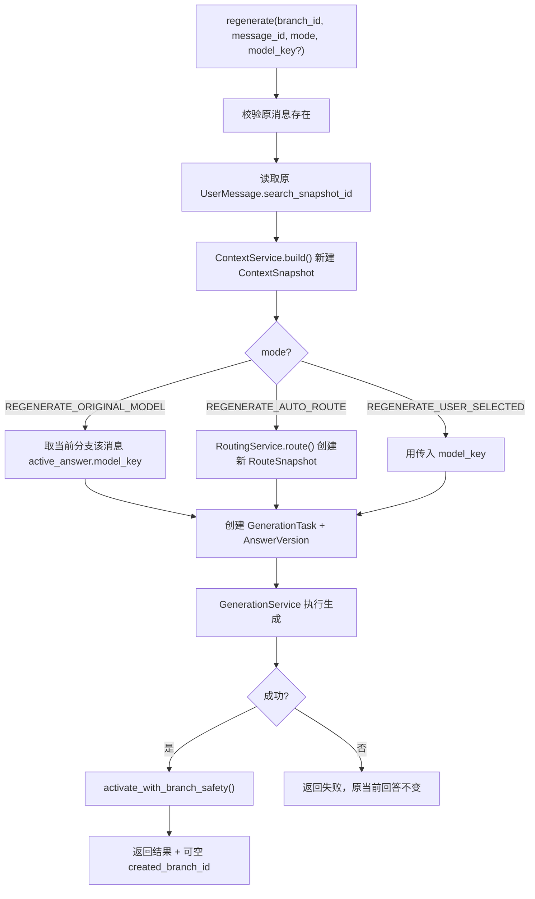
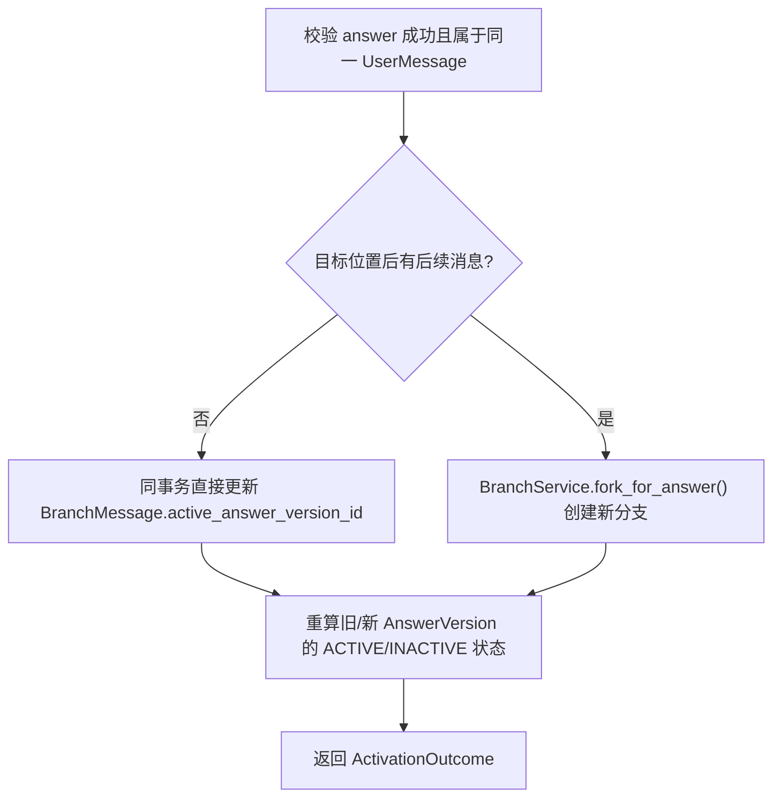

# 迭代3：回答版本与分支管理 — 详细实施计划

> 基于 LLD.md 迭代3范围，审查当前迭代1/2代码后制定。

## 一、迭代3目标范围

| 交付能力 | 明确不在本迭代 |
|---|---|
| 重新生成、回答版本激活、历史用户消息编辑、分支创建与切换 | 备忘录、角色 |

**核心设计不变量**（来自LLD第4节）：

| # | 不变量 | 迭代3如何体现 |
|---|---|---|
| 1 | 历史不可变：已创建的消息正文、搜索快照不覆盖或删除 | 编辑消息创建新 UserMessage，原消息保留 |
| 3 | 同一 BranchMessage 最多指向一个成功回答版本 | activate 事务内原子切换 |
| 4 | 搜索一次：每个 UserMessage 最多一个 SearchSnapshot | regenerate 复用原 UserMessage 的 search_snapshot_id |
| 5 | 上下文一致：同一 GenerationTask 的尝试只读同一个 ContextSnapshot | regenerate 创建新 ContextSnapshot/GenerationTask |
| — | 历史位置回答切换，若目标位置后有后续消息，自动创建新分支 | activate_with_branch_safety() |
| — | 分支创建后自动更新 Conversation.active_branch_id | edit/fork/activate_branch 均设置 |

---

## 二、新增API端点

| 方法 | 路径 | 说明 | HTTP 状态 |
|---|---|---|---|
| `POST` | `/api/v1/messages/{message_id}/regenerations` | 三种模式重新生成，复用搜索快照 | 201 |
| `POST` | `/api/v1/messages/{message_id}/answers/{answer_id}/activate` | 激活已有回答，必要时建分支 | 200 |
| `PATCH` | `/api/v1/messages/{message_id}` | 编辑历史用户消息 | 201 |
| `GET` | `/api/v1/conversations/{conversation_id}/branches` | 列出所有分支 | 200 |
| `POST` | `/api/v1/conversations/{conversation_id}/branches/{branch_id}/activate` | 切换活动分支 | 200 |

### 2.1 重新生成

`POST /api/v1/messages/{id}/regenerations`

**请求字段**：

| 字段 | 类型 | 必填 | 说明 |
|---|---|---|---|
| `branch_id` | string | 是 | 操作所在分支 |
| `mode` | enum | 是 | `REGENERATE_ORIGINAL_MODEL` / `REGENERATE_AUTO_ROUTE` / `REGENERATE_USER_SELECTED` |
| `model_key` | string | 条件必填 | 仅 `REGENERATE_USER_SELECTED` 时必填 |

**三种模式**：
- `REGENERATE_ORIGINAL_MODEL` — 取当前分支该消息的 `active_answer.model_key`，同模型重新生成
- `REGENERATE_AUTO_ROUTE` — 创建新 RouteSnapshot，按自动路由重新生成
- `REGENERATE_USER_SELECTED` — 用请求指定的 model_key

**响应**：`SendMessageResponse` + 可空 `created_branch_id`（历史位置激活建分支时返回新分支ID）

### 2.2 激活回答

`POST /api/v1/messages/{id}/answers/{answer_id}/activate`

**请求字段**：

| 字段 | 类型 | 必填 | 说明 |
|---|---|---|---|
| `branch_id` | string | 是 | 操作所在分支 |

**响应**：`ActivationOutcome(branch_id, created_branch_id?, active_answer)`

### 2.3 编辑历史消息

`PATCH /api/v1/messages/{id}`

**请求字段**：

| 字段 | 类型 | 必填 | 说明 |
|---|---|---|---|
| `branch_id` | string | 是 | 源分支 |
| `content` | string | 是 | 新消息正文 |
| `selection_mode` | enum | 是 | 新生成的选择模式 |
| `model_key` | string/null | 条件必填 | |

**行为**：源分支不变。创建新 Branch + 新 UserMessage + 新 SearchSnapshot + 新生成。

**响应**：`BranchOperationResponse(new_branch, new_message, generation_result)`

### 2.4 列出分支

`GET /api/v1/conversations/{id}/branches`

**响应**：
```json
{
  "conversation_id": "...",
  "active_branch_id": "...",
  "branches": [
    {
      "id": "...",
      "parent_branch_id": "...",
      "branch_point_type": "ROOT",
      "branch_point_message_id": "...",
      "complete_turn_count": 5,
      "is_active": true,
      "created_at": "..."
    }
  ]
}
```

### 2.5 切换活动分支

`POST /api/v1/conversations/{id}/branches/{branch_id}/activate`

无请求正文。成功返回 `200`，响应包含更新后的 Conversation 和 Branch 信息。

---

## 三、后端变更明细

### 3.1 新建文件（4个）

| 文件 | 职责 | 预计行数 |
|---|---|---|
| `alembic/versions/0003_answer_branching.py` | 迁移：添加索引（branch_point_message_id, branch_parent_id） | ~30 |
| `app/schemas/branches.py` | 重新生成/激活/编辑/分支操作 DTO | ~100 |
| `app/services/answers.py` | 三种重生成模式 + 版本激活 + 统一激活安全策略 | ~170 |
| `app/services/branches.py` | 编辑/分叉/切换/列表 + inherit_memory/role 占位 | ~150 |

### 3.2 修改文件（3个）

#### `app/api.py` — 新增5个端点

```python
@router.post("/messages/{message_id}/regenerations", status_code=201)
def regenerate_message(
    message_id: str,
    body: RegenerateRequest,
    ...
) -> SendMessageResponse

@router.post("/messages/{message_id}/answers/{answer_id}/activate")
def activate_answer(
    message_id: str,
    answer_id: str,
    body: ActivateAnswerRequest,
    ...
) -> ActivationResponse

@router.patch("/messages/{message_id}", status_code=201)
def edit_message(
    message_id: str,
    body: EditMessageRequest,
    ...
) -> BranchOperationResponse

@router.get("/conversations/{conversation_id}/branches")
def list_branches(...) -> BranchListResponse

@router.post("/conversations/{conversation_id}/branches/{branch_id}/activate")
def activate_branch(...) -> ConversationResponse
```

除 list_messages/send_message 使用 `ProviderRegistry` 外，新增端点也需注入 `providers: ProviderRegistry` 和 `settings: Settings`。

#### `app/repositories/chat.py` — 新增3个方法

```python
def has_later_messages(self, branch_id: str, position: int) -> bool:
    """判断逻辑位置之后是否还有消息（决定是否需要建分支）"""

def get_branch_message(self, branch_id: str, message_id: str) -> BranchMessage | None:
    """获取指定分支的 BranchMessage"""

def copy_branch_links(
    self, 
    source_branch_id: str, 
    through_position: int,  # 复制 <= 此位置 或 < 此位置
    new_branch_id: str,
    inclusive: bool = True,  # True 含分叉位置（回答激活），False 不含（编辑消息）
) -> list[BranchMessage]:
    """将源分支的消息关联复制到新分支"""

def get_branch_message_by_id(self, branch_id: str, user_message_id: str) -> BranchMessage | None:
    """通过 user_message_id 查找 BranchMessage"""
```

#### `app/repositories/conversations.py` — 新增3个方法

```python
def list_branches(self, conversation_id: str) -> list[Branch]:
    """列出会话的所有活跃分支"""

def get_branch(self, branch_id: str) -> Branch | None:
    """获取单个分支"""

def activate_branch(self, conversation: Conversation, branch: Branch) -> None:
    """设置会话的 active_branch_id 并更新时间"""
```

### 3.3 核心Service逻辑

#### `AnswerService` (新文件 `services/answers.py`)



**`activate_with_branch_safety(branch_id, branch_message, answer)`**：


#### `BranchService` (新文件 `services/branches.py`)

```python
def edit_user_message(
    self, source_branch_id: str, message_id: str, 
    content: str, selection_mode: SelectionMode, model_key: str | None
) -> BranchOperationResult:
    """编辑历史消息 → 新建分支+消息+搜索+生成"""
    # 1. 读取源分支和分叉消息的 logical_position
    # 2. 创建新 Branch(parent_branch_id=source, type=USER_MESSAGE_EDIT, point_message_id=message_id)
    # 3. ChatRepository.copy_branch_links(source, through_position - 1, new_branch, inclusive=False)
    #       → 复制 < fork_position 的关联，不含被编辑的消息
    # 4. ChatRepository.append_user_message(new_branch, new_content) → 新建消息
    # 5. 执行搜索 → 上下文 → 路由 → 生成（复用 ChatService._execute_generation）
    # 6. 成功则在 new_branch 激活回答
    # 7. ConversationRepository.activate_branch(conversation, new_branch)

def fork_for_answer(
    self, source_branch_id: str, message_id: str, answer_id: str
) -> Branch:
    """回答版本激活时建分支 → 复制关联到分叉点，替换该位置回答指针"""
    # 1. 读取分叉消息在源分支的 logical_position
    # 2. 创建新 Branch(parent=source, type=ANSWER_VERSION_ACTIVATE, point_answer_version_id=answer_id)
    # 3. ChatRepository.copy_branch_links(source, through_position, new_branch, inclusive=True)
    #       → 复制 <= fork_position 的关联
    # 4. 新分支中 fork_position 处 BranchMessage.active_answer_version_id = answer_id
    # 5. 不复制后续消息
    # 6. ConversationRepository.activate_branch(conversation, new_branch)

def activate_branch(self, conversation_id: str, branch_id: str) -> ConversationResponse:
    """切换活动分支"""

def list_branches(self, conversation_id: str) -> BranchListResponse:
    """列出会话所有分支"""
```

### 3.4 ChatService 重构

**问题**：`send_message()` 中第71-197行的生成流程（search→context→route→generate→finalize）与 `regenerate`/`edit_user_message` 高度重叠。

**方案**：抽取 `_execute_generation()` 方法：

```python
def _execute_generation(
    self,
    message: UserMessage,
    branch: Branch,
    link: BranchMessage,
    answer: AssistantAnswerVersion,
    selection_mode: SelectionMode,
    model_key: str | None,
    conversation: Conversation,
    reuse_search_snapshot_id: str | None = None,  # None → 新建搜索
) -> SendMessageResponse:
    """统一的生成执行入口"""
    # 1. 搜索：reuse 为空则创建新 SearchSnapshot，否则读取已有快照
    # 2. ContextService.prepare() → 上下文 + prompt
    # 3. 创建 GenerationTask + 绑定 AnswerVersion
    # 4. 路由（自动）/ 手动校验
    # 5. GenerationService 执行
    # 6. 成功 → finalize_answer；失败 → record_failure
```

`send_message` 调用时 `reuse_search_snapshot_id=None`，`regenerate` 调用时传入原消息的 `search_snapshot_id`，`edit_user_message` 调用时 `reuse_search_snapshot_id=None`（编辑创建全新消息和搜索）。

---

## 四、数据库迁移

当前状态（`0001_core_chat.py` + `0002_routing_generation.py`）已有：

- `Branch.parent_branch_id`（FK 自引用）
- `Branch.branch_point_type`（ROOT/USER_MESSAGE_EDIT/ANSWER_VERSION_ACTIVATE）
- `Branch.branch_point_message_id`、`branch_point_answer_version_id`
- `BranchMessage(branch_id, logical_position)` 唯一约束
- `BranchMessage(branch_id, user_message_id)` 唯一约束

**`0003_answer_branching.py` 迁移内容**（最小化）：

| 变更 | SQL（upgrade） |
|---|---|
| 索引：分支点消息 | `CREATE INDEX ix_branches_point_message ON branches(branch_point_message_id)` |
| 索引：父分支 | `CREATE INDEX ix_branches_parent ON branches(parent_branch_id)` |

---

## 五、Schema定义 (`schemas/branches.py`)

```python
from enum import StrEnum

class RegenerateMode(StrEnum):
    REGENERATE_ORIGINAL_MODEL = "REGENERATE_ORIGINAL_MODEL"
    REGENERATE_AUTO_ROUTE = "REGENERATE_AUTO_ROUTE"
    REGENERATE_USER_SELECTED = "REGENERATE_USER_SELECTED"

class RegenerateRequest(BaseModel):
    branch_id: str
    mode: RegenerateMode
    model_key: str | None = None  # 仅 USER_SELECTED 模式必填

    @model_validator(mode="after")
    def validate(self) -> "RegenerateRequest":
        if self.mode == RegenerateMode.REGENERATE_USER_SELECTED:
            if self.model_key not in MODEL_KEYS:
                raise ValueError("指定模式必须提供有效的 model_key")
        return self

class ActivateAnswerRequest(BaseModel):
    branch_id: str

class EditMessageRequest(BaseModel):
    branch_id: str
    content: str = Field(min_length=1)
    selection_mode: SelectionMode = SelectionMode.AUTO_ROUTE
    model_key: str | None = None

class BranchResponse(BaseModel):
    id: str
    conversation_id: str
    parent_branch_id: str | None
    branch_point_type: BranchPointType
    branch_point_message_id: str | None
    complete_turn_count: int
    is_active: bool  # 相对于会话的 active_branch_id
    created_at: datetime

class BranchListResponse(BaseModel):
    conversation_id: str
    active_branch_id: str
    branches: list[BranchResponse]

class ActivationResponse(BaseModel):
    branch_id: str
    created_branch_id: str | None  # 建分支时返回新分支ID
    active_answer: AnswerResponse

class BranchOperationResponse(BaseModel):
    branch: BranchResponse
    created_branch: BranchResponse | None
    message: SendMessageResponse | None
```

---

## 六、前端变更明细

### 6.1 新建文件（2个）

| 文件 | 职责 | 预计行数 |
|---|---|---|
| `src/components/AnswerMetadata.tsx` | 回答元信息面板（模型、路由模式、Token/成本、搜索状态、尝试链），可折叠展开 | ~100 |
| `src/components/BranchSwitcher.tsx` | 分支指示器与切换下拉菜单 | ~60 |

### 6.2 修改文件（7个）

| 文件 | 变更内容 |
|---|---|
| `src/api/types.ts` | 新增 `RegenerateRequest`, `RegenerateMode`, `EditMessageRequest`, `BranchInfo`, `BranchListResponse`, `ActivationResponse`, `BranchOperationResponse`；增加 `GenerationTaskResponse` 详细类型（搜索/路由/候选/尝试） |
| `src/api/client.ts` | 新增 5个API方法 + `getGenerationTask(taskId)` |
| `src/hooks/useChat.ts` | 新增 `regenerate()`, `activateAnswer()`, `editMessage()`, `branches` 状态, `switchBranch()`；返回值从 `string` 改为包含 `branchId` 的结构 |
| `src/components/MessageItem.tsx` | 每条消息右侧增加操作按钮（重新生成/查看版本），生成失败的消息加"重新生成"入口 |
| `src/components/ChatPanel.tsx` | header 区集成 `BranchSwitcher`；接收新props（branches, onRegenerate, onActivate, onEdit, onSwitchBranch, currentBranchId） |
| `src/components/Composer.tsx` | 支持编辑模式（传入 `editContent` 时预填文本，按钮文案变为"保存编辑"） |
| `src/App.tsx` | 传递新回调到 ChatPanel；管理 branches 相关状态 |
| `src/styles.css` | 新增 AnswerMetadata 面板、BranchSwitcher 下拉、消息操作菜单、编辑器模式样式 |

### 6.3 交互流程

**重新生成**：
1. 用户点击消息旁的"🔄 重新生成"
2. 弹出模式选择下拉：原模型 / 自动路由 / 指定模型
3. 调用 `POST /messages/{id}/regenerations`
4. 成功后 `reload()`；若返回 `created_branch_id` 则自动切换到新分支

**编辑历史消息**：
1. 用户点击消息旁的"✏ 编辑"
2. Composer 进入编辑模式：textarea 预填原文本，模型选择器可用
3. 修改后点击"保存编辑"
4. 调用 `PATCH /messages/{id}` → 后端创建新分支+新消息+新搜索+新生成
5. 前端切换到新分支并刷新消息

**分支切换**：
1. ChatPanel header 右侧显示 `BranchSwitcher`："分支 2/3 ▾"
2. 下拉菜单列出所有分支：ROOT分支标记"主分支"，派生分支标记"回答分支"/"编辑分支"
3. 点击某个分支 → `POST /conversations/{id}/branches/{branch_id}/activate` → reload

---

## 七、测试计划

### 7.1 新建后端测试文件

| 文件 | 覆盖范围 | 用例数 |
|---|---|---|
| `tests/unit/test_answer_activation.py` | 末尾直接激活（不建分支）、历史位置建分支、失败版本不可激活、同 BranchMessage 同时只能一个指针、共享消息在原分支不受影响、激活后旧版本变 INACTIVE | 6 |
| `tests/unit/test_branch_inheritance.py` | 编辑只复制分叉前消息、回答分支复制到分叉点（含该消息）、不复制后续消息 | 4 |
| `tests/api/test_answers.py` | 原模型重生成、自动路由重生成、指定模型重生成、均复用搜索快照、成功自动激活、失败不替换旧回答、历史位置激活建分支 | 7 |
| `tests/api/test_branches.py` | 编辑历史消息创建新分支/新消息、原分支不变、新分支无后续消息、切换活动分支后消息列表刷新、列出分支包含所有活跃分支 | 5 |

### 7.2 修改现有测试

- `tests/conftest.py`：需新增 AnswerService/BranchService 依赖，以及多分支/多版本/多消息的测试数据 fixtures

### 7.3 前端测试更新

- `src/test/ChatPanel.test.tsx`：增加 BranchSwitcher 渲染、编辑模式 Composer 切换、重新生成回调触发测试

---

## 八、实施顺序

| 序号 | 步骤 | 涉及文件 | 依赖 |
|---|---|---|---|
| 1 | 数据库迁移 `0003` | `alembic/versions/0003_answer_branching.py` | — |
| 2 | Repository 扩展 | `repositories/chat.py`, `repositories/conversations.py` | 1 |
| 3 | Schema `branches.py` | `schemas/branches.py` | — |
| 4 | `AnswerService` | `services/answers.py` | 2, 3 |
| 5 | `BranchService` | `services/branches.py` | 2, 3, 4 |
| 6 | ChatService 重构 | `services/chat.py` | 2, 4, 5 |
| 7 | API 端点 | `api.py` | 3, 4, 5, 6 |
| 8 | 后端测试 | `tests/unit/test_answer_activation.py`, `tests/unit/test_branch_inheritance.py`, `tests/api/test_answers.py`, `tests/api/test_branches.py` | 7 |
| 9 | 前端类型 + API客户端 | `api/types.ts`, `api/client.ts` | 3 |
| 10 | useChat 扩展 | `hooks/useChat.ts` | 9 |
| 11 | AnswerMetadata 组件 | `components/AnswerMetadata.tsx` | 9 |
| 12 | BranchSwitcher 组件 | `components/BranchSwitcher.tsx` | 9, 10 |
| 13 | MessageItem 操作菜单 | `components/MessageItem.tsx` | 10, 11 |
| 14 | ChatPanel + Composer 集成 | `components/ChatPanel.tsx`, `Composer.tsx` | 10, 12, 13 |
| 15 | App.tsx 连线 + 样式 | `App.tsx`, `styles.css` | 14 |
| 16 | 前端测试更新 | `src/test/ChatPanel.test.tsx` | 14 |
| 17 | 全流程验收 | 手动测试 + `pytest` + `vitest` | 8, 16 |

---

## 九、风险点

| 风险 | 级别 | 缓解措施 |
|---|---|---|
| **ChatService 重构**：`send_message()` 352行生成逻辑紧耦合 | 高 | 先对现有 `send_message` 行为写集成测试锁定；抽取 `_execute_generation` 后确保测试全绿 |
| **事务边界**：edit/regenerate 涉及多步（search→context→route→generate→activate→fork），需精细控制短事务 | 中 | 每步外部调用后立即 `commit()`；分支创建和激活在同一事务内完成（LLD要求） |
| **AnswerVersion 状态重算**：激活时需要 `SUCCEEDED_ACTIVE` ↔ `SUCCEEDED_INACTIVE` 切换 | 中 | 已有 `_deactivate_if_unreferenced()`，需新增"重新激活"逻辑。激活前检查是否已有其他 BranchMessage 引用了该版本 |
| **search_snapshot_id 复用**：regenerate 不创建新搜索，必须读取原 UserMessage 的字段 | 低 | `regenerate()` 入口处显式读取并传入 |
| **编辑消息的分支继承**：如果被编辑的消息已有子分支，编辑操作创建新分支不级联 | 低 | 设计上不处理（LLD 规定编辑只复制 `< fork_position` 的链接，子分支引用的是旧分支的旧消息） |

---

## 十、验收标准

1. **重新生成**：三种模式均可用；生成的回答可在末尾直接激活，也可在历史位置自动建分支
2. **回答激活**：历史位置有后续消息时自动建分支；失败版本无法激活
3. **编辑消息**：源分支原样保留；新分支包含分叉前的消息+新消息；原消息未被修改
4. **分支切换**：切换后消息列表立即刷新为对应分支的内容
5. **搜索复用**：重新生成不创建新 SearchSnapshot
6. **后端 pytest 全绿**：现有测试 + 新增 ~22个测试用例
7. **前端 vitest 全绿**：现有测试 + 新增 ChatPanel 测试
8. **手动验收**：创建会话→发3条消息→编辑第2条→验证新分支→重新生成→验证版本→切换分支→验证
