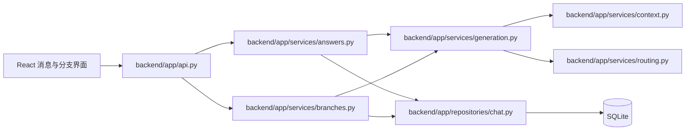
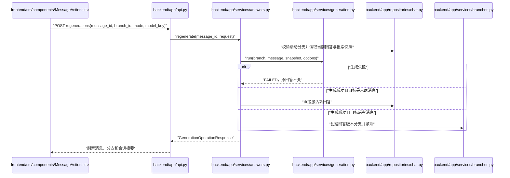
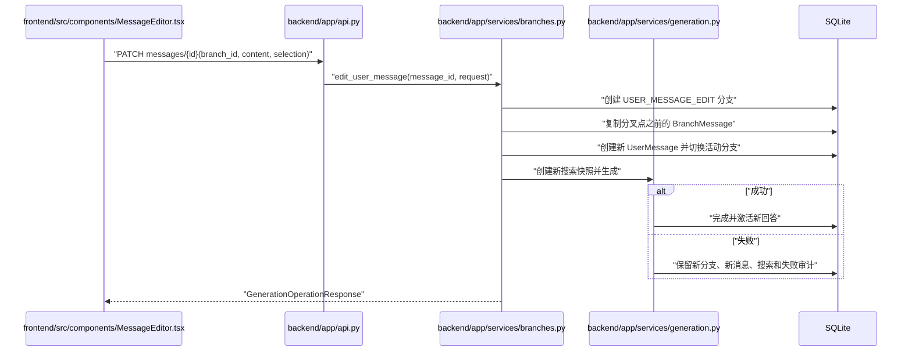
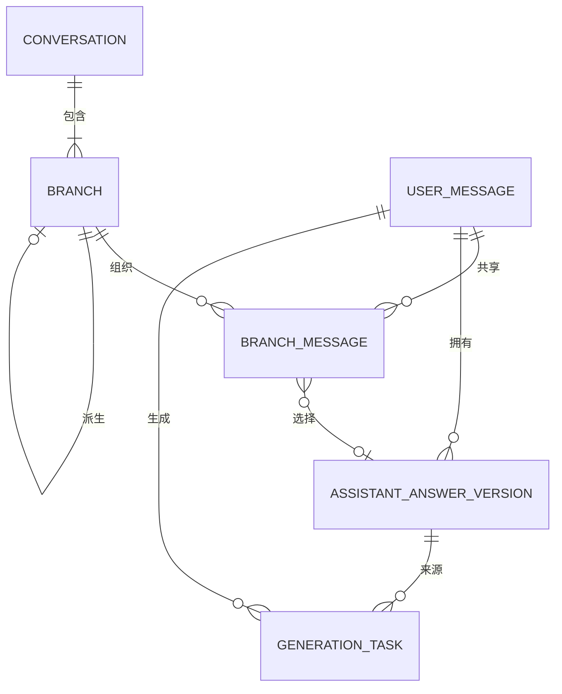

# 多模型路由聊天系统迭代3实现文档

> 文档状态：已确认并实施
> 实施日期：2026-07-23
> 设计依据：`多模型路由聊天系统需求.md`、`docs/LLD.md`、迭代2代码
> 实施原则：复用现有生成链路，消息、回答、搜索与生成审计记录不可变

## 项目结构与总体设计

迭代3在现有聊天、搜索、上下文快照、模型路由和生成审计能力上增加：

1. 同一用户消息可拥有多个助手回答版本。
2. 支持原模型、重新自动路由和临时指定模型三种重新生成方式。
3. 成功回答版本按需加载，不扩大普通消息列表响应。
4. 末尾回答可直接切换；历史回答切换时创建截断的新分支。
5. 编辑用户消息会创建新消息和新分支，原消息及原分支保持不变。
6. 支持查看和切换活动分支。

本迭代不实现备忘录、角色、分支删除或改名、回答版本删除、多用户权限、流式生成、停止生成、版本分页和后端物理删除会话。

### 核心规则

- `UserMessage.content` 不更新；编辑创建新的 `UserMessage`。
- `AssistantAnswerVersion` 不覆盖；重新生成创建新版本。
- `BranchMessage.active_answer_version_id` 决定分支内的当前回答。
- 回答仍被任一分支引用时保持 `SUCCEEDED_ACTIVE`。
- 查看版本不改变状态。
- 激活存在后续消息的回答时创建 `ANSWER_VERSION_ACTIVATE` 分支。
- 编辑任意消息都创建 `USER_MESSAGE_EDIT` 分支。
- 重新生成复用原搜索快照；编辑后的新消息执行新搜索。
- 生成失败不替换原回答；编辑生成失败仍保留新分支与新消息。
- 回答、重新生成和编辑写操作只允许针对当前活动分支。



## 目录结构

```text
backend/
  alembic/versions/0003_answer_branching.py
  app/
    api.py
    core/enums.py
    db/models_core.py
    db/models_generation.py
    schemas/branches.py
    repositories/chat.py
    repositories/conversations.py
    repositories/generation.py
    services/answers.py
    services/branches.py
    services/chat.py
    services/context.py
    services/conversations.py
    services/generation.py
  tests/api/
    test_answers.py
    test_branches.py
frontend/src/
  api/client.ts
  api/types.ts
  hooks/useChat.ts
  components/
    ChatPanel.tsx
    MessageItem.tsx
    MessageActions.tsx
    MessageEditor.tsx
    AnswerVersionDialog.tsx
    BranchSwitcher.tsx
    chat-actions.css
  test/
    MessageItem.test.tsx
    BranchSwitcher.test.tsx
```

所有新增代码文件均少于 500 行；未创建迭代4、5占位代码，也未新增依赖和环境变量。

## 整体逻辑和交互时序图

### 重新生成与安全激活



### 编辑历史用户消息



## API接口定义

| 方法 | 路径 | 用途 |
|---|---|---|
| `GET` | `/api/v1/messages/{message_id}/answers?branch_id=...` | 按需获取成功回答版本 |
| `POST` | `/api/v1/messages/{message_id}/regenerations` | 按三种模式重新生成 |
| `POST` | `/api/v1/messages/{message_id}/answers/{answer_id}/activate` | 安全激活回答 |
| `PATCH` | `/api/v1/messages/{message_id}` | 编辑消息并创建分支 |
| `GET` | `/api/v1/conversations/{conversation_id}/branches` | 获取有效分支 |
| `POST` | `/api/v1/conversations/{conversation_id}/branches/{branch_id}/activate` | 切换活动分支 |

`RegenerationMode`：

- `REGENERATE_ORIGINAL_MODEL`
- `REGENERATE_AUTO_ROUTE`
- `REGENERATE_USER_SELECTED`

错误约定：

- `404`：会话、分支、消息或回答不存在。
- `409`：归属不符、非活动分支写入、回答不可激活或搜索快照缺失。
- `422`：重新生成模式、模型键或编辑请求字段组合非法。
- 模型生成失败但审计记录保存成功时返回业务响应，避免误报为 HTTP 500。

## 数据实体结构深化

`GenerationTask` 新增可空外键 `source_answer_version_id`。重新生成记录操作开始时的当前成功回答；新消息为空。

`Branch.branch_point_message_id` 和 `branch_point_answer_version_id` 增加外键约束。服务层保证：

| 分支类型 | message_id | answer_version_id |
|---|---|---|
| `ROOT` | 空 | 空 |
| `USER_MESSAGE_EDIT` | 必填 | 空 |
| `ANSWER_VERSION_ACTIVATE` | 必填 | 必填 |

`Branch.complete_turn_count` 按该分支中具有成功当前回答的 `BranchMessage` 数量重新计算。共享 `UserMessage.status` 表示全局结果；会话列表生成状态优先读取活动分支最后一条关联。



## 模块化文件详解 (File-by-File Breakdown)

- `services/generation.py`：统一新消息、重新生成和编辑后的生成编排，成功回答先完成为非活动版本。
- `services/answers.py`：回答版本查询、三种重新生成和分支安全激活。
- `services/branches.py`：编辑分支、回答分支、分支列表与切换。
- `repositories/chat.py`：回答完成/激活分离、关联复制、完整轮数和全局回答状态维护。
- `schemas/branches.py`：迭代3全部请求与响应 DTO。
- `useChat.ts`：集中管理分支、版本缓存、忙碌状态和操作后刷新。
- `MessageActions.tsx`：三种重新生成和版本入口。
- `MessageEditor.tsx`：消息内编辑并明确提示创建分支。
- `AnswerVersionDialog.tsx`：按需加载、纯预览、历史位置激活二次确认。
- `BranchSwitcher.tsx`：仅在多分支时显示和切换。

## 测试与验收结果

- 后端全量 pytest：39 项通过。
- 前端全量 Vitest：17 项通过。
- TypeScript 无输出检查：通过。
- Vite 生产构建：通过。
- Alembic `0002 -> 0003 -> 0002`：通过。
- 新增代码文件行数：均低于 500 行。

## 迭代演进依据

迭代3继续使用 `BranchMessage` 表达分支视图，未引入第二套消息或生成模型。搜索、上下文、路由、尝试和成本快照仍由既有模块生成；新增服务只负责回答与分支业务边界。该结构可在迭代4通过分支点稳定定位备忘录继承范围，但本迭代不提前创建备忘录数据或占位实现。
