# 多模型路由聊天系统迭代4实现文档（评审稿）

> 文档状态：已生成待用户复核  
> 设计依据：`多模型路由聊天系统需求.md`、`docs/LLD.md`、迭代3项目代码  
> 当前基线：后端 39 项测试、前端 19 项测试、TypeScript 检查和 Vite 生产构建全部通过  
> 本文确认前不修改 `docs/LLD.md`、不执行数据库迁移、不实施迭代4代码

## 项目结构与总体设计

### 1. 迭代目标

迭代4在现有会话、回答版本和分支能力上增加分支级备忘录：

1. 每个分支独立维护不可变备忘录版本。
2. 备忘录分为用户保护区和系统摘要区。
3. 首次达到 10 个完整轮次时总结前 5 轮。
4. 后续每增加 5 个完整轮次进行一次增量总结。
5. 最近 5 个完整轮次继续以原始对话进入上下文。
6. 用户可以编辑保护区，但系统永远不能自动修改保护区。
7. 支持查看全部备忘录版本。
8. 支持恢复历史版本，并通过创建新版本保留审计历史。
9. 检测保护区与后续对话的潜在冲突，只提示、不自动处理。
10. 新分支只继承覆盖范围严格早于分叉位置的备忘录。
11. 备忘录更新失败不得影响已经成功的聊天回答。

### 2. 本迭代不实现

- 会话级 n/k/m 配置界面或 API。
- 异步任务队列、后台 Worker。
- 手动触发系统摘要。
- 删除备忘录版本。
- 修改系统摘要。
- 逐条接受、忽略或关闭冲突。
- 备忘录全文搜索。
- 多用户权限与并发编辑。
- 迭代5角色功能。

### 3. 已确认的实现决策

- `n=10`、`k=5`、`m=5` 由环境变量全局配置。
- 不加入 `Conversation.default_memory_config_json`。
- 摘要与冲突检测使用 `MEMORY_MODEL_ID` 指定的固定模型。
- 不调用路由器，不做模型降级。
- 暂时性模型错误使用同一模型重试一次。
- 前端采用右侧抽屉。
- 冲突只提示，由用户手动编辑保护区创建新版本。
- 备忘录更新保持同步执行，但和聊天回答使用独立事务。
- 每个新增代码文件不超过 500 行。

### 4. 核心业务规则

1. `protected_user_text` 只能由用户提交产生。
2. 系统更新必须逐字复制当前保护区。
3. `system_summary` 只能由系统生成或从历史版本恢复。
4. 任何修改都创建新 `MemoryVersion`，旧版本不更新、不删除。
5. 当前版本由 `Branch.active_memory_version_id` 决定，不保存 `is_current` 字段。
6. 完整轮次只统计具有当前成功回答的 `BranchMessage`。
7. 没有当前备忘录时，上下文保留全部有效完整轮次。
8. 有当前备忘录时，只把未被摘要覆盖的有效轮次作为原始历史。
9. 第一次更新覆盖第 1～5 个完整轮次。
10. 第 15 个完整轮次覆盖至第 10 个完整轮次。
11. 第 20 个完整轮次覆盖至第 15 个完整轮次。
12. 更新只向模型传递尚未进入摘要的新范围。
13. 用户编辑保护区不改变摘要及覆盖范围。
14. 恢复操作不能直接激活旧版本，必须创建 `RESTORE` 新版本。
15. 如果恢复版本落后于当前原始窗口，必须补齐已经退出原始窗口的历史。
16. 补齐失败时保留操作前的当前版本。
17. 分支继承时 `covered_through_position < fork_position`。
18. 没有可继承版本时，新分支从无备忘录状态开始。
19. 用户保护区冲突检测失败时保存版本，并标记为 `UNKNOWN`。
20. 所有备忘录写操作只允许作用于当前活动分支。

### 5. 模块关系

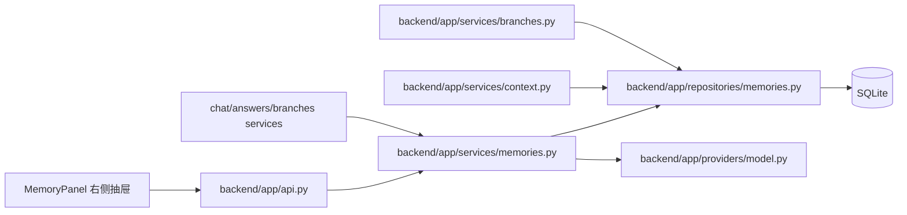

## 目录结构

```text
backend/
  alembic/
    versions/
      0001_core_chat.py
      0002_routing_generation.py
      0003_answer_branching.py
      0004_memory.py
      0005_roles.py                         # 迭代5再实现，用固定返回值占位
  app/
    api.py
    core/
      config.py
      enums.py
      errors.py
    db/
      models_core.py
      models_generation.py
      models_memory.py
      models_role.py                        # 迭代5再实现，用固定返回值占位
      session.py
    schemas/
      chat.py
      branches.py
      memories.py
      roles.py                              # 迭代5再实现，用固定返回值占位
    repositories/
      chat.py
      conversations.py
      generation.py
      memories.py
      roles.py                              # 迭代5再实现，用固定返回值占位
    services/
      chat.py
      answers.py
      branches.py
      context.py
      generation.py
      memories.py
      roles.py                              # 迭代5再实现，用固定返回值占位
    providers/
      model.py
      registry.py
  tests/
    unit/
      test_memory_trigger.py
      test_memory_restore.py
      test_branch_inheritance.py
    api/
      test_memories.py
      test_chat.py
      test_answers.py
      test_branches.py
frontend/
  src/
    api/
      client.ts
      types.ts
    hooks/
      useChat.ts
    components/
      ChatPanel.tsx
      SideDrawer.tsx
      MemoryPanel.tsx
      ConfirmationDialog.tsx
      chat-actions.css
    test/
      MemoryPanel.test.tsx
      ChatPanel.test.tsx
docs/
  LLD.md
  iteration3-plan.md
  iteration4-plan.md
  iteration5-plan.md                     # 迭代5评审通过后生成
```

目录树展示后续模块位置，但迭代4实施时不创建无功能的迭代5占位代码。

## 整体逻辑和交互时序图

### 1. 成功回答后的自动更新

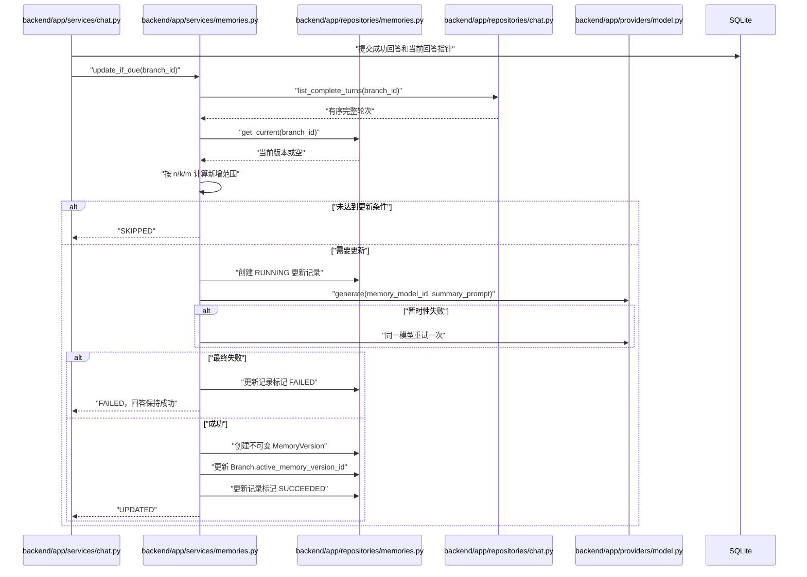

`answers.py` 的重新生成和 `branches.py` 的编辑消息生成也复用相同触发入口。历史重新生成创建新分支时，对最终活动分支执行检查。

### 2. 编辑保护区

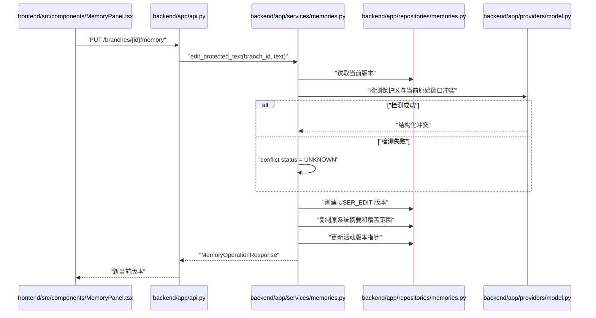

### 3. 恢复历史版本

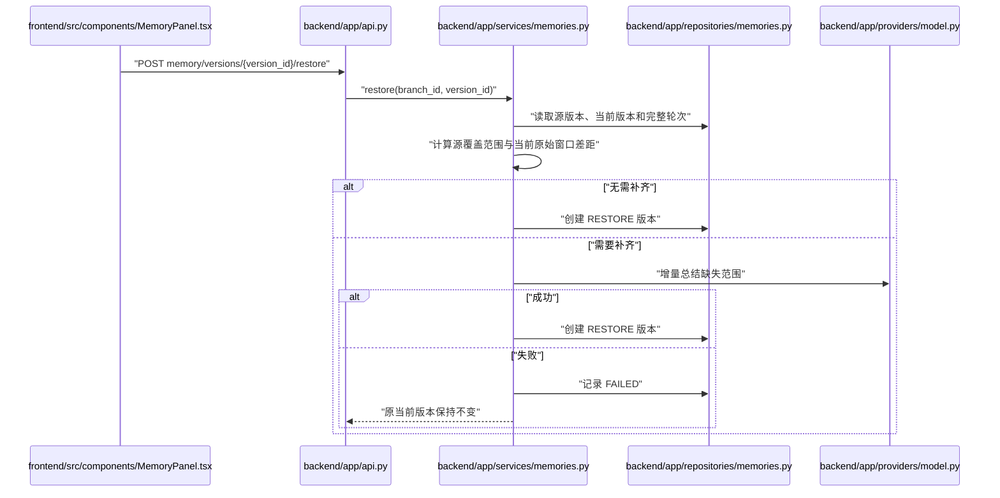

### 4. 分支继承

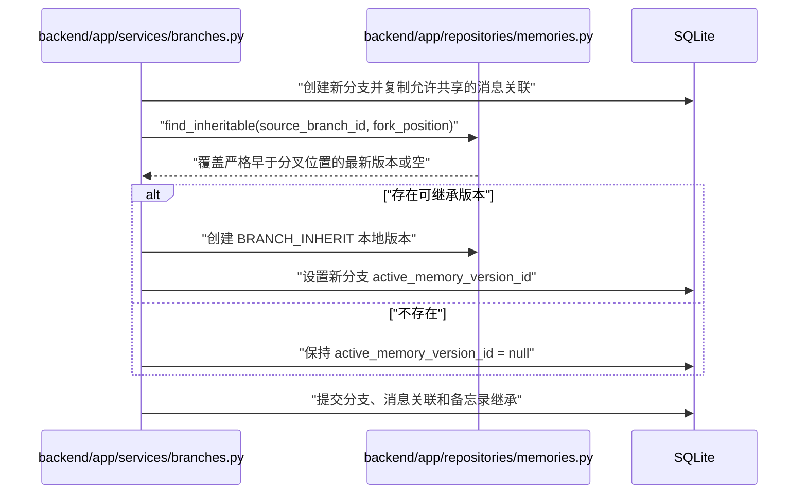

## API接口定义

### 1. 获取当前备忘录

`GET /api/v1/branches/{branch_id}/memory`

响应 `CurrentMemoryResponse`：

| 字段 | 类型 | 说明 |
|---|---|---|
| `branch_id` | string | 目标分支 |
| `current` | MemoryVersionResponse/null | 当前版本 |
| `latest_update` | MemoryUpdateStatusResponse/null | 最近自动更新或恢复补齐记录 |
| `config` | MemoryConfigResponse | 当前全局 n/k/m，只读 |

允许读取任意有效分支；写操作仍限当前活动分支。

### 2. 获取版本历史

`GET /api/v1/branches/{branch_id}/memory/versions?limit=20&cursor=`

- 默认 20，最大 100。
- 按 `version_number DESC, id DESC` 排序。
- 游标不透明。
- 返回 `items`、`next_cursor`、`has_more`。
- `is_current` 根据分支指针派生。
- 不返回不存在于该分支的版本。

### 3. 编辑用户保护区

`PUT /api/v1/branches/{branch_id}/memory`

请求：

| 字段 | 类型 | 规则 |
|---|---|---|
| `protected_user_text` | string | 允许空字符串，内容原样保存 |

响应 `MemoryOperationResponse`：

| 字段 | 类型 |
|---|---|
| `branch_id` | string |
| `operation_status` | `SUCCEEDED` |
| `current` | MemoryVersionResponse |
| `created_version` | MemoryVersionResponse |
| `latest_update` | MemoryUpdateStatusResponse/null |

服务端不得接收 `system_summary`、覆盖范围、版本号或冲突结果。

### 4. 恢复历史版本

`POST /api/v1/branches/{branch_id}/memory/versions/{version_id}/restore`

无请求正文。

响应 `MemoryOperationResponse`：

- 成功：`operation_status=SUCCEEDED`，返回新 `RESTORE` 版本。
- 模型补齐失败：`operation_status=FAILED`，`created_version=null`，`current` 仍为原版本。
- 不直接激活旧版本。
- 源版本必须属于目标分支。

### 5. 错误规则

- 404：分支或版本不存在。
- 409：写入非活动分支、版本归属错误、事务状态冲突。
- 422：请求字段类型错误。
- 模型调用失败：返回业务失败结果，不返回 HTTP 500。
- 数据库或上下文组装异常：返回 HTTP 500。

## 数据实体结构深化

### 1. Branch 新增字段

| 字段 | 类型 | 说明 |
|---|---|---|
| `active_memory_version_id` | UUID/null | 当前备忘录版本 |

### 2. ContextSnapshot 新增字段

| 字段 | 类型 | 说明 |
|---|---|---|
| `memory_version_id` | UUID/null | 本次生成实际使用的备忘录版本 |

现有 `protected_memory_text`、`system_memory_text` 继续保存不可变文本快照。

### 3. MemoryVersion

| 字段 | 类型 | 约束 |
|---|---|---|
| `id` | UUID | PK |
| `branch_id` | UUID | FK Branch |
| `version_number` | integer | 分支内递增 |
| `type` | enum | 五种版本类型 |
| `base_version_id` | UUID/null | 操作前当前版本 |
| `restored_from_version_id` | UUID/null | RESTORE 来源 |
| `inherited_from_version_id` | UUID/null | BRANCH_INHERIT 来源 |
| `protected_user_text` | text | 非空，允许空字符串 |
| `system_summary` | text | 非空，允许空字符串 |
| `covered_through_position` | integer/null | 摘要覆盖到的逻辑位置 |
| `added_from_position` | integer/null | 本版本新增摘要起点 |
| `added_through_position` | integer/null | 本版本新增摘要终点 |
| `conflict_metadata_json` | JSON | 冲突检测结果 |
| `created_at` | datetime | UTC |

唯一约束：`(branch_id, version_number)`。

版本类型：

- `INITIAL_SYSTEM_SUMMARY`
- `INCREMENTAL_SYSTEM_UPDATE`
- `USER_EDIT`
- `RESTORE`
- `BRANCH_INHERIT`

### 4. MemoryUpdateRecord

| 字段 | 类型 |
|---|---|
| `id` | UUID |
| `branch_id` | UUID |
| `base_memory_version_id` | UUID/null |
| `target_from_position` | integer |
| `target_through_position` | integer |
| `status` | `RUNNING/SUCCEEDED/FAILED` |
| `attempt_count` | integer |
| `error_category` | string/null |
| `error_message` | string/null |
| `created_at` | datetime |
| `completed_at` | datetime/null |
| `created_memory_version_id` | UUID/null |

该实体只用于同步更新审计，不代表后台任务队列。

### 5. 冲突元数据

```json
{
  "status": "CLEAR | CONFLICT | UNKNOWN",
  "checked_through_position": 15,
  "items": [
    {
      "dialogue_position": 14,
      "description": "后续对话与用户保护区中的偏好存在潜在冲突"
    }
  ]
}
```

不存储模型返回的整段原始响应，不允许模型返回内容覆盖保护区。

### 6. ER 图

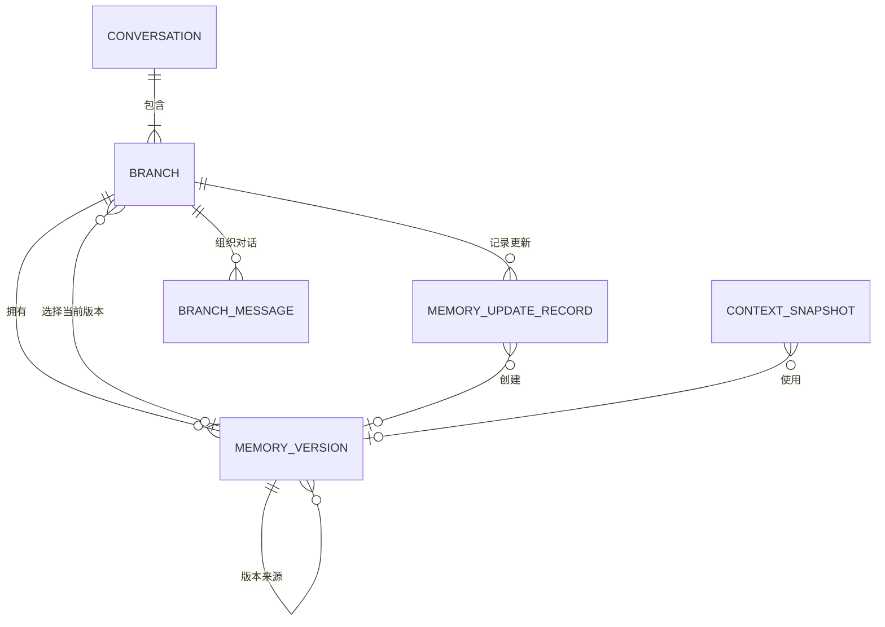

## 配置项

| 配置 | 环境变量 | 默认值 | 规则 |
|---|---|---:|---|
| `memory_n` | `MEMORY_N` | 10 | `n > k` |
| `memory_k` | `MEMORY_K` | 5 | `k >= 0` |
| `memory_m` | `MEMORY_M` | 5 | `m > 0` |
| `memory_model_id` | `MEMORY_MODEL_ID` | 无 | 启用迭代4时必填，值为 `MODEL_A/B/C` |

启动校验：

- 固定模型必须存在且启用。
- 不增加会话级配置字段。
- 不增加摘要专用温度和 Token 配置，复用现有生成参数。
- Mock 模型识别备忘录任务标记并返回确定性结构化结果，保证本地开发可验收。

## 模块化文件详解 (File-by-File Breakdown)

迭代4新增的核心业务文件为 `models_memory.py`、`schemas/memories.py`、`repositories/memories.py`、`services/memories.py` 和 `MemoryPanel.tsx`。现有聊天、上下文和分支模块只增加调用入口，不复制生成、回答激活或分支创建流程。

## 涉及到的文件详解 (File-by-File Breakdown)

### `backend/alembic/versions/0004_memory.py`

a. 文件用途说明：创建两张备忘录表，为 Branch 和 ContextSnapshot 增加备忘录外键；迁移不修改现有消息、回答和分支内容。

b. 文件内类图：无类。

c. 函数/方法详解：

#### `upgrade()`

- 用途：将迭代3数据库升级为支持分支备忘录的数据结构。
- 输入参数：无。
- 输出数据结构：Alembic 数据库结构变更。

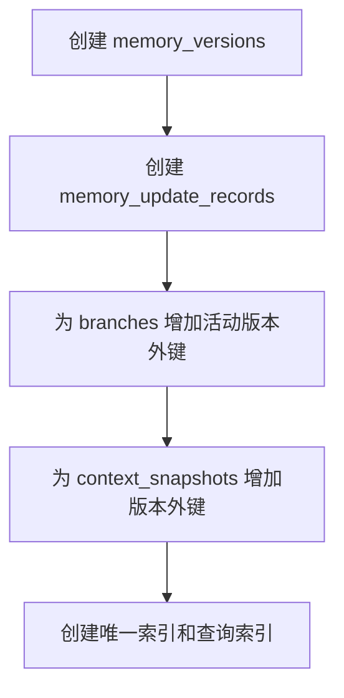

#### `downgrade()`

- 用途：回退迭代4新增结构。
- 输入参数：无。
- 输出数据结构：恢复至迭代3数据库结构。

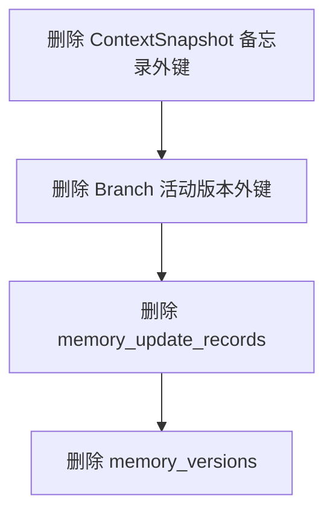

### `backend/app/core/config.py`

a. 文件用途说明：增加全局备忘录参数并在应用启动时完成校验。

b. 文件内类图：

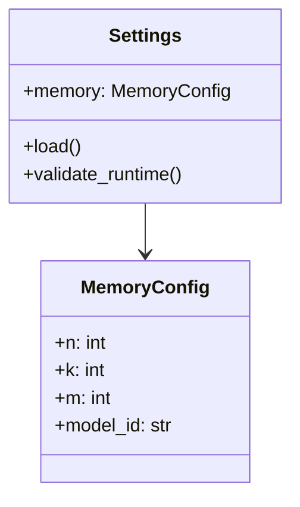

c. 函数/方法详解：

#### `Settings.load()`

- 用途：读取 `MEMORY_N/K/M/MODEL_ID` 并创建不可变配置。
- 输入参数：进程环境变量。
- 输出数据结构：`Settings`。

#### `Settings.validate_runtime()`

- 用途：校验 n/k/m 关系以及固定模型是否存在并启用。
- 输入参数：当前 Settings。
- 输出数据结构：无；非法配置抛出启动错误。

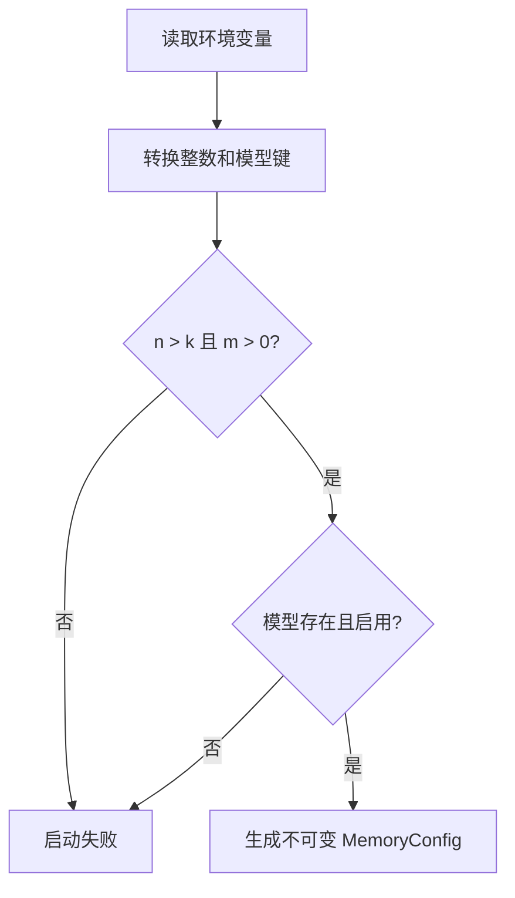

### `backend/app/db/models_memory.py`

a. 文件用途说明：映射 `MemoryVersion`、`MemoryUpdateRecord` 及版本来源关系，不包含业务算法。

b. 文件内类图：

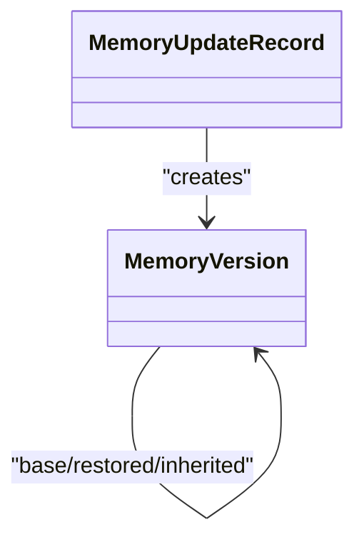

c. 函数/方法详解：无业务函数，仅包含 SQLAlchemy 字段、外键、索引和关系定义。

### `backend/app/schemas/memories.py`

a. 文件用途说明：定义当前备忘录、版本历史、保护区编辑和恢复操作的数据协议。

b. 文件内类图：

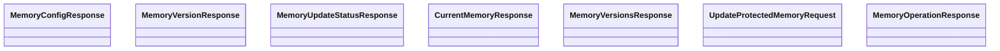

c. 函数/方法详解：

#### `UpdateProtectedMemoryRequest`

- 用途：接收用户保护区文本。
- 输入参数：`protected_user_text`。
- 输出数据结构：保留原始文本的请求 DTO。

请求校验只验证类型，保护区允许空字符串且不去除用户内容。

### `backend/app/repositories/memories.py`

a. 文件用途说明：封装备忘录版本、更新记录、当前指针和继承查询。

b. 文件内类图：

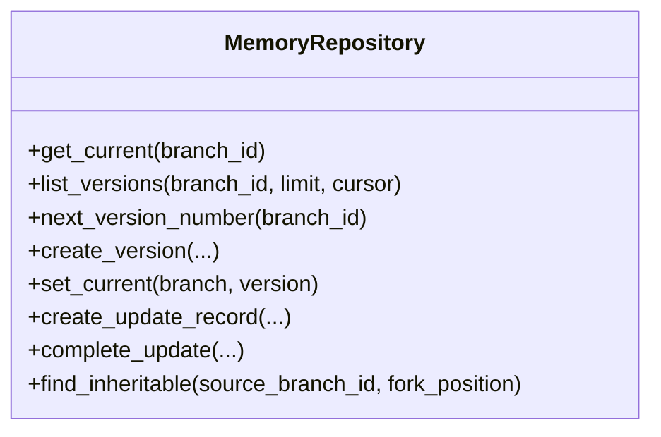

c. 函数/方法详解：

#### `get_current(branch_id)`

- 用途：根据分支当前指针读取备忘录。
- 输入参数：分支 ID。
- 输出数据结构：`MemoryVersion | None`。

#### `list_versions(branch_id, limit, cursor)`

- 用途：按版本号倒序分页读取历史版本。
- 输入参数：分支 ID、页大小、不透明游标。
- 输出数据结构：版本列表和下一页游标。

#### `create_version(...)`

- 用途：创建不可变版本。
- 输入参数：分支、版本类型、来源字段、保护区、摘要、覆盖范围和冲突元数据。
- 输出数据结构：新 `MemoryVersion`。

#### `find_inheritable(source_branch_id, fork_position)`

- 用途：查找可被新分支继承的最后一个版本。
- 输入参数：源分支 ID、分叉逻辑位置。
- 输出数据结构：`MemoryVersion | None`。

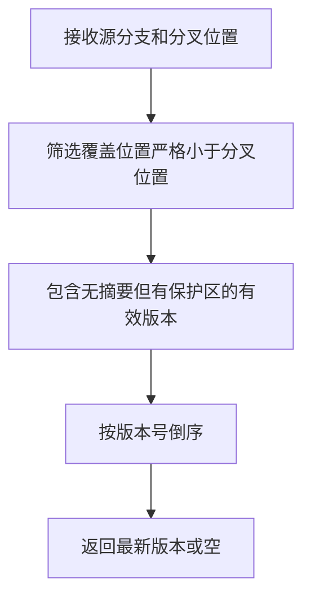

### `backend/app/services/memories.py`

a. 文件用途说明：负责触发判断、增量摘要、保护区编辑、恢复、冲突检测和分支继承。

b. 文件内类图：

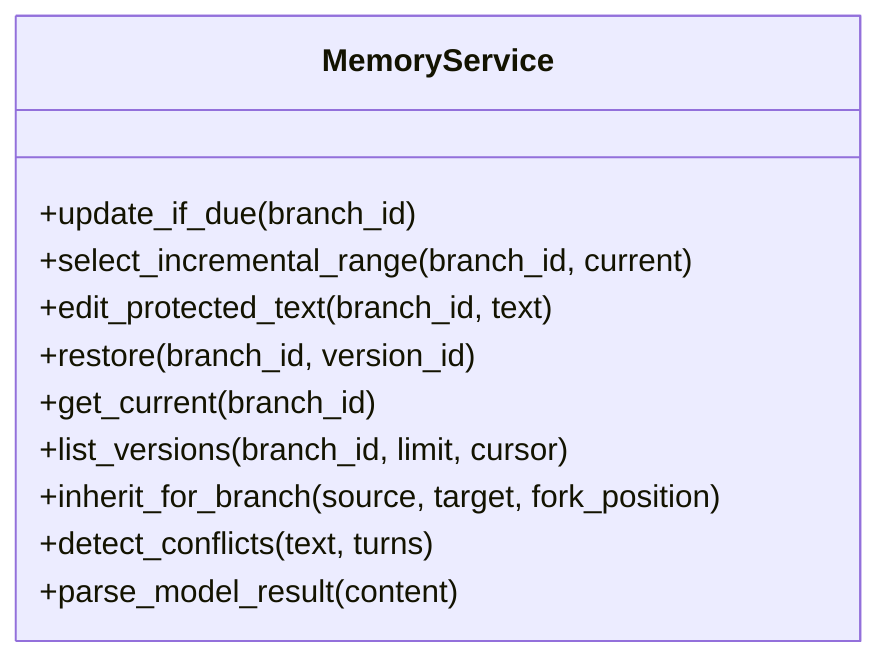

c. 函数/方法详解：

#### `update_if_due(branch_id)`

- 用途：成功回答后按 n/k/m 判断并同步更新摘要。
- 输入参数：活动分支 ID。
- 输出数据结构：`MemoryUpdateOutcome(UPDATED/SKIPPED/FAILED)`。

#### `select_incremental_range(branch_id, current)`

- 用途：计算未被摘要覆盖、且已经退出最近 k 轮窗口的新增范围。
- 输入参数：分支 ID、当前版本。
- 输出数据结构：可空的范围和有序完整轮次。

#### `edit_protected_text(branch_id, text)`

- 用途：保存用户保护区并创建 `USER_EDIT` 版本。
- 输入参数：活动分支 ID、用户文本。
- 输出数据结构：`MemoryOperationResponse`。

#### `restore(branch_id, version_id)`

- 用途：从历史版本建立新基线并补齐遗漏摘要。
- 输入参数：活动分支 ID、来源版本 ID。
- 输出数据结构：成功或失败的 `MemoryOperationResponse`。

#### `inherit_for_branch(source, target, fork_position)`

- 用途：为新分支创建本地 `BRANCH_INHERIT` 版本。
- 输入参数：源分支、新分支、分叉位置。
- 输出数据结构：新版本或空。

#### `detect_conflicts(text, turns)`

- 用途：识别保护区和后续原始对话的潜在冲突。
- 输入参数：保护区文本、当前原始窗口。
- 输出数据结构：结构化冲突元数据；模型失败返回 `UNKNOWN`。

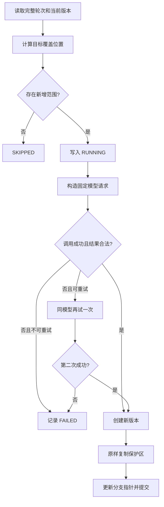

### `backend/app/services/context.py`

a. 文件用途说明：将当前备忘录加入不可变生成上下文，并过滤已经被摘要覆盖的原始历史。

b. 文件内类图：沿用 `ContextService`。

c. 函数/方法详解：

#### `prepare(branch_id, message, search_snapshot)`

- 用途：读取当前备忘录并创建 ContextSnapshot。
- 输入参数：分支 ID、目标消息、搜索快照。
- 输出数据结构：`PreparedContext`。

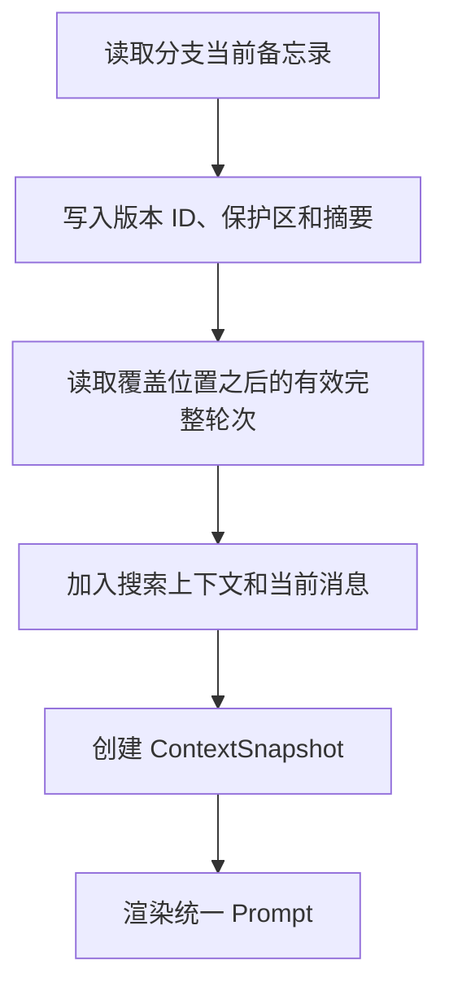

Prompt 明确声明冲突优先级：

```text
当前用户消息
> 最近原始对话
> 用户保护区
> 系统摘要
```

### `backend/app/services/chat.py`、`backend/app/services/answers.py`

a. 文件用途说明：成功回答已经提交后调用备忘录更新入口。

b. 文件内类图：沿用现有 Service。

c. 函数/方法详解：

#### `MemoryService.update_if_due(branch_id)` 调用点

- 用途：在新消息、重新生成成功后检查备忘录更新。
- 输入参数：最终活动分支 ID。
- 输出数据结构：更新结果；不改变聊天响应的成功状态。

- 备忘录失败不回滚回答。
- 返回聊天响应时不把备忘录失败冒充生成失败。
- 前端通过备忘录查询接口查看最近失败状态。

### `backend/app/services/branches.py`

a. 文件用途说明：在两类新分支创建流程中继承有效备忘录。

b. 文件内类图：沿用 `BranchService`。

c. 函数/方法详解：

#### `edit_user_message(...)`

- 用途：创建消息编辑分支并继承分叉位置之前有效的备忘录。
- 输入参数：消息 ID、编辑请求。
- 输出数据结构：`GenerationOperationResponse`。

#### `fork_for_answer(...)`

- 用途：创建回答版本分支并继承覆盖范围严格早于回答位置的备忘录。
- 输入参数：会话、源分支、分叉关联、目标回答。
- 输出数据结构：新 Branch。

备忘录继承与分支消息复制在同一事务中完成。

### `backend/app/providers/model.py`

a. 文件用途说明：正式 Provider 协议保持不变；Mock Provider 为备忘录任务提供确定性结构化响应。

b. 文件内类图：沿用 `ModelProvider`、`CompletionModelProvider`、`MockModelProvider`。

c. 函数/方法详解：

#### `MockModelProvider._default_response(request)`

- 用途：区分普通聊天和内部备忘录任务。
- 输入参数：`ModelRequest`。
- 输出数据结构：`ModelResult`。

- 普通聊天行为保持不变。
- 识别内部备忘录任务标记。
- 返回结构化摘要与冲突结果。

### `frontend/src/components/SideDrawer.tsx`

a. 文件用途说明：提供迭代4、5共用的右侧抽屉。

b. 文件内类图：函数组件 `SideDrawer`。

c. 函数/方法详解：

#### `SideDrawer(props)`

- 用途：渲染标题、正文、遮罩和关闭入口。
- 输入参数：`open`、`title`、`onClose`、`children`。
- 输出数据结构：可访问的抽屉 UI。

- 支持遮罩、关闭按钮和 Escape 关闭。
- 不引入新的 UI 依赖。

### `frontend/src/components/MemoryPanel.tsx`

a. 文件用途说明：展示、编辑和恢复分支备忘录。

b. 文件内类图：函数组件 `MemoryPanel`。

c. 函数/方法详解：

#### `MemoryPanel(props)`

- 用途：展示保护区、只读摘要、冲突、更新状态和历史版本。
- 输入参数：当前版本、历史、加载状态和保存/恢复回调。
- 输出数据结构：备忘录抽屉内容。

#### `handleSave()`

- 用途：仅提交用户保护区。
- 输入参数：表单中的保护区文本。
- 输出数据结构：保存 Promise；失败时保留输入。

#### `handleRestore(versionId)`

- 用途：二次确认后恢复历史版本。
- 输入参数：目标版本 ID。
- 输出数据结构：恢复操作 Promise。

### `frontend/src/hooks/useChat.ts`

a. 文件用途说明：增加活动分支备忘录状态和操作。

b. 文件内类图：无类，自定义 Hook。

c. 函数/方法详解：

- `loadMemory()`：加载当前分支备忘录。
- `loadMemoryVersions()`：按需加载版本历史。
- `saveProtectedMemory(text)`：保存保护区并刷新当前版本。
- `restoreMemory(versionId)`：恢复版本并刷新当前数据。

切换分支后清理旧分支缓存并加载新分支当前备忘录。

## 测试方案

### 后端单元测试

- 0～9 轮不更新。
- 第 10 轮总结 1～5。
- 第 11～14 轮不更新。
- 第 15 轮只增量总结 6～10。
- 第 20 轮只增量总结 11～15。
- 失败回答不增加完整轮数、不触发更新。
- 暂时性错误只重试一次。
- 确定性错误不重试。
- 更新失败不改变当前版本。
- 系统更新逐字复制保护区。
- 用户编辑复制摘要和覆盖范围。
- 冲突检测失败标记 UNKNOWN。
- 恢复无需补齐时直接创建版本。
- 恢复补齐失败时保留当前版本。
- 分支只继承覆盖严格早于分叉点的版本。
- 原分支版本和指针不改变。

### API测试

- 当前备忘录为空时正确返回。
- 历史按版本号倒序分页。
- 非活动分支写入返回 409。
- 不能提交系统摘要。
- 不能恢复其他分支版本。
- 用户编辑创建 USER_EDIT。
- 恢复成功创建 RESTORE。
- 恢复模型失败返回业务失败。
- 自动更新失败不改变消息成功响应。

### 前端测试

- 抽屉关闭前不请求历史。
- 系统摘要不可编辑。
- 保存只发送保护区。
- 冲突警告正确展示。
- 恢复前显示确认框。
- 取消恢复不发送请求。
- 切换分支刷新备忘录。
- 请求失败保留编辑正文。
- 单次操作期间禁用重复提交。

### 验收命令

- 后端全量 pytest。
- 前端全量 Vitest。
- TypeScript 无输出检查。
- Vite 生产构建。
- 从迭代3数据库副本升级至 0004。
- 迁移后验证原消息、回答、分支数量和正文未改变。
- downgrade 回到 0003 并验证迭代3仍可启动。

## 迭代演进依据

1. 复用 ContextSnapshot 已存在的保护区和摘要文本槽。
2. 使用 Branch 当前版本指针，不在每个版本保存可变 `is_current`。
3. 使用同步轻量审计记录，不引入队列。
4. 固定模型避免为内部摘要重复实现路由、降级和回答版本。
5. 全局 n/k/m 满足“可配置”，避免增加暂时不需要的会话设置系统。
6. 分支本地继承版本保证两个分支后续独立演进。
7. 迭代5只需向 ContextSnapshot 增加角色版本，不需要改变备忘录算法。
