# 多模型路由聊天系统迭代5实现文档（评审稿）

> 文档状态：已生成待用户复核  
> 设计依据：`多模型路由聊天系统需求.md`、`docs/LLD.md`、迭代3项目代码、`docs/iteration4-plan.md`  
> 当前基线：后端 39 项测试、前端 19 项测试、TypeScript 检查和 Vite 生产构建全部通过  
> 本文确认前不修改 `docs/LLD.md`、不执行数据库迁移、不实施迭代5代码

## 项目结构与总体设计

### 1. 迭代目标

迭代5增加会话角色和角色模板，并完成浏览器端到端验收：

1. 用户可以为当前活动分支设置助手角色。
2. 角色包含名称、人格、背景、专业领域、性格特征、表达风格和回答约束。
3. 每次保存创建不可变角色版本。
4. 角色修改只影响后续生成。
5. 新分支继承分叉位置当时实际生效的角色版本。
6. 不同分支可以独立切换和修改角色。
7. 支持停用当前分支角色，但不删除旧角色版本。
8. 支持创建和选择角色模板。
9. 模板只填充表单，保存后才创建角色版本。
10. 角色文本进入 ContextSnapshot 并参与 Token、成本和上下文窗口计算。
11. 引入 Playwright 验证前后端核心流程。

### 2. 本迭代不实现

- 角色版本历史页面。
- 恢复或重新激活旧角色版本。
- 模板编辑、删除、归档。
- 内置模板市场。
- 角色自动生成。
- 不同消息单独指定角色。
- 多角色组合。
- 多用户模板权限。
- 角色图片和头像。
- 模板导入导出。

旧角色版本只用于历史 ContextSnapshot、分支继承和数据审计。停用后重新设置角色需要保存新版本或使用模板填充。

### 3. 已确认的实现决策

- 角色版本归属于 Conversation。
- 当前生效指针归属于 Branch。
- 角色修改只更新当前活动分支。
- 新分支继承分叉位置实际使用的角色版本。
- 支持显式停用角色。
- 停用只清空分支指针，不删除任何 RoleVersion。
- 模板仅支持创建和选择。
- 前端复用迭代4的右侧抽屉。
- 增加核心 Playwright E2E。
- 不新增运行时环境变量。

### 4. 核心规则

1. `RoleVersion` 创建后不可修改。
2. 同一会话内 `version_number` 单调递增。
3. `Branch.active_role_version_id` 决定下一次生成使用的角色。
4. 旧 ContextSnapshot 永远保留原角色版本和渲染文本。
5. 切换分支后展示目标分支自己的角色。
6. 停用角色只影响当前活动分支的后续生成。
7. 停用不创建空 RoleVersion。
8. 模板创建后不可修改或删除。
9. 模板选择只更新前端表单。
10. 保存角色时才创建 RoleVersion。
11. 模板与角色版本都必须包含明确的专业领域字段。
12. 回答版本分支优先继承目标回答的 ContextSnapshot 中的角色版本。
13. 编辑消息分支继承原消息位置生成时使用的角色版本。
14. 缺少目标位置上下文时，读取分叉位置之前最近的 ContextSnapshot。
15. 仍无上下文时，新分支无角色。
16. 不允许使用源分支“现在的角色”追溯填充历史分叉点。
17. 新建、编辑和重新生成时都使用操作分支当前指针。
18. 所有角色写操作只作用于当前活动分支。

### 5. 模块关系

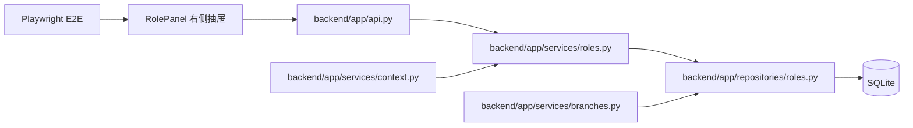

## 目录结构

```text
backend/
  alembic/
    versions/
      0001_core_chat.py
      0002_routing_generation.py
      0003_answer_branching.py
      0004_memory.py
      0005_roles.py
  app/
    api.py
    core/
      enums.py
      errors.py
    db/
      models_core.py
      models_generation.py
      models_memory.py
      models_role.py
    schemas/
      chat.py
      branches.py
      memories.py
      roles.py
    repositories/
      chat.py
      conversations.py
      generation.py
      memories.py
      roles.py
    services/
      chat.py
      answers.py
      branches.py
      context.py
      memories.py
      roles.py
  tests/
    unit/
      test_role_inheritance.py
      test_role_rendering.py
    api/
      test_roles.py
      test_role_templates.py
      test_branches.py
frontend/
  src/
    api/
      client.ts
      types.ts
    hooks/
      useChat.ts
    components/
      ChatPanel.tsx
      SideDrawer.tsx
      MemoryPanel.tsx
      RolePanel.tsx
      ConfirmationDialog.tsx
      chat-actions.css
    test/
      RolePanel.test.tsx
      ChatPanel.test.tsx
  e2e/
    core-chat.spec.ts
  playwright.config.ts
  package.json
docs/
  LLD.md
  iteration3-plan.md
  iteration4-plan.md
  iteration5-plan.md
```

## 整体逻辑和交互时序图

### 1. 保存角色并用于下一次生成

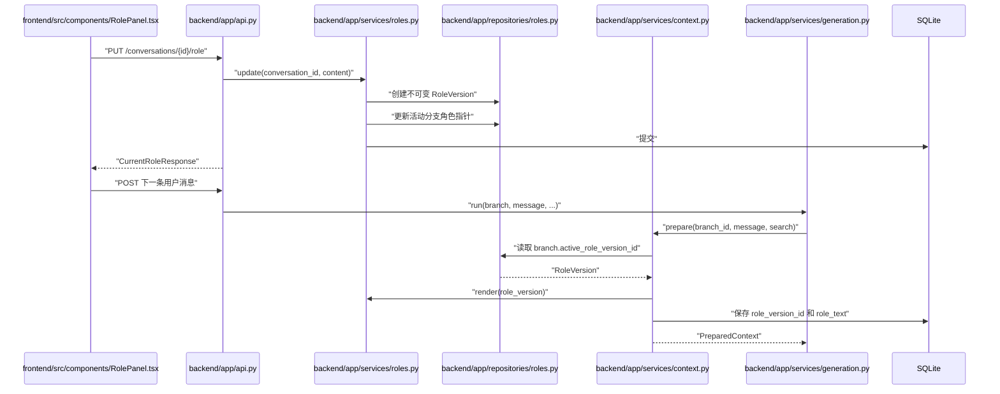

### 2. 停用角色

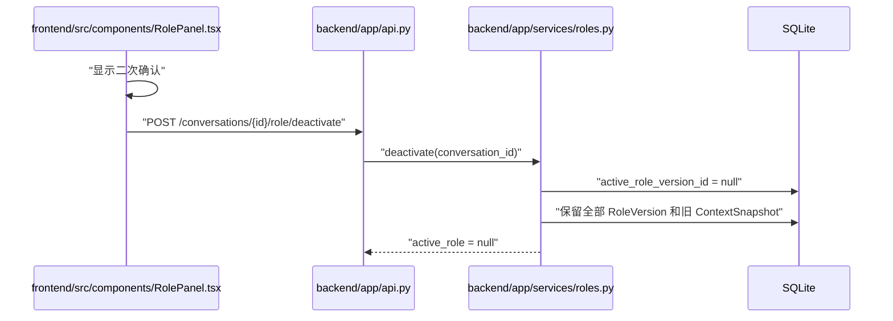

### 3. 分支角色继承

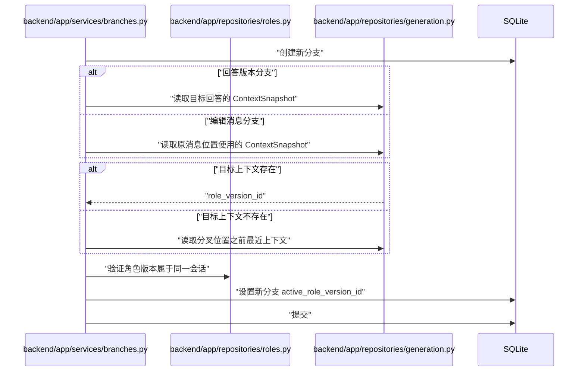

## API接口定义

### 1. 获取当前角色

`GET /api/v1/conversations/{conversation_id}/role`

响应 `CurrentRoleResponse`：

| 字段 | 类型 |
|---|---|
| `conversation_id` | string |
| `branch_id` | string |
| `active_role` | RoleVersionResponse/null |

始终返回当前活动分支的角色。

### 2. 保存角色

`PUT /api/v1/conversations/{conversation_id}/role`

请求 `RoleContentRequest`：

| 字段 | 类型 | 说明 |
|---|---|---|
| `name` | string | 必须非空 |
| `persona` | string | 允许空 |
| `background` | string | 允许空 |
| `domain` | string | 专业领域，允许空 |
| `traits` | string[] | 保留顺序，去除空项和重复项 |
| `style` | string | 允许空 |
| `constraints_text` | string | 允许空 |
| `source_template_id` | string/null | 从模板填充后保存时传入 |

响应为新的 `CurrentRoleResponse`。

规则：

- 创建新 RoleVersion。
- 更新当前活动分支指针。
- 不修改其他分支。
- 不修改旧 ContextSnapshot。
- `source_template_id` 存在时必须引用有效模板。

### 3. 停用当前角色

`POST /api/v1/conversations/{conversation_id}/role/deactivate`

无请求正文。

响应：

- `active_role=null`
- `branch_id` 为当前活动分支。
- 不删除角色版本。
- 已经无角色时幂等成功。

### 4. 获取角色模板

`GET /api/v1/role-templates`

返回：

```text
RoleTemplateListResponse
  items: RoleTemplateResponse[]
```

按 `created_at ASC, id ASC` 排序。当前本地单用户范围不分页。

### 5. 创建角色模板

`POST /api/v1/role-templates`

状态码：201。

请求字段与角色内容一致，但不接收 `source_template_id`。

创建模板不会：

- 自动更新当前角色。
- 创建 RoleVersion。
- 修改任何分支。

### 6. 错误规则

- 404：会话或模板不存在。
- 409：会话无活动分支、角色版本归属错误或状态冲突。
- 422：名称为空、traits 类型错误或字段格式错误。
- 停用空角色返回幂等成功。

## 数据实体结构深化

### 1. Branch 新增字段

| 字段 | 类型 | 说明 |
|---|---|---|
| `active_role_version_id` | UUID/null | 当前分支后续生成使用的角色版本 |

### 2. ContextSnapshot 新增字段

| 字段 | 类型 | 说明 |
|---|---|---|
| `role_version_id` | UUID/null | 本次生成实际使用的版本 |

现有 `role_text` 保存不可变渲染结果。

### 3. RoleTemplate

| 字段 | 类型 |
|---|---|
| `id` | UUID |
| `name` | string |
| `persona` | text |
| `background` | text |
| `domain` | text |
| `traits_json` | JSON array |
| `style` | text |
| `constraints_text` | text |
| `created_at` | datetime |

模板创建后不可更新或删除。

### 4. RoleVersion

| 字段 | 类型 | 约束 |
|---|---|---|
| `id` | UUID | PK |
| `conversation_id` | UUID | FK Conversation |
| `version_number` | integer | 会话内递增 |
| `source_template_id` | UUID/null | FK RoleTemplate |
| `name` | string | 非空 |
| `persona` | text | 非空，允许空字符串 |
| `background` | text | 非空，允许空字符串 |
| `domain` | text | 非空，允许空字符串 |
| `traits_json` | JSON array | 非空 |
| `style` | text | 非空，允许空字符串 |
| `constraints_text` | text | 非空，允许空字符串 |
| `created_at` | datetime | UTC |

唯一约束：`(conversation_id, version_number)`。

### 5. ER 图

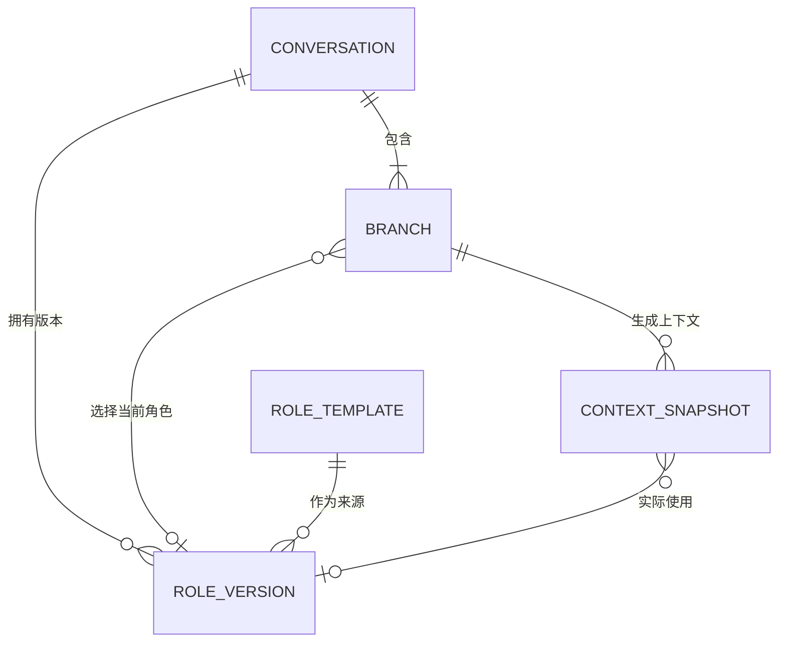

## 模块化文件详解 (File-by-File Breakdown)

迭代5新增角色数据、协议、Repository、Service 和面板，复用迭代4的右侧抽屉与现有不可变 ContextSnapshot。角色不复制生成、分支或 Token 计算流程。

## 涉及到的文件详解 (File-by-File Breakdown)

### `backend/alembic/versions/0005_roles.py`

a. 文件用途说明：创建角色模板和版本表，并为分支、上下文增加角色外键。

b. 文件内类图：无类。

c. 函数/方法详解：

#### `upgrade()`

- 用途：将迭代4数据库升级为支持角色版本。
- 输入参数：无。
- 输出数据结构：Alembic 数据库结构变更。

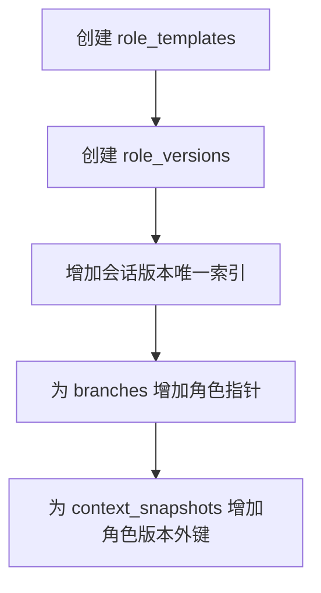

#### `downgrade()`

- 用途：回退迭代5新增结构。
- 输入参数：无。
- 输出数据结构：恢复至迭代4数据库结构。

迁移不为旧会话创建默认角色；升级后旧分支保持无角色。

### `backend/app/db/models_role.py`

a. 文件用途说明：映射 `RoleTemplate` 和 `RoleVersion`。

b. 文件内类图：

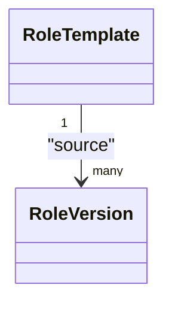

c. 函数/方法详解：无业务函数，仅定义字段、关系、唯一约束和索引。角色内容不可通过 Repository 更新。

### `backend/app/schemas/roles.py`

a. 文件用途说明：定义角色和模板的输入输出协议。

b. 文件内类图：

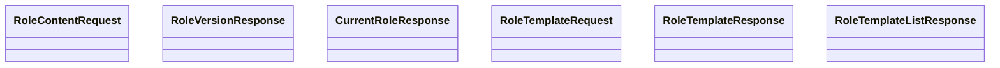

c. 函数/方法详解：

#### `RoleContentRequest.validate_content()`

- 用途：规范化名称和特征列表。
- 输入参数：角色内容字段及可空模板来源 ID。
- 输出数据结构：规范化角色请求。

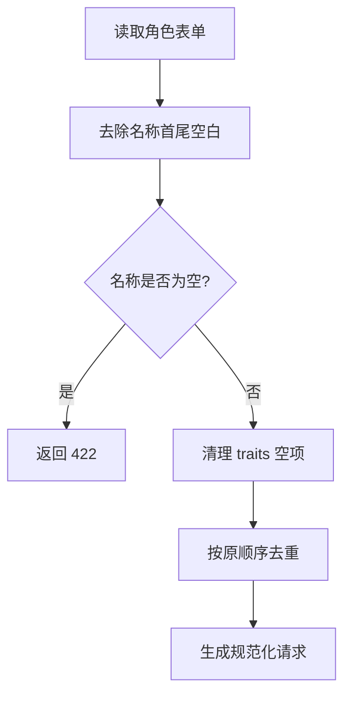

不允许客户端提交渲染后的 system prompt。

### `backend/app/repositories/roles.py`

a. 文件用途说明：封装角色模板、不可变版本和分支当前指针。

b. 文件内类图：

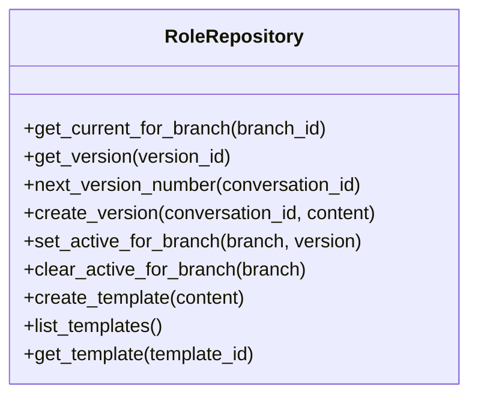

c. 函数/方法详解：

#### `create_version(conversation_id, content)`

- 用途：在会话内创建下一不可变角色版本。
- 输入参数：会话 ID、规范化角色内容。
- 输出数据结构：`RoleVersion`。

#### `set_active_for_branch(branch, version)`

- 用途：更新分支后续生成使用的角色。
- 输入参数：目标分支、角色版本。
- 输出数据结构：更新后的 Branch。
- 约束：RoleVersion 必须属于同一 Conversation。

#### `clear_active_for_branch(branch)`

- 用途：停用当前分支角色。
- 输入参数：目标分支。
- 输出数据结构：角色指针为空的 Branch。

#### `create_template(content)` / `list_templates()`

- 用途：创建或列出本地角色模板。
- 输入参数：模板内容或无。
- 输出数据结构：模板或有序模板列表。

### `backend/app/services/roles.py`

a. 文件用途说明：负责角色版本、停用、模板、渲染和分叉点继承解析。

b. 文件内类图：

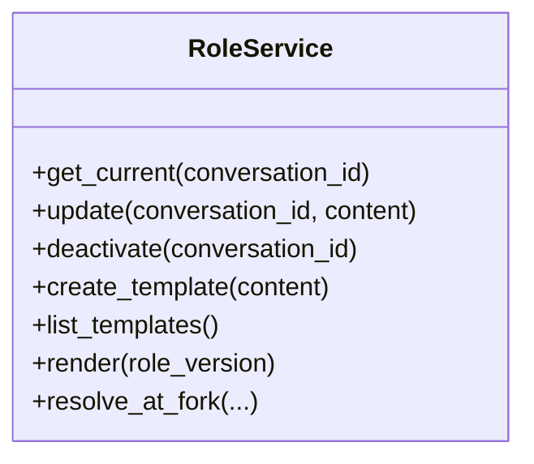

c. 函数/方法详解：

#### `get_current(conversation_id)`

- 用途：获取会话当前活动分支的角色。
- 输入参数：会话 ID。
- 输出数据结构：`CurrentRoleResponse`。

#### `update(conversation_id, content)`

- 用途：创建新角色版本并更新活动分支指针。
- 输入参数：会话 ID、角色请求。
- 输出数据结构：包含新版本的 `CurrentRoleResponse`。

#### `deactivate(conversation_id)`

- 用途：清空活动分支角色指针但保留旧版本。
- 输入参数：会话 ID。
- 输出数据结构：`active_role=null` 的响应。

#### `create_template(content)` / `list_templates()`

- 用途：创建和读取本地模板。
- 输入参数：模板内容或无。
- 输出数据结构：模板响应。

#### `render(role_version)`

- 用途：按固定顺序生成角色上下文文本。
- 输入参数：RoleVersion。
- 输出数据结构：字符串。

#### `resolve_at_fork(...)`

- 用途：解析分叉位置当时实际使用的角色版本。
- 输入参数：分支类型、目标回答或消息位置。
- 输出数据结构：`RoleVersion | None`。

角色渲染固定顺序：

1. 角色名称。
2. 人格定位。
3. 背景。
4. 专业领域。
5. 性格特征。
6. 表达风格。
7. 回答约束。

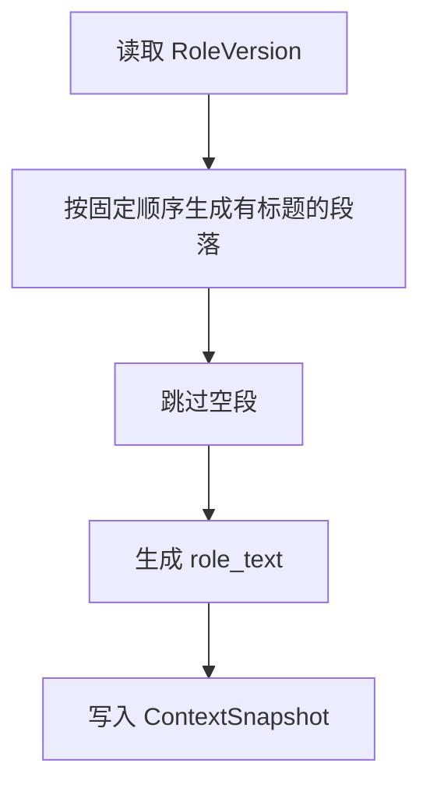

### `backend/app/services/context.py`

a. 文件用途说明：把当前分支角色加入不可变生成上下文。

b. 文件内类图：沿用 `ContextService`。

c. 函数/方法详解：

#### `prepare(branch_id, message, search_snapshot)`

- 用途：读取角色与备忘录并创建统一上下文。
- 输入参数：分支 ID、目标消息、搜索快照。
- 输出数据结构：`PreparedContext`。

- 从分支指针读取当前 RoleVersion。
- 调用 `RoleService.render()`。
- 将 `role_version_id` 和 `role_text` 同时写入 ContextSnapshot。
- Token 预测继续针对最终完整 Prompt，因此自然包含角色 Token。
- 上下文窗口检查无需增加角色专用算法。

### `backend/app/services/branches.py`

a. 文件用途说明：创建分支时继承分叉位置实际生效的角色。

b. 文件内类图：沿用 `BranchService`。

c. 函数/方法详解：

#### `inherit_role_at_fork(...)`

- 用途：设置新分支角色指针。
- 输入参数：源分支、新分支、分叉消息及可空目标回答。
- 输出数据结构：角色版本或空。

- 回答激活分支使用目标回答任务的 ContextSnapshot。
- 编辑消息分支使用被编辑位置原有效回答的 ContextSnapshot。
- 没有目标上下文时回退到分叉前最近上下文。
- 不读取源分支当前角色代替历史角色。
- 备忘录继承和角色继承在同一分支创建事务中完成。

### `backend/app/api.py`

a. 文件用途说明：注册角色与模板的五个端点。

b. 文件内类图：无类。

c. 函数/方法详解：

- `get_role(conversation_id)`：获取当前角色。
- `update_role(conversation_id, body)`：保存新角色版本。
- `deactivate_role(conversation_id)`：停用角色。
- `list_role_templates()`：获取模板。
- `create_role_template(body)`：创建模板。

API 层只处理协议转换，不包含角色继承或版本算法。

### `frontend/src/components/RolePanel.tsx`

a. 文件用途说明：在右侧抽屉编辑当前角色并管理创建型模板。

b. 文件内类图：函数组件 `RolePanel`。

c. 函数/方法详解：

#### `RolePanel(props)`

- 用途：展示角色状态、表单、模板选择和操作按钮。
- 输入参数：当前角色、模板、忙碌状态和保存/停用/创建模板回调。
- 输出数据结构：角色面板。

#### `handleTemplateSelect(templateId)`

- 用途：把模板内容填入本地表单。
- 输入参数：模板 ID。
- 输出数据结构：更新后的本地表单；不请求保存角色接口。

#### `handleSave()`

- 用途：保存新角色版本。
- 输入参数：当前表单和可空来源模板 ID。
- 输出数据结构：保存 Promise。

#### `handleDeactivate()`

- 用途：二次确认后停用当前分支角色。
- 输入参数：无。
- 输出数据结构：停用 Promise。

- API 失败时保留表单内容。
- 保存模板不会自动应用角色。

### `frontend/src/components/ChatPanel.tsx`

a. 文件用途说明：增加彼此独立的备忘录和角色入口。

b. 文件内类图：函数组件 `ChatPanel`。

c. 函数/方法详解：

- 角色入口不与连接状态合并。
- 角色入口不与分支选择器合并。
- 抽屉一次只打开一个。
- 分支切换后关闭旧分支抽屉或刷新面板数据。

### `frontend/src/hooks/useChat.ts`

a. 文件用途说明：管理当前角色、模板和相关操作。

b. 文件内类图：无类，自定义 Hook。

c. 函数/方法详解：

- `loadRole()`：加载活动分支当前角色。
- `saveRole(content)`：保存角色并刷新当前角色。
- `deactivateRole()`：停用并刷新。
- `loadRoleTemplates()`：获取模板列表。
- `createRoleTemplate(content)`：创建模板并刷新模板列表。

分支切换后同时刷新消息、分支列表、当前备忘录和当前角色。

### `frontend/playwright.config.ts`

a. 文件用途说明：配置使用临时 SQLite 和 Mock Provider 的浏览器端到端测试。

b. 文件内类图：无类。

c. 函数/方法详解：配置 Vite 与后端 webServer、无头 Chromium、截图和 trace；不依赖真实搜索、路由资产或模型接口。

### `frontend/e2e/core-chat.spec.ts`

a. 文件用途说明：通过真实浏览器验收迭代1～5核心联动。

b. 文件内类图：无类。

c. 函数/方法详解：

#### `core chat flow`

- 用途：验证会话、角色、消息、分支、停用和备忘录联动。
- 输入参数：Playwright Page。
- 输出数据结构：测试断言结果。

核心流程：

1. 创建会话。
2. 打开角色抽屉。
3. 创建角色模板。
4. 使用模板设置角色。
5. 发送消息并显示回答。
6. 编辑历史消息创建分支。
7. 验证新分支继承分叉位置角色。
8. 修改新分支角色。
9. 切回原分支，验证原角色不变。
10. 停用角色并验证后续消息仍可生成。
11. 打开备忘录抽屉并验证分支状态联动。

## 测试方案

### 后端单元测试

- 角色渲染顺序固定。
- 空字段不输出空标题。
- traits 保序去重。
- 保存角色创建新版本。
- 旧版本不修改。
- 保存只影响活动分支。
- 停用不删除版本。
- 停用空角色幂等。
- 回答分支继承目标回答使用的角色。
- 编辑分支继承分叉位置角色。
- 缺失上下文时回退到更早位置。
- 没有历史上下文时不继承角色。
- 不使用源分支当前角色追溯历史。

### API测试

- 无角色时返回 `active_role=null`。
- 保存角色后返回新版本。
- 同一会话版本号递增。
- 角色版本不能跨会话关联。
- 模板创建不修改当前角色。
- 模板选择来源正确记录。
- 不提供模板修改和删除端点。
- 停用后旧 ContextSnapshot 仍引用原角色。
- 切换分支后获取对应角色。

### 前端测试

- 打开抽屉时加载当前角色和模板。
- 选择模板只填充表单。
- 保存角色发送规范化字段。
- 保存模板不自动应用角色。
- 停用前显示确认。
- 取消停用不发送请求。
- 分支切换刷新角色。
- API 失败保留输入。
- 角色入口、备忘录入口、分支和连接状态保持独立布局。

### Playwright验收

- 使用真实浏览器完成创建会话、设置角色、发送、分支继承和停用。
- 不访问真实模型或搜索服务。
- 失败时输出截图和 trace。
- 保留现有 pytest、Vitest 和生产构建作为必过检查。

### 验收命令

- 后端全量 pytest。
- 前端全量 Vitest。
- TypeScript 无输出检查。
- Vite 生产构建。
- Playwright Chromium 核心流程。
- 从迭代4数据库升级到 0005。
- downgrade 回到 0004。
- 验证 downgrade 不修改会话、消息、回答和备忘录内容。

## 迭代演进依据

1. 角色内容属于会话，避免在每个分支重复存储相同内容。
2. 生效指针属于分支，满足分支独立演进和历史继承。
3. ContextSnapshot 同时保存角色 ID 与文本，保证配置变化不追溯修改历史。
4. 停用只清空指针，避免创建“空角色版本”污染版本语义。
5. 模板保持创建和选择，不引入暂时不需要的编辑、删除和引用冲突。
6. `domain` 独立建字段，补齐需求文档明确要求但现有 LLD 尚未覆盖的专业领域。
7. 角色 Token 通过现有完整 Prompt Token 预测自然计入，无需独立计费模块。
8. Playwright 只覆盖核心联动流程，不替代后端和组件级测试。
9. 后续如明确需要角色历史恢复，可增加列表和 RESTORE 版本，不需要修改现有不可变模型。
